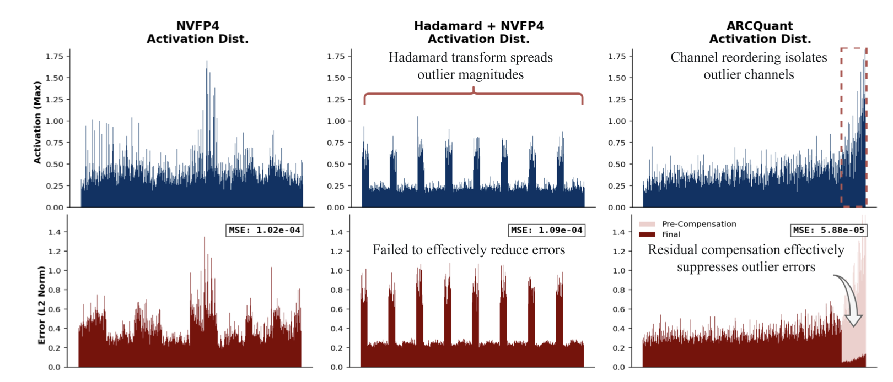
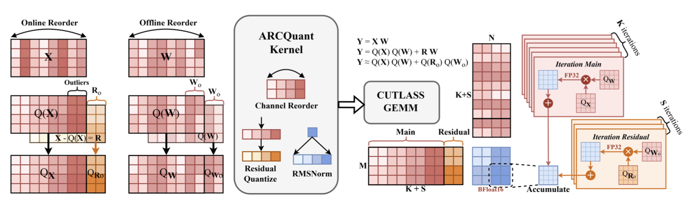

目前把使用NVFP4对大语言模型进行PTQ有一下难点:

1. NVFP4格式与现有的权重-激活值PTQ方法不兼容:
   1. 旋转类方法，如QuaRot等会把异常值能量扩散到所有块，破坏NVFP4本身块隔离优势，反而放大局部动态范围
   2. 平滑类方法，如Smoothquant等在低比特下几乎失效
2. 混合精度方案硬件不兼容，Tensor Core要求数据格式统一，采用混合精度必然导致模型吞吐量下降

如图所示，虽然基于旋转矩阵的方法可以降低全局峰值，但是会显著增加原本低幅值 block 的局部动态范围。这个影响抵消了细粒度 scaling 原本带来的离群值隔离优势。导致在NVFP4上效果不佳。

为了解决上述问题，ARCQuant提出了一个“不改动数值格式，不混合精度，不旋转矩阵”的NVFP4量化框架。

具体实现如下:

1. 离线选出"必须补偿"的异常通道:用校准集统计每层激活的通道最大值，按绝对值降序重排；以FP8（E5M2）动态范围作为参考，设阈值$\tau = 2^{-3}M$，只取超过该阈值的前S条通道作为"残差通道"。
2. 对输入X先重拍然后进行量化得到$Q_x$,然后对选出来的残差通道计算残差:$R_o = X_o - s_{X_o}\cdot Q(X_o)$,再把$R_o$用同一NVFP4格式量化为$Q_{R_o}$.最后把$Q_x$和$Q_{R_o}$在通道维度拼接，得到增广激活矩阵:$Q_{Xaug}=[Q_x|Q_{R_o}]\in \mathbb{R}^{N\times (K+S)}$.之后权重侧离线做对称处理:把对应 S 条权重复制一份，拼接成 $Q_{Waug}=[Q_W∣Q_{Wo}]$。
3. 最后矩阵乘法格式与NVFP4 Tensor Core所需格式完全相同:$Y = s_{Xaug} \cdot Q_{Xaug}\cdot(s_{Waug}\cdot Q_{Waug})^\top$。全程保持数据格式一致，可直接调用 CUTLASS/cuBLAS，无需改内核循环。

