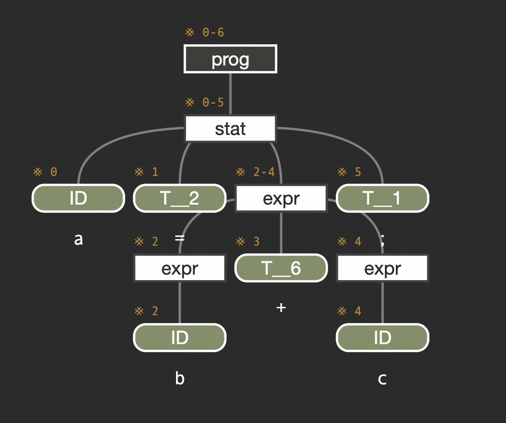
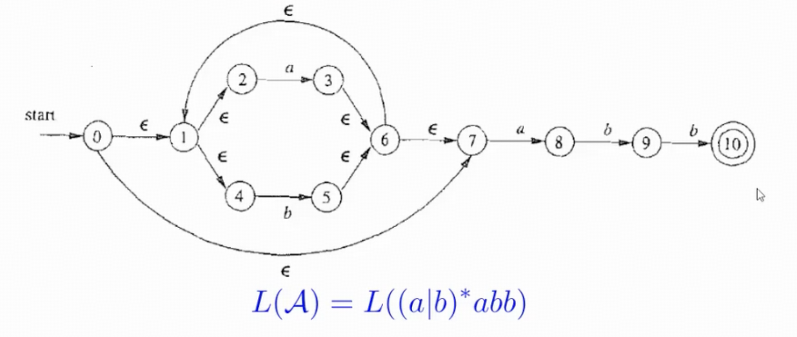
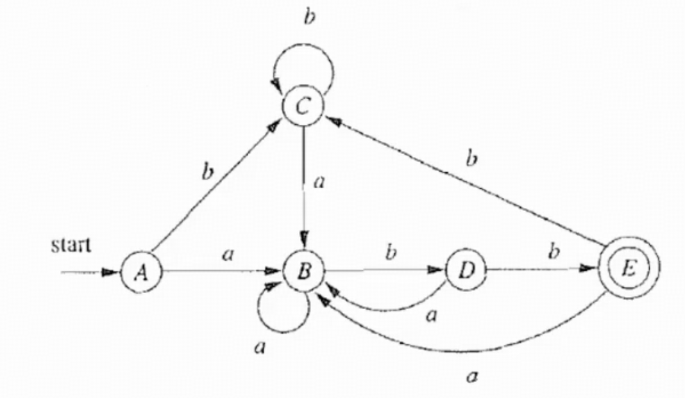
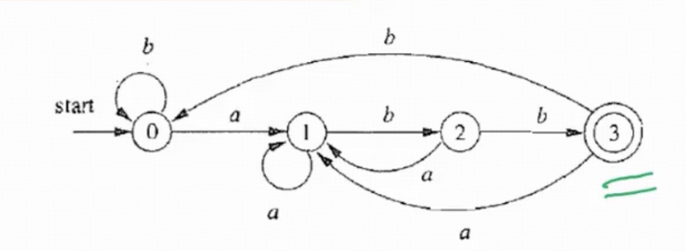

这一章我们学习的是词法分析。

我们知道编译器通常由以下几个部分组成:

1. 前端: 通过词法分析和语法分析，将源代码解析为抽象语法树（AST）。通过语义分析，扫描抽象语法树，检查其是否存在语义错误
2. 中端：将AST转化为中间表示IR，并在此基础上完成一些机器无关优化
3. 后端：将中间表示IR转换为目标平台的汇编代码，并在此基础上完成一些机器相关优化

## 1.1 词法分析

词法分析简单来说就是把字节流转换为单词流 (token stream). 词法分析器(lexer)会按照某种规则读文件，并将文件的内容拆分成一个个 token 作为输出, 传递给语法分析器 (parser). 同时, lexer 还会忽略文件里的一些无意义的内容, 比如空格, 换行符和注释.

Lexer 生成的 token 会包含一些信息, 用来让 parser 区分 token 的种类, 以及在必要时获取 token 的内容. 

例如我们有这样一个程序:

```c
int main() 
{
// 我是注释诶嘿嘿
return 0;
}
```

那么Lexer可能会将他转化为如下token 流:

```text
种类: 关键字, 内容: int.
种类: 标识符, 内容: main.
种类: 其他字符, 内容: (.
种类: 其他字符, 内容: ).
种类: 其他字符, 内容: {.
种类: 关键字, 内容: return.
种类: 整数字面量, 内容: 0.
种类: 其他字符, 内容: ;.
种类: 其他字符, 内容: }.
```

目前为止，我们实现词法分析从易到难有三种方法：

1. 词法分析器生成器
2. 手写词法分析器
3. 自动化词法分析器

接下来我们重点看看前面两项

## 1.2 词法分析器生成器

在本课程中，我们使用的词法分析生成器是antlr。

在使用antlr时，我们的输入是一个包含词法单元规约的g4文件，那么antlr会自动生成一个词法分析器

如果我们使用antlr这样的语法分析器生成器，我们主要做的事情就是就是写清楚语法规则。

我们接下来尝试用antlr实现一个类似C++的词法分析器:

首先我们知道一个C++程序肯定是由若干条Statement组成的，那么我们就有第一条语法规则：

```text
grammer SimpleSysY; // 注意在g4中第一行需要定义grammer，并且保持和文件名一致

prog: stat* EOF; //这里加入EOF来说明结束条件
```

而statement都是由表达式expr组成的，为了简便，我们先初步规定expr只支持赋值语句和输出，那么我们可以有下一条规则:

```text
stat: expr ';' // 需要注意''内的分号说明一条statement要以分号结尾
    | ID '=' expr ';'
    | 'print' expr ';'
    ;
```

接下来我们就可以去描述一个表达式的语法规则了。那么显然，这是一个递归的描述:

```text
expr: expr ('+' | '-' | '*' | '/' ) expr
    | '(' expr ')'
    | ID
    ;
```

但是这样写会有点问题，这里会涉及到符号优先级的问题，例如乘法和除法的优先级肯定是高于加法和减法的，想要在antlr中表达优先级我们可以:

```text
expr: expr ('*' | '/' ) expr
    | expr ('+' | '-'  ) expr
    | '(' expr ')'
    | ID
    ;
```

当然除了优先级以外，我们还要考虑结合性的影响，在g4中，如果我们不显式指定是左结合还是右结合，就会默认是左结合，这和我们的计算是符合的，但是我们后续还会继续探讨这部分的内容。

整体上来看，语法结果就是这样，接下来我们看看词法结构:

我们知道在C++中一个标识符是以下划线或字母开头，以字母数字下划线结尾的字符串:

```text
ID: ('_' | [a-zA-Z])('_' | [a-zA-Z0-9])*;
```

而如果此时我们用上面的写好的语法规则和词法规则去对一个语句去做测试: `a = b + c;`

会发现有部分的报错，这是因为空格没有被识别到，因此我们还需要加入空格的词法规则:

```text
WS: [ \t\r\n]+ -> skip;
```

其中我们用+是因为至少要有一个才能被识别，而后面的skip则是识别到了就跳过，否则我们实际上grammar中没有相关的规则，会导致语法规则识别不出来。

这样，上面那个语句我们就可以画出语法分析树了:



当然在我们实际的实验中，这样简单的语法规则和词法规则肯定是不够的，具体的我们可以在Lab中实现，这里只做简单的介绍。

另外这里可以补充一点写语法规则和词法规则时一些需要注意的点:

1. 特殊的规则尽量写在前面，比如docs comment和mul comment的匹配规则分别写作:

```text
DOCS_COMMENT : '/**' .*? '*/';
MUL_COMMENT : '/*' .*? '*/'; // 其中 .*?中的？表示非贪婪匹配模式
```

那么此时明显可以看到DOCS_COMMENT也可以被MUL_COMMENT给匹配到的，因此我们在写词法规则的时候应该把DOCS_COMMENT的规则写在MUL_COMMENT前面，让前者优先匹配。

2. 在antler这类词法分析器生成器中，提供了`fragment`的功能来进行助记:

```text
fragment LETTER: [a-zA-Z]
fragment NUMBER: [0-9]
fragment WORD: '_' | LETTER | NUMBER
ID: ('_' | LETTER)(WORD)*;
```

3. antlr中有三个比较重要的优先匹配规则来解决冲突，分别是最前优先匹配，最长优先匹配(例如1.23会被匹配为float而不是INT和FLOAT，>=不会被识别为>和=)，非贪婪匹配

## 1.3 词法分析生成器的基本原理（1）

在Antlr这类词法分析器生成器中，我们只需要在g4文件中描述词法单元的正则表达式就能自动生成词法分析器，这背后的流程可以分为若干个步骤。

比较经典的流程是:

Regix->NFA->DFA->Transition Table->Machine Code

接下来我们会逐一介绍上面的各个部分

### 1.3.1 正则表达式

首先我们给出正则表达式的定义:

给定字母表$\Sigma$，$\Sigma$上的正则表达式有且仅有以下规则定义:

1. $\epsilon$是正则表达式
2. $\forall a \in \Sigma $,a是正则表达式
3. 如果r是正则表达式，则(r)也是正则表达式
4. 如果r与s都是正则表达式，则 r|s,rs,r\*也是正则表达式

此外，我们规定正则表达式中的运算优先级如下:

$$
() > * > connect > |
$$

对应的正则语言如下:

我们规定每个正则表达式r对应一个正则语言L(r)

1. $L(\epsilon) = \{\epsilon\}$
2. $L(a) = \{a\},\forall a \in \Sigma$
3. $L((r)) = L(r)$
4. $L(r|s)=L(r)\cup L(s)$  $L(rs)=L(r)L(s)$  $L(r*)=(L(r))*$

下面是常用到的正则表达式符号以及对应的含义:

| 符号 | 含义 | 例子 | 例子含义 |
| --- | --- | --- | --- |
| `a` | 匹配字符本身 | `a` | 匹配字符 a |
| `.` | 匹配除换行符以外的任意单个字符 | `a.b` | 如 acb、a1b |
| `r\|s` | 或 / 选择 | `a\|b` | 匹配 a 或 b |
| `r*` | 前面的表达式重复 0 次或多次 | `a*` | ""、a、aa、… |
| `r+` | 前面的表达式重复 1 次或多次 | `a+` | a、aa、… |
| `r?` | 前面的表达式出现 0 次或 1 次 | `a?` | "" 或 a |
| `(r)` | 和r相同 | `(ab)*` | ""、ab、abab、… |
| `[s]` | 字符集合，匹配其中任意一个字符 | `[abc]` | a、b 或 c |
| `[^s]` | 字符集合取反 | `[^abc]` | 除 a、b、c 外的字符 |
| `^` | 通常表示字符串/行开头 | `^abc` | 以 abc 开头 |
| `$` | 通常表示字符串/行结尾 | `abc$` | 以 abc 结尾 |
| `\` | 转义特殊字符 | `\*` | 匹配字符 * 本身 |
| `r{m}` | 恰好重复 m 次 | `a{3}` | aaa |
| `r{m,n}` | 重复 m 到 n 次 | `a{2,4}` | aa、aaa、aaaa |
| `"s"` | 串s的字面值 | `"*a"` | *a |

### 1.3.2 NFA 非确定性有穷自动机

我们定义非确定性有穷自动机A是一个五元组 $A = (\Sigma,S,s_0,\delta,F)$:

1. 字母表 $\Sigma\ \ (\epsilon \notin \Sigma)$
2. 有穷的状态集合 S
3. 唯一的初始状态 $s_0$
4. 状态转移函数 $\delta$：$\delta: S\times(\Sigma \cup \{\epsilon\})\to 2^S$
5. 接受状态集合 $F \subseteq S$

NFA的主要特点是一个输入可以有多个下一状态，且允许 $\epsilon$转移

自动机A定义了一种语言 L(A),它能接受的所有字符串构成的集合

### 1.3.3 DFA 确定性有穷自动机

我们定义确定性有穷自动机A是一个五元组 $A = (\Sigma,S,s_0,\delta,F)$:

1. 字母表 $\Sigma\ \ (\epsilon \notin \Sigma)$
2. 有穷的状态集合 S
3. 唯一的初始状态 $s_0$
4. 状态转移函数 $\delta$：$\delta: S\times \Sigma \to S$
5. 接受状态集合 $F \subseteq S$

与NFA不同的点在于DFA一个输入只有一个状态，不允许空转移

NFA简洁易于理解，便于描述语言L(A)，而DFA容易判断 $x \in L(A)$,适合产生词法分析器

因此我们通常用NFA描述语言，DFA实现词法分析器

## 1.4 词法分析生成器的基本原理（2）

在上一节中我们提到了Regix以及NFA，DFA的基本含义，我们接下来介绍他们之间的相互转化。

### 1.4.1 从RE到NFA: Thompson 构造法

Thompson构造法的基本思想是按结构归纳，即把正则表达式递归地拆分成小的子表达式，每个子表达式先构造一个小NFA，再通过 $\epsilon$边把这些小的NFA连接起来。

依据正则表达式的定义，我们可以拆开看:

1. 基本字符:

对于一个字符`a`，我们可以构造:

```text
      a
(q0) ---> (q1)
```

其中q0是入口，q1是出口

2. 连接:rs

假设我们已经构造好了正则表达式r和s的NFA，那么对于连接我们可以通过将r的出口和s的入口以一个 $\epsilon$边连接即可:

```text
        r              s
 --> [ NFA ] --ε--> [ NFA ] -->
```

3. 选择 r|s

我们此时希望NFA可以选择走r的入口，也可以走s的入口，那么我们只需要新建一个入口和一个新的出口，并用 $\epsilon$边将他们分别与r和s的入口，出口连接即可

```text
           ε --> [NFA(r)] --ε
          /                    \
start ---                       ---> end
          \                    /
           ε --> [NFA(s)] --ε
```

4. Kleene 星号: r\*

对于Kleene星号，我们需要具备两种能力，即一次都不执行和执行完以后重新执行:

```text
                ε
          +-------------> end
          |
        start
          |
          | ε
          v
      start_r ---- r ----> end_r
          ^                   |
          |_______ ε _________|
                              |
                              ε
                              |
                              v
                             end
```

前者我们通过将新的入口和新的出口直接通过 $\epsilon$边连接完成，后者我们则在r的NFA上加入一条由出口指向入口的 $\epsilon $边。

我们可以通过下面这个例子来展示Thompson构造法转化RE到NFA的完整流程:

假设我们有正则表达式`a(b|c)*`

我们可以先按照语法树来决定构造顺序：

```text
          连接
         /    \
        a      *
              |
              |
              |
             b|c
            /   \
           b     c
```

然后我们可以自底向上构造，首先构造一下a,b,c：

```text
a  →  NFA(a)

b  →  NFA(b)

c  →  NFA(c)
```

接下来构造`b|c`:

```text
       /-- b --\
-- ε -          - ε -->
       \-- c --/
```

然后给`b|c`套上Kleene星号:

```text
        ε----------------------+
        |                      |
        v                      |
start --> [ b|c ] --> merge ---+
   |                            |
   +----------ε----------------> end
                 merge --ε-----> end
```

最后再把a的按照连接的方式连起来:

```text
start --> [a] --> [(b|c)*] --> end
```

### 1.4.2 从NFA到DFA:子集构造法



子集构造法的核心思想在于DFA的一个状态，对应于NFA的一组状态。

由于DFA在描述状态转移时只允许目标状态有且仅有一个，而NFA可以有多个，因此我们干脆把NFA中所有可能的状态整体看成DFA的一个状态。

在描述具体方法前，我们通过上面的NFA介绍两个名词:

1. $\epsilon-\text{closure}$： 表示在NFA中从状态集合S出发，只走任意条 $\epsilon$边，能够到达的状态，包括S自己。

例如下图中，从状态 $q_0$出发，只走任意条 $\epsilon$边，能够到达的状态为: $\{q_0,q_1,q_2,q_4,q_7\}$,因此我们有: $\epsilon-\text{closure}(\{q_0\})=\{q_0,q_1,q_2,q_4,q_7\}$

2. Move: 表示在NFA中从状态集合S出发，读取字符 `a`一步后能到达的状态集合

借用这两个名词，以及上面这个例子，我们可以很好的描述子集构造法的流程了。

首先，从初始状态出发，计算: $\epsilon-\text{closure}(q_0)$,计算出来后记作初始状态 $D_0 = \{q_0,q_1,q_2,q_4,q_7\}$

之后从 $D_0$读字符a，算 $\epsilon-\text{closure}(\text{move}(D_0,a)) = D_1 = \{q_1,q_2,q_3,q_4,q_6,q_7,q_8\}$

接着从 $D_0$读字符b，得到 $D_2 = \{q_1,q_2,q_4,q_5,q_6,q_7\}$

再从 $D_1$读字符a，算 $\epsilon-\text{closure}(\text{move}(D_1,a)) = \{q_1,q_2,q_3,q_4,q_6,q_7,q_8\} = D_1$

再从 $D_1$读取字符b，算 $\epsilon-\text{closure}(\text{move}(D_1,b))=D_3=\{q_1,q_2,q_3,q_4,q_5,q_6,q_7,q_9\}$

然后从 $D_2$读字符a，得到 $D_1$，从 $D_2$读字符b，得到 $\epsilon-\text{closure}(\text{move}(D_2,b)) = D_2 = \{q_1,q_2,q_4,q_5,q_6,q_7\}$

最后从 $D_3$读字符a，得到 $D_1$ ，从 $D_3$读字符b，得到 $\epsilon-\text{closure}(\text{move}(D_3,b)) = D_4^* = \{q_1,q_2,q_4,q_5,q_6,q_7,q_{10}\}$,因为它包含终态 $q_{10}$，所以我们会给它一个特殊的标记。

而从 $D_4$读字符a和字符b分别可以得到 $D_1,D_2$

总结下来，我们可以得到如下状态转移图:

| DFA 状态 | 对应 NFA 状态集合 | a | b |
| --- | --- | --- | --- |
| $D_0$ | {0,1,2,4,7} | $D_1$ | $D_2$ |
| $D_1$ | {1,2,3,4,6,7,8} | $D_1$ | $D_3$ |
| $D_2$ | {1,2,4,5,6,7} | $D_1$ | $D_2$ |
| $D_3$ | {1,2,4,5,6,7,9} | $D_1$ | $D_4$ |
| $D_4^*$ | {1,2,4,5,6,7,10} | $D_1$ | $D_2$ |

转化为DFA，可以画成:



### 1.4.3 最小化DFA

DFA最小化的目标是在保持语言完全不变的前提下，把行为等价的DFA状态合并，得到状态数最少的DFA。

首先，我们需要明确什么叫两个状态是等价的:

我们假设DFA中存在两个状态p,q。从他们出发，如果输入任意的字符串w，最终要么都接受，要么都拒绝，那么我们可以认为: $p\equiv q $。

知道了怎样的状态是等价，也就是可以合并的，我们可以开始考虑怎么最小化DFA了。

首先我们可以知道的是，接受状态和非接受状态是不可合并的，因此我们可以把DFA的状态集合分为两组:

$$
P_0 = \{F,Q-F\}
$$

接下来则可以进一步不断细分，我们对于同一组中的两个状态p和q，观察他们读入每个字符后的去向。如果:

$$
\delta(p,a) =\epsilon-\text{closure}(\text{move}(p,a)) \neq \delta(q,a)
$$

那么此时p和q不能继续待在一个组，于是把他们拆开。

不断重复上述流程，直至无法继续拆分为止。

最终每一个分组中状态都是等价状态，可以合并为一个DFA状态。

为了方便我们理解，我们利用我们上面根据子集构造法得到的DFA来做一遍上述流程。

| 状态 | a | b | 是否接受 |
| --- | --- | --- | --- |
| $D_0$ | $D_1$ | $D_2$ | 否 |
| $D_1$ | $D_1$ | $D_3$ | 否 |
| $D_2$ | $D_1$ | $D_2$ | 否 |
| $D_3$ | $D_1$ | $D_4$ | 否 |
| $D_4$ | $D_1$ | $D_2$ | 是 |

其中唯一接受状态： $F = \{D_4 \}$

第一步，按接受/不接受进行第一步划分，得到:

$$
P_0 = \{ \{D_4\},\{D_0,D_1,D_2,D_3\}\}
$$

为了方便，我们记作: $P_0 = \{A,B\},A=\{ D_4\}$

第二步，检查B是否可以进一步拆分。

- $D_0$: 根据表格，我们发现无论输入a还是b，最后仍然落入B中，因此我们记作: $D_0:(B,B)$
- $D_1$: 类似的，我们可以得到: $D_1:(B,B)$
- $D_2$: $D_2:(B,B)$
- $D_3$: $D_3(B,A)$

于是我们发现只有 $D_3$与B中的其他状态不同，因此我们可以进一步划分出:

$$
P_1 = \{\{D_4\},\{D_3\},\{D_0,D_1,D_2\}\}
$$

接着，我们继续检查 $C=\{D_0,D_1,D_2\}$,按照上面的流程，我们可以得到:  
$D_0:(C,C)$ $D_1:(C,B)$ $D_2:(C,C)$

发现 $D_1$，不同因此继续拆分: $P_2 = \{\{D_4\},\{D_3\},\{D_1\},\{D_0,D_2\}\}$

最后，我们可以发现 $D_0,D_2$显然是不可拆分的，他们是等价的，因此我们得到了最小的DFA状态:

$$
S_0 = \{D_0,D_2\},S_1=\{D_1\},S_2=\{D_3\},S_3=\{D_4\}
$$

其中 $S_3$是终态，我们可以得到状态转移表格:

| 状态 | a | b |
| --- | --- | --- |
| $S_0$ | $S_1$ | $S_0$ |
| $S_1$ | $S_1$ | $S_2$ |
| $S_2$ | $S_1$ | $S_3$ |
| $S_3^*$ | $S_1$ | $S_0$ |

画成DFA就是


