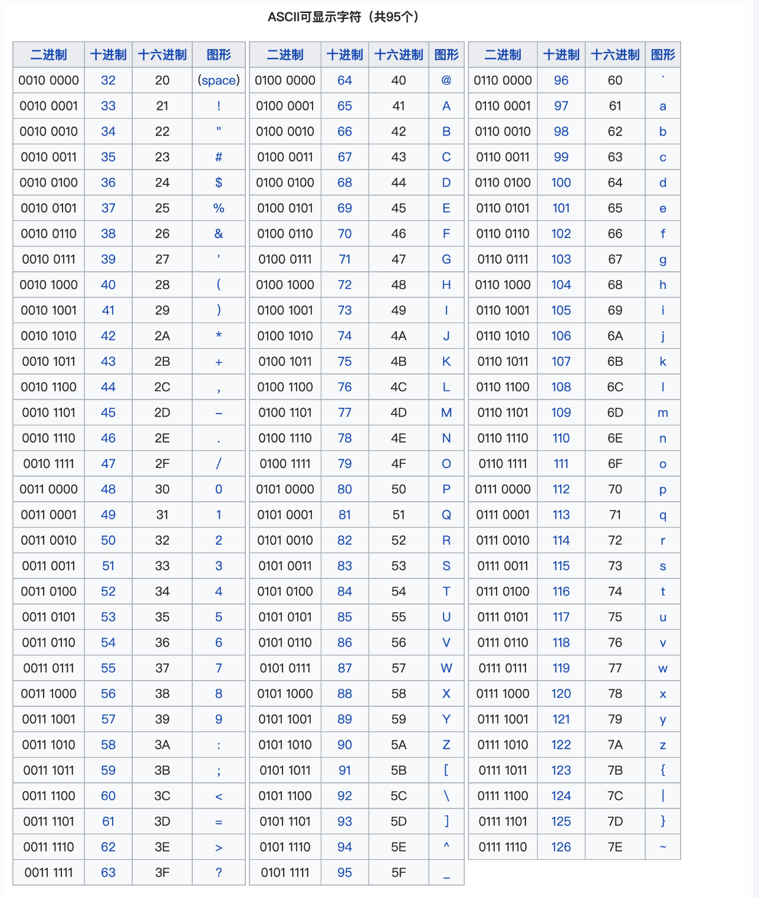
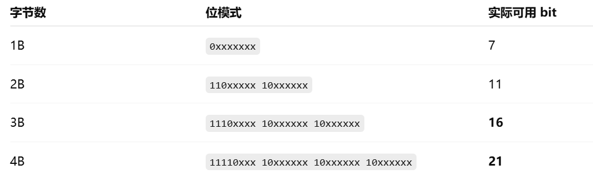
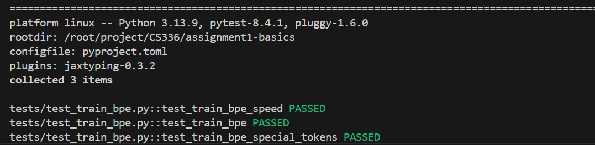
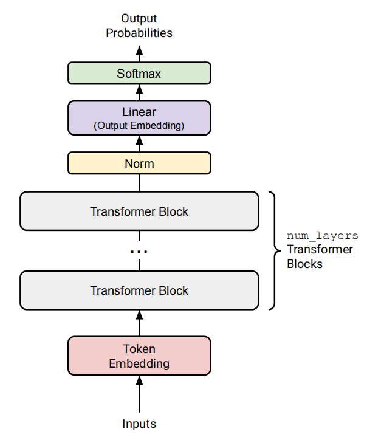
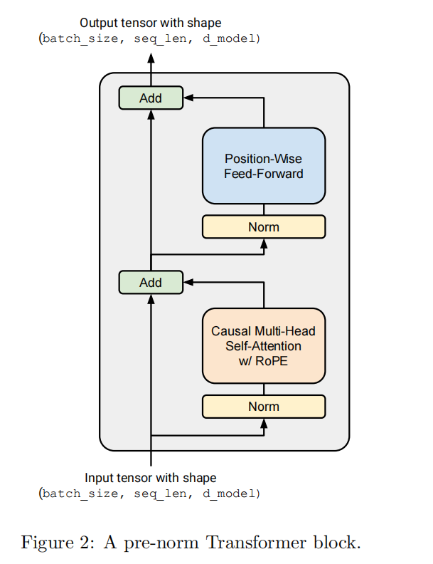
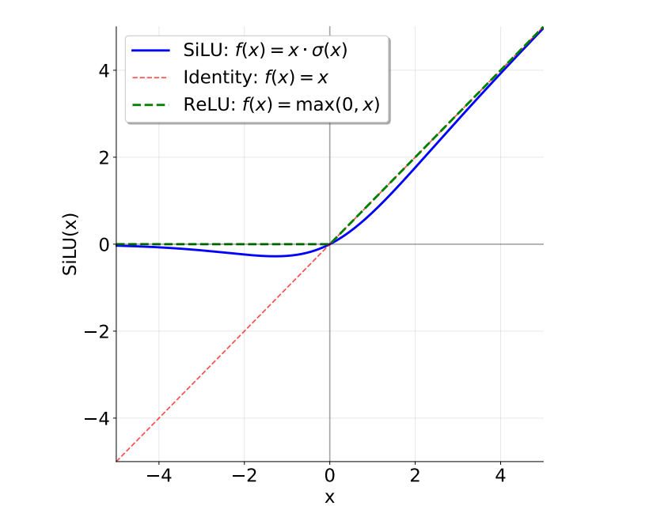
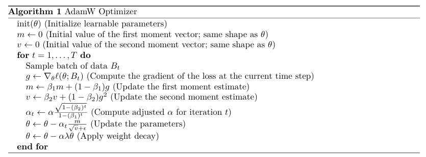

## 环境配置

首先克隆课程仓库到本地的**WSL**中：

```bash
git clone https://github.com/stanford-cs336/assignment1-basics.git
```

接着按照仓库要求安装环境即可，分为环境安装和数据下载，环境的话:

```bash
#先在WSL上安装uv
curl -LsSf https://astral.sh/uv/install.sh | sh 
source $HOME/.local/bin/env
uv run pytest tests
```

数据的话就按照readme中的介绍正常下载就行。

下面是课程实验指导手册：

[cs336_assignment1_basics.pdf](https://github.com/stanford-cs336/assignment1-basics/blob/main/cs336_assignment1_basics.pdf)

本人项目地址：<https://github.com/July-h5kf3/CS336/tree/main>

## 文本编码和Tokenizer

### ASCII Unicode与UTF-8编码

ASCII编码在我们C++课程中就已经介绍了，这里不多赘述，见下表（0-31以及127是控制字符）



Unicode则是一个文本编码标准，不同于ASCII，Unicode会将诸如汉字，emoji等等的字符都有一个整形数字与之对应(如"牛"对应的数字为29275)，这个数字我们称为码点(code point).

在最新的Unicode 16.0中，已经包含了154,998个字符。假设从0开始编码，那么用二进制表示的话至少需要18位，假设每个字符定长，那么一个字符我们需要3B来表示。

实际上Unicode的码点到了0x10FFFF，也就是说如果采取定长的话就需要21bit。此外，为了兼容ASCII，每个B都需要牺牲一定的bit来做标识



因此最终如果采用定长的话，一个字符就需要4B来表示。这种编码方式我们称为UTF-32

这种方式显然会浪费大量的空间，一个改良的方式就是采用变长存储。比如0-255的用1B等，这种编码方式为UTF-8.

综上，Unicode标准定义了 从字符到码点(整数)的映射，但是由于词表的规模过于庞大且稀疏，直接在Unicode码点上训练分词器是不现实的。因此通常的做法是将一个Unicode字符转换为一系列字节，也就是采用UTF-8编码。

我们接下来看看是如何进行这个过程的。上面我们在说为什么是UTF-8的时候说到之所以是4B而不是3B是因为需要一定的bit来进行标识，标识的作用就是用于判断该字符占几个字节。

其中前缀可以分为:

- 控制位：0,110,1110,11110就分别告知后面还有多少个字节(B)
- 延续位：10开头则表示这是一个”从属字节“，不是新字符的开头

我们以牛(unicode为29275，十六进制为0x725B)这个字符为例进行编码的模拟

将其转化为二进制后有:0111001001011011,且我们可以判断UTF-8需要3字节，因此使用3字节的UTF-8

带入3B的模板:

11100111 10001001 10011011

转化为十六进制即为:

牛 = E7 89 9B(231,137,155)

### BPE Tokenizer的实现

#### BPE算法原理与训练实现

虽然字节级分词(如UTF-8)可以缓解词级分词器所面临的词表外(OOV)问题，但直接将文本分解为字节会导致冗长的输入序列。这会减慢模型训练速度，因为在词级语言模型中，一个包含 10 个词的句子可能只需要 10 个 token，而在字符级模型中（取决于词的长度），同样的句子可能需要 50 个甚至更多的 token。处理更长的序列会使模型在每一步都需要更多的计算量。

此外，在字节序列上进行语言建模是比较困难的，因为更长的输入序列会在数据中引入更强的长期依赖问题。

子词分词(subword tokenization)位于词级分词和字节级分词之间，是一种折中方案。需要注意的是，字节级分词器的词表大小固定为 256（字节值范围为 0 到 255）。子词分词器通过使用更大的词表，来换取对输入字节序列更好的压缩效果。例如，如果字节序列 `b'the'` 在原始训练数据中频繁出现，那么为它在词表中分配一个条目，就可以将原本由 3 个 token 组成的序列压缩为 1 个 token。

那么我们如何选择要加入词表的子词单元呢？

目前的主流方法是字节对编码即（BPE），这是一种压缩算法，它通过迭代的方式，将出现频率最高的一对字节替换（“合并”）为一个新的、尚未使用的索引。需要注意的是，该算法通过向词表中加入子词 token 来最大化输入序列的压缩率——如果某个词在输入文本中出现得足够频繁，它最终就会被表示为一个单独的子词单元。

使用 BPE 构建词表的子词分词器通常被称为 **BPE 分词器**。

这里举个例子来说明，假设一个字符的unicode转化为UTF-8后为[239,165,32],此时我们的词表中有:

{256:[239,165],257:[256,32]}

那么由于最终该字符的表示就是[257].这个字典就是我们得到的BPE

想要训练一个BPE分词器需要三个步骤。

- 词表初始化

分词器的词表是从**字节串 token 到整数 ID 的一一映射**。由于我们训练的是**字节级 BPE 分词器**，初始词表就是**所有可能的字节集合**。因为字节一共有 256 种可能取值，所以初始词表大小为 256。

- 预分词

在拥有词表之后，理论上我们可以直接统计语料中哪些字节经常相邻出现，并从出现频率最高的字节对开始进行合并。然而，这样做的计算代价非常高，因为**每进行一次合并，都需要对整个语料做一次完整遍历**。

此外，直接在整个语料上合并字节，可能会产生只在标点符号上有所不同的 token（例如 `dog!` 和 `dog.`）。尽管它们在语义上非常相近（只差一个标点），却会被分配完全不同的 token ID。

为了解决这些问题，我们会先对语料进行**预分词**。可以将其理解为一种**粗粒度的分词方式**，用于帮助我们更高效地统计字符对出现的频率。例如，单词 `"text"` 可能作为一个预分词单元出现了 10 次。那么在统计字符 `'t'` 和 `'e'` 相邻出现的次数时，我们只需知道 `"text"` 中 `'t'` 和 `'e'` 是相邻的，就可以一次性将它们的计数增加 10，而不需要逐字遍历整个语料。

由于我们训练的是**字节级 BPE 模型**，每一个预分词单元都会被表示为一串 **UTF-8 字节序列**。

在本项目中我们将使用一种<strong>基于正则表达式的预分词器，</strong>其定义如下:

```python
PAT = r"""
'(?:[sdmt]|ll|ve|re) #英文缩写如 's,'d等
| ?\p{L}+ #单词
| ?\p{N}+ #阿拉伯数字
| ?[^\s\p{L}\p{N}]+ #标点符号
|\s+(?!\S) #行尾空白
|\s+ # 其他空白
"""
```

为了更好理解这个预分词器的行为，可以看下面的程序的运行结果：

```python
# 需要安装 `regex` 包
import regex as re
re.findall(PAT, "some text that i'll pre-tokenize")
```

其输出为:

```text
['some', ' text', ' that', ' i', "'ll", ' pre', '-', 'tokenize']
```

- 计算BPE合并

在将输入文本转化为预分词，并将每个预分词表示为UTF-8字节序后，我们就可以开始计算BPE合并操作（即训练BPE分词器）。

从整体上来看，BPE算法会反复统计所有字节对的出现频率，并找出出现次数最高的一对字节("A","B")。然后，将语料中所有该字节对("A","B")的出现位置合并，替换为一个新的token "AB".这个新的合并token会被加入到词表中。

因此BPE训练完成后的最终词表大小，等于初始词表大小加上训练过程中BPE合并的次数。

为了提升训练效率，在BPE训练过程中，我们不考虑跨越预分词边界的字节对。当多个字节对具有相同的最高频率时，需要以确定性的方式打破平局，**我们采用的方式是选择字典序更大的那一对**。

- 特殊Token的处理

在实际应用中，某些字符串(例如 `<|endoftext|>`)常用于编码元数据（如文档之间的边界）。在对文本进行编码时，通常希望将这些字符串视为“特殊 token”<strong>，</strong>它们永远不应被拆分成多个 token，而是始终作为一个整体保留下来。

例如，序列结束标记 `<|endoftext|>` 应始终对应一个单独的 token（即一个整数 ID），这样语言模型才能明确知道何时停止生成文本。这些特殊 token 必须被显式加入词表，并分配固定的 token ID。

**接下来我们进行具体实现：**

首先进行词表的初始化，按照上面的内容，我们的词表初始时只有256个字节串token到整形的映射以及规定的特殊的token，具体实现代码如下:

我们找到test/adapters.py中的run_train_bpe函数，这是我们实现bpe分词器的主要部分。其中bytes是python内置的字节序列类型

```python
vocab = {i: bytes([i]) for i in range(256)}
    for token in special_tokens:
        if token not in vocab.values():
            vocab[len(vocab)] = token.encode("utf-8")
```

接下来我们实现预分词器，项目中pretokenization_example.py中提供了参考，我们按照那个思路去做就行。

这里的预分词器采取了并行优化，也就是将文本拆分为了多个chunk同时进行预分词，example代码中提供了边界划分的代码。我们只需要设计每个chunk的预分词方法，并使用python中的 `multiprocessing` 库进行并行即可。

```python
with open(input_path, "rb") as f:
        num_processes = os.cpu_count() or 4
        boundaries = find_chunk_boundaries(f, num_processes, b"<|endoftext|>")
    ranges = list(zip(boundaries[:-1], boundaries[1:]))
    with mp.Pool(processes=num_processes) as pool:
        results = pool.map(
            _pretokenize_range,
            [(input_path,s,e) for s,e in ranges],
        )
```

此外，在进行预分词前，我们还需要在预分词前删除特殊的token，在上面我们说到，我们是采用正则表达式进行的预分词，在此之前我们需要删除语料中的所有特殊token。

为了能够在后面的tokenizer中复用这里的预分词函数，我们选择采用如下方式进行处理。

```python
def split_keep_special(text: str, special_tokens: list[str]) -> list[str]:
    #这里需要补充的一点在于，这里之所以对special token进行保留，是因为后续在tokenizer中我们可以直接复用这个函数
    if not special_tokens:
        return [text]
    special_tokens = sorted(special_tokens, key=lambda x: -len(x))
    #需要避免special token中有|等正则符号
    pattern = "(" + "|".join(re.escape(token) for token in special_tokens) + ")"
    parts = re.split(pattern, text)
    return [p for p in parts if p != ""]
```

> 这里需要注意，是我在后面实现tokenizer的时候发现的bug，就是由于会出现special token串联的情况，因此需要先将special token按照长度降序排列
>
> 比如:Special token = ["<|endoftext|>", "<|endoftext|><|endoftext|>"].我们需要先匹配后者，才能保证正确split

具体而言就是我们以special token为分割将一个chunk划分为若干个part，这样每个part要么是special token要么为单独的不含special token的文本。我们就可以对每个文本采用正则表达式的方式进行预分词了，预分词之后我们再统计每个token出现的次数即可。

```python
def _pretokenize_range(args: tuple[str | os.PathLike, int, int]) -> dict[bytes, int]:
    #首先将chunk按照special token进行split,避免出现跨doc的合并问题
    input_path, start, end = args
    token_counts = Counter()
    PAT = r"""'(?:[sdmt]|ll|ve|re)| ?\p{L}+| ?\p{N}+| ?[^\s\p{L}\p{N}]+|\s+(?!\S)|\s+"""
    with open(input_path, "rb") as f:
        f.seek(start)
        to_read = end - start
        data = f.read(to_read)
        parts = split_keep_special(data.decode("utf-8", errors="ignore"), ["<|endoftext|>"])
    for part in parts:
        if part == "<|endoftext|>":
            #token_counts[part.encode("utf-8")] += 1
            continue
        for m in re.finditer(PAT, part):
            token_counts[m.group(0).encode("utf-8")] += 1
    return token_counts
```

我们得到了预分词的结果（即每个预分词token的频数）后，将预分词得到的每个token转化为UTF-8编码就能进行BPE的训练了。

BPE的训练简单来说就是对于每个预分词的token，我们会计算每个字节对出现的频率。注意是以token为单位进行字节对频率的统计的！(例如 hello world，我们统计的字节对就不会出现ow的统计)

然后将出现频率最高的字节对进行合并为一个并加入到词表中，并更新预分词的结果。不断迭代直到达到我们目标的词表大小（每次迭代词表大小增加1）

```python
def run_train_bpe(
    input_path: str | os.PathLike,
    vocab_size: int,
    special_tokens: list[str],
    **kwargs,
) -> tuple[dict[int, bytes], list[tuple[bytes, bytes]]]:
    """Given the path to an input corpus, run train a BPE tokenizer and
    output its vocabulary and merges.

    Args:
        input_path (str | os.PathLike): Path to BPE tokenizer training data.
        vocab_size (int): Total number of items in the tokenizer's vocabulary (including special tokens).
        special_tokens (list[str]): A list of string special tokens to be added to the tokenizer vocabulary.
            These strings will never be split into multiple tokens, and will always be
            kept as a single token. If these special tokens occur in the `input_path`,
            they are treated as any other string.

    Returns:
        tuple[dict[int, bytes], list[tuple[bytes, bytes]]]:
            vocab:
                The trained tokenizer vocabulary, a mapping from int (token ID in the vocabulary)
                to bytes (token bytes)
            merges:
                BPE merges. Each list item is a tuple of bytes (<token1>, <token2>),
                representing that <token1> was merged with <token2>.
                Merges are ordered by order of creation.
    """
    #词表的初始化，初始时词表应该只有从字节串 token 到整数 ID 的一一映射,以及规定的special tokens
    vocab = {i: bytes([i]) for i in range(256)}
    merges = []
    for token in special_tokens:
        b = token.encode("utf-8")
        if b not in vocab.values():
            vocab[len(vocab)] = b
    
    with open(input_path, "rb") as f:
        num_processes = os.cpu_count() or 4
        boundaries = find_chunk_boundaries(f, num_processes, b"<|endoftext|>")
    ranges = list(zip(boundaries[:-1], boundaries[1:]))
    total_token_counts = Counter()
    with mp.Pool(processes=num_processes) as pool:
        results = pool.map(
            _pretokenize_range,
            [(input_path,s,e) for s,e in ranges],
        )
    for token_counts in results:
        total_token_counts.update(token_counts)
    word_freqs = total_token_counts
    word_symbols = {
        token: tuple(vocab[b] for b in token)
        for token in word_freqs.keys()
    }
    while len(vocab) < vocab_size:
        pair_counts = Counter()
        for token,freq in word_freqs.items():
            symbols = word_symbols[token]
            if len(symbols) < 2:
                continue
            for a,b in zip(symbols, symbols[1:]):
                pair_counts[(a,b)] += freq
        if not pair_counts:
            break
        
        #合并出现频次最高的pair,如果有多个pair出现频次相同，则选择字典序最大的那个
        best_pair = max(pair_counts.items(), key=lambda kv: (kv[1], kv[0]))[0]
        #更新vocab和word_symbols
        merges.append(best_pair)
        merged_token = best_pair[0] + best_pair[1]
        vocab[len(vocab)] = merged_token

        for token in list(word_symbols.keys()):
            symbols = word_symbols[token]
            if len(symbols) < 2:
                continue
            new_symbols = []
            i = 0
            while i < len(symbols):
                if i < len(symbols) - 1 and (symbols[i], symbols[i+1]) == best_pair:
                    new_symbols.append(merged_token)
                    i += 2
                else:
                    new_symbols.append(symbols[i])
                    i += 1
            word_symbols[token] = tuple(new_symbols)
    return vocab, merges
```

至此，我们已经完成了BPE的训练，进行测试发现能通过所有测试点！



但是事实上是存在一定的优化空间的，因为每次合并发生后，我们会遍历所有token进行pair的统计，这个过程太浪费时间了，因此我们可以通过**反向索引**的方式进行进一步地优化。

具体而言，只有存在发生合并的pair的token才会出现统计值的变化，因此我们可以建立一个pair2token的索引，每次发生合并后只更新对应的token即可。

```python
def run_train_bpe(
    input_path: str | os.PathLike,
    vocab_size: int,
    special_tokens: list[str],
    **kwargs,
) -> tuple[dict[int, bytes], list[tuple[bytes, bytes]]]:
    """Given the path to an input corpus, run train a BPE tokenizer and
    output its vocabulary and merges.

    Args:
        input_path (str | os.PathLike): Path to BPE tokenizer training data.
        vocab_size (int): Total number of items in the tokenizer's vocabulary (including special tokens).
        special_tokens (list[str]): A list of string special tokens to be added to the tokenizer vocabulary.
            These strings will never be split into multiple tokens, and will always be
            kept as a single token. If these special tokens occur in the `input_path`,
            they are treated as any other string.

    Returns:
        tuple[dict[int, bytes], list[tuple[bytes, bytes]]]:
            vocab:
                The trained tokenizer vocabulary, a mapping from int (token ID in the vocabulary)
                to bytes (token bytes)
            merges:
                BPE merges. Each list item is a tuple of bytes (<token1>, <token2>),
                representing that <token1> was merged with <token2>.
                Merges are ordered by order of creation.
    """
    #词表的初始化，初始时词表应该只有从字节串 token 到整数 ID 的一一映射,以及规定的special tokens
    vocab = {i: bytes([i]) for i in range(256)}
    merges = []
    for token in special_tokens:
        b = token.encode("utf-8")
        if b not in vocab.values():
            vocab[len(vocab)] = b
    
    with open(input_path, "rb") as f:
        num_processes = os.cpu_count() or 4
        boundaries = find_chunk_boundaries(f, num_processes, b"<|endoftext|>")
    ranges = list(zip(boundaries[:-1], boundaries[1:]))
    total_token_counts = Counter()
    with mp.Pool(processes=num_processes) as pool:
        results = pool.map(
            _pretokenize_range,
            [(input_path,s,e) for s,e in ranges],
        )
    for token_counts in results:
        total_token_counts.update(token_counts)
    word_freqs = total_token_counts
    word_symbols = {
        token: tuple(vocab[b] for b in token)
        for token in word_freqs.keys()
    }
    pair2token = defaultdict(set)
    pair_counts = Counter()
    for token,freq in word_freqs.items():
        symbols = word_symbols[token]
        if len(symbols) < 2:
            continue
        for a,b in zip(symbols, symbols[1:]):
            pair_counts[(a,b)] += freq
            pair2token[(a,b)].add(token)
    while len(vocab) < vocab_size:
        if not pair_counts:
            break
        
        #合并出现频次最高的pair,如果有多个pair出现频次相同，则选择字典序最大的那个
        best_pair = max(pair_counts.items(), key=lambda kv: (kv[1], kv[0]))[0]
        #更新vocab和word_symbols
        merges.append(best_pair)
        merged_token = best_pair[0] + best_pair[1]
        vocab[len(vocab)] = merged_token

        tokens_to_update = pair2token[best_pair]

        for token in list(tokens_to_update):
            freq = word_freqs[token]
            symbols = word_symbols[token]
            if len(symbols) < 2:
                continue
            new_symbols = []
            #这里和原来不同了，我们需要减去旧的pair的计数
            i = 0
            while i < len(symbols) - 1:
                p = (symbols[i], symbols[i+1])
                pair_counts[p] -= freq
                pair2token[p].discard(token)
                i += 1
            #然后进行合并
            i = 0
            while i < len(symbols):
                if i < len(symbols) - 1 and (symbols[i], symbols[i+1]) == best_pair:
                    new_symbols.append(merged_token)
                    i += 2
                else:
                    new_symbols.append(symbols[i])
                    i += 1
            word_symbols[token] = tuple(new_symbols)
            for i in range(len(new_symbols) - 1):
                p = (new_symbols[i], new_symbols[i+1])
                pair_counts[p] += freq
                pair2token[p].add(token)
    return vocab, merges
```

至此我们完成了BPE分词的训练，下面我们在具体的数据集上进行训练，得到词表，并将词表存储到磁盘上。

这里选用的就是TinyStories数据集了，另外一个实在太大，懒得弄了

```python
import multiprocessing as mp
import regex as re
import os
import json
import pickle
from pathlib import Path
from typing import BinaryIO
from collections import Counter
from adapters import run_train_bpe
from common import gpt2_bytes_to_unicode

def main():
    filepath = "data/TinyStoriesV2-GPT4-train.txt"
    # filepath = "data/owt_train.txt"
    vocab_size = 10000
    special_tokens = ["<|endoftext|>"]
    vocab, merges = run_train_bpe(filepath, vocab_size, special_tokens)
    print(f"The longest tokens in the vocabulary are:{sorted(vocab.values(), key=len, reverse=True)[:10]}")
    output_dir = Path(__file__).resolve().parent / "outputs"
    output_dir.mkdir(parents=True, exist_ok=True)

    bytes_to_unicode = gpt2_bytes_to_unicode()

    def encode_token(token_bytes: bytes) -> str:
        return "".join(bytes_to_unicode[b] for b in token_bytes)

    vocab_items = sorted(vocab.items(), key=lambda kv: kv[0])
    vocab_json = {encode_token(token_bytes): token_id for token_id, token_bytes in vocab_items}

    vocab_path = output_dir / "trained_vocab.json"
    merges_path = output_dir / "trained_merges.txt"
    serialized_path = output_dir / "trained_vocab_merges.pkl"

    with open(vocab_path, "w", encoding="utf-8") as f:
        json.dump(vocab_json, f, ensure_ascii=False, indent=2)

    with open(merges_path, "w", encoding="utf-8") as f:
        for token_a, token_b in merges:
            f.write(encode_token(token_a))
            f.write(" ")
            f.write(encode_token(token_b))
            f.write("\n")

    with open(serialized_path, "wb") as f:
        pickle.dump({"vocab": vocab, "merges": merges}, f, protocol=pickle.HIGHEST_PROTOCOL)
if __name__ == "__main__":
    main()
```

#### BPE Tokenizer：Encoder & Decoder

接下来我们需要实现的就是完整的BPE Tokenizer了，这包含两个部分一个是Encoder，一个是Decoder。

其中Encoder的作用就是使用我们训练好的BPE进行编码的过程，这与训练BPE词表是相对应的，主要包括如下步骤

- 预分词

首先，我们需要对输入的序列进行预分词，并将每个预分词得到的Token表示为一个UTF-8字节序列。接下来我们会在每个Token内部，将这些字节合并成词表中的元素。

- 应用合并规则

然后我们**按照BPE训练过程中生成合并规则的顺序**，将这些词表元素的合并规则依次应用到预分词上。

```python
def encode(self,text):
        from .adapters import split_keep_special
        #对单个文本进行BPE编码，返回token id列表
        #首先对文本进行预分词(此时假设text为"Hello <PAD> world!")
        parts = split_keep_special(text, self.special_tokens)
        #此时parts = [""Hello ","<PAD>"," world!"]
        token_ids = []
        for part in parts:
            if part in self.special_tokens:
                token_ids.append(self.vocab_inv[part.encode("utf-8")])
                continue
            for m in re.finditer(self.PAT, part):
                token = m.group(0).encode("utf-8")
                #此时Token为b"Hello"
                symbols = [bytes([b]) for b in token]
                #此时symbols为[b"H",b"e",b"l",b"l",b"o"]

                #接下来进行BPE合并
                while True:
                    pairs = [(symbols[i], symbols[i+1]) for i in range(len(symbols)-1)]
                    if not pairs:
                        break
                    candidate_pairs = [p for p in pairs if p in self.merges]
                    if not candidate_pairs:
                        break
                    merged_token = min(candidate_pairs, key=lambda p: self.merges[p])
                    new_symbols = []
                    i = 0
                    while i < len(symbols):
                        if i < len(symbols) - 1 and (symbols[i], symbols[i+1]) == merged_token:
                            new_symbols.append(merged_token[0] + merged_token[1])
                            i += 2
                        else:
                            new_symbols.append(symbols[i])
                            i += 1
                    symbols = new_symbols
                #将合并后的symbols转换为token ids
                for sym in symbols:
                    token_ids.append(self.vocab_inv[sym])
        return token_ids
```

此时有一个问题，事实上是要求encode的内存开销是小于1MB的，我们可以发现，主要的开销是在于对于每个Token的处理，我们都会新建pairs以及symbols。事实上我们的文本中有大量的重复token出现，因此可以考虑使用采用LRU的Cache机制。

由于我们通常需要encode的文本很长，我们做不到一次性将所有的文本加载到内存中，因此有时我们需要流式处理：

```python
def encode_iterable(self, iterable: Iterable[str]) -> Iterator[int]:
        #对输入的流式文本的指定范围进行BPE编码，返回token id生成器
        for text in iterable:
            token_ids = self.encode(text)
            for tid in token_ids:
                yield tid
```

另外就是Decoder了，其作用就是将一串整数形式的token ID解码回原始文本，我们只需要查找每个ID在词表中对应的条目，将这些字节序列依次拼接起来，然后再将得到的字节序列解码为一个Unicode字符串即可。

另外，需要注意的是，输入的TokenID并不保证一定能够映射成合法的 Unicode 字符串。若输入的tokenID不能生成有效的Unicode字符串，那么我们还需要将格式错误的字节替换为官方的Unicode替换字符U+FFFD(按照指导手册的方法，我们使用 `errors="replace"` 即可)

```python
def decode(self,token_ids):
        #将token id列表解码为文本,很简单，遍历一遍就行
        bytes_list = [self.vocab[tid] for tid in token_ids]
        text = b"".join(bytes_list).decode("utf-8",errors="replace")
        return text
```

## Transformer模块的构建

接下来我们会具体构建一个Transformer语言模型。

语言模型以一批(batch)整数形式的token ID序列作为输入即形如(batch_size,sequence_length)的pytorch Tensor。其中，对于每一个输入的Token，模型都会预测其下一个词的概率分布。

在训练语言模型时，我们使用这些下一个词的预测结果，来计算**真实下一个词**与**预测下一个词**之间的**交叉熵损失（cross-entropy loss）**。

在推理阶段从语言模型生成文本时，我们取**最后一个时间步**（即序列中的最后一个位置）得到的下一个词概率分布，用它来生成序列中的下一个 token（例如，选择概率最大的 token、从分布中进行采样等），然后将生成的 token 加入到输入序列中，并重复这一过程。

### 模型架构介绍

下图为语言模型的架构图:



具体而言，给定一段token ID序列，Transformer语言模型首先使用输入嵌入(红色块，Input Embedding)将Token ID转化为稠密向量，然后将这些Embedding后的token依次送入 `num_layers` 个Transformer模块，最后通过一个可学习的线性投影层（称为"Output Embedding"或"LM Head"）来产生对下一个Token的预测Logits。

#### Token Embedding

在最开始的一步中，Transformer会批量地将token ID序列嵌入为一系列向量，这些向量包含了关于Token身份的信息。

更具体地说，给定一个 token ID 序列，Transformer 语言模型使用一个 **token embedding 层** 来生成一系列向量。该嵌入层接收一个形状为`(batch_size, sequence_length)`  的整数张量作为输入，并输出一个形状为
`(batch_size, sequence_length, d_model)` 的向量序列。

> **我们为什么要做这么一个Embedding？**
>
> 经过 BPE Tokenizer 后，我们得到的是离散的 token ID。这些 ID 只是符号编号，本身不具备任何语义或数学结构，因此无法直接用于衡量 token 之间的相似性或进行连续建模。
>
> 为此，我们将离散的 token 映射到一个连续的高维向量空间（Embedding space），使模型可以通过向量运算来学习和表达语义关系。
>
> 在训练完成后，这样的向量空间通常会呈现出良好的语义结构。例如，在该空间中，“公主”和“女人”对应的向量在方向上更为接近，而与“小狗”的向量差异较大。
>
> 在实际应用中，我们常使用**余弦相似度**来衡量这种向量间的语义相似性，其定义为：
>
> $$\cos(\theta) = \frac{A\cdot B}{||A||||B||}$$

#### Pre-Norm Transformer Block



> **为什么是Pre-Norm 而非原始论文的post-Norm？**
>
> 这是一个比较经验主义的结论。大家发现使用Pre-Norm之后训练的梯度更加稳定。
>
> 一个比较合理的解释在于：
>
> 在Post-Norm结构中，梯度在反向传播时必须经过LayerNorm和子层变换，这会削弱残差连接为梯度提供的直通路径，从而在深层网络中引发梯度消失或梯度不稳定，训练更加困难
>
> 相比之下，Pre-Norm将LayerNorm放在子层之前，使残差连接成为一条更加接近恒等映射的路径。这样在反向传播时，梯度可以更直接地通过残差连接传递，从而显著提升训练稳定性，尤其是在深层 Transformer 中。

在完成嵌入之后，激活值会被送入若干个结构完全相同的神经网络层进行处理。一个标准的Decoder-Only Transformer LM由 `num_layers` 个相同的层组成（通常称为Transformer Block）

每一个Transformer Block都接收一个形状为`(batch_size, sequence_length, d_model)` 的输入，并输出一个同样形状的张量`(batch_size, sequence_length, d_model)`。

在每个模块中，模型一方面通过自注意力机制（self-attention）<strong>在整个序列范围内聚合信息，</strong>另一方面通过前馈网络（feed-forward layers）对这些信息进行非线性变换。

#### Output Normalization and Embedding

在经过了`num_layers` 个 Transformer 模块之后，我们将取最终的激活值，并将其转换为在整个词表上的概率分布。

在我们将要实现的Transformer Block中，我们要在最后一个block使用Layer Normalization，以确保其输出具有合适的尺度（Scale）

在完成归一化之后，我们将使用一个**标准的可学习线性变换**，把 Transformer 模块的输出转换为**预测下一个 token 的 logits**

### 编程优化小技巧

在整个Transformer的构建过程中，我们会对许多Batch-like的输入执行相同的操作。下面是一些例子:

- <strong>batch elements:</strong>我们对每个batch元素都应用相同的Transformer前向计算
- <strong>Sequence length:</strong>像RMSNorm和前馈网络这样的“按位置”(position-wise)操作，会对序列中的每一个位置执行完全相同的计算
- **Attention heads:** 注意力操作会在多个注意力头之间以批次处理的方式进行即MHA(Multi-Head Attention)

为了充分利用GPU的并行能力，且让代码易读，我们需要一种高效的方式来执行这些操作。

许多pytorch操作都可以在张量前端接受额外的<strong>“类批次”</strong>维度，并在这些维度上高效地重复或广播计算。

例如，假设我们要执行一个按位置，按批次的操作。我们有一个形状为`(batch_size, sequence_length, d_model)` 的“数据张量” `D`，并希望将其与一个形状为`(d_model, d_model)` 的矩阵 `A` 进行批量向量-矩阵乘法。

在这种情况下，直接使用`D @ A` 就可以完成批量矩阵乘法。这是 PyTorch 中一个高效的基础操作，其中`(batch_size, sequence_length)` 这两个维度会被自动当作批处理维度。

正因如此，在编写函数的时候，假设输入可能包含额外的类批次维度，并将这些维度放在张量形状的最前面是很有帮助的。为了能够让张量能够以这种方式进行批处理，往往需要多次使用`view`、`reshape` 和 `transpose` 来调整形状。但这样做通常比较繁琐，而且代码会变得难以阅读，也不容易直观理解张量的形状变化。

一种更加符合人类直观理解的方式是选择使用`torch.einsum` 中的 einsum 记号，或者使用与框架无关的库，如 **einops** 或 **einx**。其中两个关键操作是：

- einsum：用于在任意维度的输入张量之间执行张量收缩
- rearrange：用于对张量维度进行重新排列，拼接或者拆分

下面我们通过一些具体的例子来进行学习。

Example 1

```python
import torch
from einops import rearrange, einsum
Y = D @ A.T
#很难看出输入输出的张量形状以及具体的含义
#若我们采用einsum，就很直观了
Y = einsum(D,A,"batch sequence d_in,d_out d_in -> batch sequence d_out")
#我们还有一个更加简便的例子:
Y = einsum(D,A,"... d_in,d_out d_in -> ... d_out")
```

这里通过einsum我们清楚地表明了每个维度的语义，即说明了张量的结构，也说明了输出张量的结构。

Example 2

假设我们有一批图像，并且希望为每一张图像生成 10 个不同“变暗”程度的版本，这些变化由一个缩放因子控制：

```python
images = torch.randn(64,128,128,3)#(batch,height,width,channel)
dim_dy = torch.linspace(start = 0.0,end = 1.0,steps = 10)
## 通过reshape和逐元素相乘实现
dim_value = rearrange(dim_dy,"dim_value -> 1 dim_value 1 1")
image_rearr = rearrange(images,"b height width channel -> b 1 height width channel")
dimmed_images = images_rearr * dim_value
## 若我们通过enisum实现:
dimmed_images = enisum(
    images,dim_dy,
    "batch height width channel,dim_value -> batch dim_value height width channel"
)
```

Example3

假设我们有一批图像，其张量形状为 `(batch, height, width, channel)`。
 我们希望对图像中的**所有像素**进行一次线性变换，但这个变换**在每个通道（channel）上是相互独立的**。
 该线性变换由一个矩阵 `B` 表示，其形状为 `(height × width, height × width)`

```python
channels_last = torch.randn(64,32,32,3)#(batch,height,width,channel)
B = torch.randn(32*32,32*32)

#传统实现方法就是通过view + transpose
channels_last_flat = channels_last.view(
    -1,channels_last.size(1) * channels_last.size(2),channels_last.size(3)
)
channels_first_flat_transformed = channels_first_flat @ B.T
channels_last_flat_transformed = channels_first_flat_transformed.transpose(1, 2)
channels_last_transformed = channels_last_flat_transformed.view(*channels_last.shape)

#如果我们用enisum
height = width = 32
channels_last_transformed = einsum(
    channels_last,B,
    "batch h_in w_in channel,(h_out w_out)(h_in w_in) -> batch h_out w_out channel"
)
```

### 模型基本块的搭建：线性层和嵌入层

#### 参数的初始化

要有效地训练神经网络，通常需要谨慎地进行模型参数初始化。

Pre-Norm Transformer对初始化异常地robust，但初始化方式仍然会对训练速度和收敛性产生显著影响。

在本任务中，我们采用如下初始化方式:

- 线性层权重

$N(\mu = 0,\sigma^2 = \frac{2}{d_{in} + d_{out}})$，并截断在区间 $[-3\sigma,3\sigma]$内

- 嵌入层权重

$N(\mu = 0,\sigma^2 = 1)$，并截断在区间$[-3,3]$内

- RMSNorm

初始化为1

我们需要使用`torch.nn.init.trunc_normal_` 来对截断正态分布权重进行初始化。

#### 线性层模块

线性层是Transformer以及神经网络中最基本，最核心的构建模块之一。首先，我们需要实现一个自定义的Linear类，它继承自`torch.nn.Module`，并执行如下线性变换:

$$
y = Wx
$$

需要注意的是，我们不包含bias，这与现代大多数大语言模型的设计是一致的，这是出自减少访存的考虑。

这里我们需要设计一个Linear类，其中不包含bias，且使用规定的初始化方法。

```python
import torch
import math
from einops import rearrange, einsum
class Linear(torch.nn.Module):
    def __init__(self,in_features,out_features,device = None,dtype = None):
        super().__init__()
        self.in_features = in_features
        self.out_features = out_features
        self.W = torch.nn.Parameter(torch.empty((out_features,in_features),device = device,dtype = dtype))
        sigma = math.sqrt(2 / (in_features + out_features))
        torch.nn.init.trunc_normal_(self.W,mean = 0.0,std = sigma,a = -3.0 * sigma,b = 3.0 * sigma)
    def forward(self,x):
        return einsum(x,self.W,"... d_in,d_out d_in->... d_out")
```

#### Embedding模块

如前所述，Transformer的第一层就是一个Embedding层，它将整数形式的Token ID映射到维度为 $d_{model}$的向量空间中。我们将实现一个自定义的Embedding类，该类继承自`torch.nn.Module`

`forward` 方法应当通过索引（indexing）操作，从一个形状为`(vocab_size, d_model)` 的嵌入矩阵中，为每一个 token ID 选取对应的嵌入向量。输入的 token ID 是一个`torch.LongTensor`，其形状为`(batch_size, sequence_length)`。

同样的，按照指导书的要求实现一个Embedding类即可，forward方式其实我们可以理解为查表，因此直接索引就行。同样需要注意初始化方法！

```python
import torch
from einops import rearrange, einsum

class Embedding(torch.nn.Module):
    def __init__(self,num_embeddings,embedding_dim,device = None,dtype = None):
        """
        num_embeddings: int 表示词表大小
        embedding_dim: int 表示每个词向量的维度
        """
        super().__init__()
        self.num_embeddings = num_embeddings
        self.embedding_dim = embedding_dim
        self.weight = torch.nn.Parameter(torch.empty((num_embeddings,embedding_dim),device = device,dtype = dtype))
        torch.nn.init.trunc_normal_(self.weight,mean = 0.0,std = 1.0,a = -3.0,b = 3.0)
    def forward(self,token_ids):
        """
        根据给定的token_ids返回对应的Embedding向量
        """
        return self.weight[token_ids]
```

### Pre-Norm Transformer Block

每个Transformer模块包括两个子层，MHA(多头注意力机制)以及按位置的前馈网络

在最初的Transformer论文中，模型在每一个子层外部都使用了残差连接，并在其后接层归一化（Layer Normalization）。这种结构通常被称为Post-norm Transformer.

然而，已有多项研究发现，将层归一化从每个子层的输出端移动到每个子层的输入端（并在最后一个block之后再额外加一层归一化），可以显著提升Transformer训练的稳定性。

如今，Pre-Norm Transformer已成为语言模型中的标准配置（例如 GPT-3、LLaMA、PaLM 等），因此我们也将实现这一变体。接下来，我们将依次介绍并实现预归一化 Transformer 模块中的各个组成部分。

#### 均方根层归一化(RMSNorm)

最初的Transformer论文中采用Layer Normalization来对激活值进行归一化。在本项目中，我们采用RMSNorm的公式来进行归一化。

> **为什么使用RMSNorm？**
>
> 我们先来看看原始的LayerNorm:
>
> $$y = \frac{x - E[x]}{\sqrt{Var[x]+\epsilon}}*\gamma + \beta$$
>
> 其中， $\gamma$和 $\beta$ 为可训练的参数
>
> 一般而言，这出于两个考虑：
>
> - Fewer operation：RMSNorm无需计算均值和方差，减少了算术运算和**内存访问**
> - Fewer parameter：去掉了偏置参数，减少了参数量以及通讯开销
>
> 虽然在LLM或者说神经网络的训练中，矩阵乘法占据了大部分的计算开销，但是访存开销以及通讯开销同样是不能忽视的存在。

具体原理如下：

给定一个激活向量 $a \in \mathbb{R}^{d_{model}}$,RMSNorm会对每一个激活分量 $a_i$进行如下的缩放:

$$
RMSNorm(a_i) = \frac{a_i}{RMS(a)}g_i
$$

其中:

$$
RMS(a) = \sqrt{\frac{1}{d_{model}}\sum_{i = 1}^{d_{model}}a_i^2 + \epsilon}
$$

这里g是一个可学习的增益(gain)参数，而 $\epsilon$则是一个用于数值稳定的超参数，通常固定为1e-5。

在计算平方时，为了数值稳定，我们应该将输入的张量上转为float32.

同样实现一个类就行，注意初始化的gain全1

```python
import torch
from einops import rearrange, einsum
import math
class RMSNorm(torch.nn.Module):
    def __init__(self, d_model, eps = 1e-5,device = None,dtype = None):
        super().__init__()
        self.d_model = d_model
        self.eps = eps
        #依据实验指导书，初始化为全1
        self.weight = torch.nn.Parameter(torch.ones(d_model, device=device, dtype=dtype))
    def forward(self,x):
        #为了数值稳定，先将类型转化为float32
        in_dtype = x.dtype
        x = x.to(torch.float32)
        rms = torch.sqrt(torch.mean(x ** 2, dim=-1, keepdim=True) + self.eps)
        x_normed = x / rms
        x_normed = x_normed * self.weight
        return x_normed.to(in_dtype)
```

#### Position-Wise Feed-Forward Network

在最初的Transformer论文中，Transformer的前馈神经网络由两个线性变换组成，中间使用ReLU函数。其中前馈神经网络内部隐藏层的维度通常设为输入维度的**4倍。**

然而，现代语言模型相较于这一原始设计，通常会引入两项主要改动:即**使用不同的激活函数**以及**引入门控机制。**

具体而言，我们将实现在目前一些主流大模型中(LLaMA3，Qwen2.5等)的采用的**SwiGLU激活函数**。SwiGLU激活函数将SiLU激活函数与一种称为门控线性单元的机制结合在一起。

此外，我们将省略线性层中的偏置项。

- SiLU/Swish激活函数

SiLU(也叫Swish)激活函数定义如下:

$$
SiLU(x) = x \cdot \sigma(x) = \frac{x}{1 + e^{-x}}
$$

如下图所示，SiLU激活函数在形态上类似于ReLU，但在零点处是平滑的。



- 门控线性单元（GLU）

Gated Linear Units的定义为：

一个线性变换经过sigmoid函数后的结果，与另一个线性变换的结果进行逐元素相乘:

$$
GLU(x,W1,W2) = \sigma(W_1x)⊙ W_2x
$$

GLU被认为可以通过为梯度提供一条线性传播路径，在保持非线性表达能力的同时，缓解深层网络中的梯度消失问题。

将二者结合，就得到了SwiGLU前馈网络：

$$
FFN(x) = SwiGLU(x,W_1,W_2,W_3) = W_2(SiLU(W_1x)⊙W_3x)
$$

其中

- $x \in \mathbb{R}^{d_{model}}$
- $W_1,W_3 \in \mathbb{R}^{d_{ff}\times d_{model}}$
- $W_2 \in \mathbb{R}^{d_{model}\times d_{ff}}$
- $d_{ff} = \frac{8}{3}d_{model}$

我们按照要求直接实现就行，可以直接引入之前我们设计的Linear层，但是我这里还是手写了一遍。

需要注意d_ff肯定得是整数，并且实验手册中也强调了它得是64的整数倍以提升性能；然后我们的SiLU激活函数在实现的时候可以使用torch.sigmoid

```python
import torch
import torch.nn as nn
import math
from einops import rearrange, einsum

class SwiGLU(nn.Module):
    def __init__(self,d_model,device = None,dtype = None):
        super().__init__()
        self.d_model = d_model
        #根据指导手册要求，但是需要保证是64的整数倍
        d_ff = int(math.ceil((8/3) * d_model / 64) * 64)
        
        self.W1 = torch.nn.Parameter(torch.empty((d_ff,d_model),device=device,dtype=dtype))
        self.W2 = torch.nn.Parameter(torch.empty((d_model,d_ff),device=device,dtype=dtype))
        self.W3 = torch.nn.Parameter(torch.empty((d_ff,d_model),device=device,dtype=dtype))

        sigma1 = (2 / (d_model + d_ff)) ** 0.5
        sigma2 = (2 / (d_ff + d_model)) ** 0.5

        torch.nn.init.trunc_normal_(self.W1,mean = 0.0,std = sigma1,a = -3.0 * sigma1,b = 3.0 * sigma1)
        torch.nn.init.trunc_normal_(self.W2,mean = 0.0,std = sigma2,a = -3.0 * sigma2,b = 3.0 * sigma2)
        torch.nn.init.trunc_normal_(self.W3,mean = 0.0,std = sigma1,a = -3.0 * sigma1,b = 3.0 * sigma1)
    def forward(self,x):
        x_proj1 = einsum(x,self.W1,"... d_model,d_ff d_model->... d_ff")
        x_proj1 = x_proj1 * torch.sigmoid(x_proj1) #计算SiLU激活
        x_proj2 = einsum(x,self.W3,"... d_model,d_ff d_model->... d_ff")
        x_glu = x_proj1 * x_proj2
        out = einsum(x_glu,self.W2,"... d_ff,d_model d_ff->... d_model")
        return out
```

#### RoPE，旋转位置编码

为了向模型中注入位置信息，我们将实现旋转位置编码。

> **为什么需要位置编码？旋转位置编码有何优点?**
>
> 这里的问题比较深入，我将会在自己的博客中从数学的角度进行学习介绍。

具体而言，给定位于位置i的给定Query token(这后面会介绍，我们目前专注于RoPE的实现):

$$
q(i) = W_qx(i)\in \mathbb{R}^{d}
$$

我们将应用一个成对的旋转矩阵 $R_i$从而得到

$$
q'(i) = R_i q(i) = R_i W_q x(i)
$$

这里， $R_i$会将embedding 向量中的元素成对地旋转（想想我们在二维坐标系中的旋转）：

我们将 $q(i)_{2k-1:2k}$视为二维向量，并按角度:$\theta_{i,k} = \frac{i}{\Theta^{\frac{2k-2}{d}}}$进行旋转，其中 $k\in \{1,\dots,d/2\},\Theta$为某个常数。

因此我们可以将 $R_i$看作一个大小为 $d \times d$的块对角矩阵，其中第k个块为 $R_i^k$,其中:

$$
R_i^k = \left[\begin{matrix}\cos(\theta_{i,k}) & -\sin(\theta_{i,k})\\ \sin(\theta_{i,k})& \cos(\theta_{i,k})\end{matrix}\right ]
$$

于是完整的旋转矩阵为:

$$
R_i = \left[\begin{matrix}R_i^1 & 0 & 0 & \dots & 0\\0 & R_i^2 & 0 &\dots & 0\\0 & 0 & R_i^3 &\dots & 0\\\vdots & \vdots & \vdots & \ddots & \vdots\\0 & 0 & 0 &\dots & R_i^{d/2}\end{matrix} \right]
$$

虽然我们可以显式构造完整的 d×d 矩阵，但一个更好的实现应当利用该矩阵的结构性质，以更高效的方式完成变换。由于我们仅仅关心同一序列内token的相对旋转关系，因此可以在不同层，不同batch之间复用已经计算好的 $\cos(\theta_{i,k}),\sin(\theta_{i,k})$值。

具体而言，我们可以实现一个被所有层共享的RoPE模块，并在函数初始化时通过`self.register_buffer(persistent=False)` 预先创建一个大小为 2d 的 sin 和 cos 值缓存，而不是使用 `nn.Parameter`（因为我们不希望学习这些固定的正弦和余弦值）

代码实现如下:
简单来说，对于每个输入x (...,seq_len,dim)，实际上每个位置的角度都是固定的，因此我们在初始化的时候就把每个位置的角度以及对应三角函数计算出来就行。

```python
from einops import rearrange, einsum
import torch
import torch.nn as nn

class RotaryPositionalEmbedding(nn.Module):
    def __init__(self,theta,d_k,max_seq_len,device):
        """
        d_k: int, 维度大小，必须为偶数
        theta: float, RoPE中的\Theta值
        max_seq_len: int, 最大序列长度
        device: torch.device, 设备
        """
        super().__init__()
        assert d_k % 2 == 0, "d_k must be even"
        self.theta = theta
        self.d_k = d_k
        self.max_seq_len = max_seq_len
        self.device = device

        #一共有d / 2个频率
        half_dk = d_k // 2
        k = torch.arange(0,half_dk,device=device).float()
        inv_freq = 1.0 / (self.theta ** (2.0 * k / d_k))

        positions = torch.arange(0,max_seq_len,device = device).float()

        angles = einsum(positions,inv_freq,"max_seq_len,half_dk->max_seq_len half_dk")
        cos = torch.cos(angles)
        sin = torch.sin(angles)

        self.register_buffer("cos",cos,persistent = False)
        self.register_buffer("sin",sin,persistent = False)

    def forward(self,x,token_positions):
        """
        inputs:
            x: ...,seq_len,d_k
            token_positions:...,seq_len
        returns:
            x_rotated: ...,seq_len,d_k
        """
        cos = self.cos[token_positions]  # ...,seq_len,half_dk
        sin = self.sin[token_positions]  # ...,seq_len,half_dk

        x_even = x[...,0::2]
        x_odd = x[...,1::2]

        x_rot_even = x_even * cos - x_odd * sin
        x_rot_odd = x_even * sin + x_odd * cos

        out = torch.empty_like(x)
        out[...,0::2] = x_rot_even
        out[...,1::2] = x_rot_odd
        return out
```

#### Scaled dot-product Attention

我们接下来将实现缩放点积注意力，也就是Transformer原始论文中的Attention机制。

在此之前，我们需要实现Softmax，这是一种将未归一化的分数向量转化为归一化分布的操作。

$$
\text{Softmax}(v_i) = \frac{\exp (v_i)}{\sum_j \exp(v_j)}
$$

虽然这个看似简单，但是我们需要特别注意数值稳定的问题，因为指数求和一般会很大很大。因此我们可以通过注意到**softmax操作对所有输入上加上任意常数c是不变的**来避免这个问题。

通常的做法是从向量 $o_i$的所有元素中减去其中最大的那个值，使其新的最大值为0.

具体实现没有什么额外需要说明的，直接应用就行:

```python

def run_softmax(in_features: Float[Tensor, " ..."], dim: int) -> Float[Tensor, " ..."]:
    """
    Given a tensor of inputs, return the output of softmaxing the given `dim`
    of the input.

    Args:
        in_features (Float[Tensor, "..."]): Input features to softmax. Shape is arbitrary.
        dim (int): Dimension of the `in_features` to apply softmax to.

    Returns:
        Float[Tensor, "..."]: Tensor of with the same shape as `in_features` with the output of
        softmax normalizing the specified `dim`.
    """
    max_num = torch.max(in_features,dim=dim,keepdim=True).values
    exp_tensor = torch.exp(in_features - max_num)
    sum_exp = torch.sum(exp_tensor,dim=dim,keepdim=True)
    return exp_tensor / sum_exp
```

我们接下来可以进行Attention的实现，在数学上将Attention操作定义如下:

$$
\text{Attention}(Q,K,V) = \text{softmax}(\frac{Q^\top K}{\sqrt{d_k}})V
$$

其中 $Q\in \mathbb{R}^{n\times d_k},K\in \mathbb{R}^{m\times d_k},V\in \mathbb{R}^{m\times d_v}$.这些都是该操作的输入。

有时我们需要对注意力操作的输出进行掩码。掩码应具有形状 $M\in \{\text{True},\text{False}\}^{n\times m}$,这是一个布尔矩阵，其中第i行表示第i个查询可以关注哪些键。

按照惯例，在位置(i,j)上取值为True表示查询i可以关注键j，而取值为False表示不能。

```python
def run_scaled_dot_product_attention(
    Q: Float[Tensor, " ... queries d_k"],
    K: Float[Tensor, " ... keys d_k"],
    V: Float[Tensor, " ... values d_v"],
    mask: Bool[Tensor, " ... queries keys"] | None = None,
) -> Float[Tensor, " ... queries d_v"]:
    """
    Given key (K), query (Q), and value (V) tensors, return
    the output of your scaled dot product attention implementation.

    Args:
        Q (Float[Tensor, " ... queries d_k"]): Query tensor
        K (Float[Tensor, " ... keys d_k"]): Key tensor
        V (Float[Tensor, " ... values d_v"]): Values tensor
        mask (Bool[Tensor, " ... queries keys"] | None): Mask tensor
    Returns:
        Float[Tensor, " ... queries d_v"]: Output of SDPA
    """
    d_k = Q.shape[-1]
    scores = einsum(Q,K,"... q d_k,... k d_k -> ... q k") / (d_k ** 0.5)
    if mask is not None:
        #对于mask的，我们直接将mask为False的位置设置为负无穷
        scores = scores.masked_fill(~mask,float("-inf"))
    attn_weights = run_softmax(scores,dim=-1)
    return einsum(attn_weights,V,"... q k,... k d_v -> ... q d_v")
```

#### Causal Multi-Head Self-Attention

接下来我们将按照Transformer原始论文中的描述来实现多头注意力机制。

具体而言：

$$
\text{MultiHead}(Q,K,V) = \text{Concat}(head_1,head_2,\dots,head_n)
$$

其中:

$$
\text{head}_i = \text{attention}(Q_i,K_i,V_i)
$$

基于此，我们可以得到多头注意力操作的形式:

$$
\text{MultiHeadSelfAttention(x)} = W_O \text{MultiHead}(W_Qx,W_Kx,W_Vx)
$$

其中W均为可学习的参数。一般而言，这里得到Q，K，V需要3次矩阵乘法，但是我们可以尝试将key,query和value的投影合并到一个单一的权重矩阵中，从而只需要一次矩阵乘法。

此外，我们还需要实现因果掩码(Causal Masking).

其目的在于防止模型关注到序列中未来的Token。换言之，如果给定模型一个token序列 $t_1,t_2,\dots,t_n$而我们希望为前缀 $t_1,\dots,t_i$计算下一个词的预测，那么模型不应该访问的位置就是 $t_{i+1}\dots t_n$.

因为在推理阶段生成文本时，模型无法获取这些未来的Token，而这些Token会泄露关于真实下一个词的信息，从而使语言建模的预训练目标变得平凡。

事实上，我们可以通过对序列中每个不同的前缀分别运行一次多头注意力，从而防止访问未来token。但是这样效率太低，我们使用因果注意力掩码，它允许第i个token关注序列中所有满足 $j \leq i$的位置。

在实现上，我们可以通过torch.triu或基于广播的索引比较来构造这个掩码，并且在上面的Attention中我们已经支持了掩码。

此外，这里还需要应用我们先前实现的RoPE（针对Q，K）。此外，head维度应当被视为一个类batch维度进行处理，因为在MHA中，每个head的计算是相互独立的。

在这个的实现中，我们需要注意以下四个矩阵的维度。以及RoPE是只针对Q和K使用的就行。

```python
class CausalMultiHeadSelfAttention(nn.Module):
    def __init__(self,d_model,num_heads,seq_len,device,use_rope=True):
        """
        d_model: int,模型维度
        num_heads: int,注意力头数
        device: torch.device,设备
        use_rope: bool,是否使用RoPE
        """
        super().__init__()
        assert d_model % num_heads == 0, "d_model must be divisible by num_heads"
        self.d_model = d_model
        self.num_heads = num_heads
        self.d_k = d_model // num_heads
        self.device = device
        self.theta = 10000.0

        self.W_q = Linear(self.d_k,self.d_model,self.device)
        self.W_k = Linear(self.d_k,self.d_model,self.device)
        self.W_v = Linear(self.d_k,self.d_model,self.device)
        self.W_o = Linear(self.d_model,self.d_k,self.device)
        if use_rope:
            self.use_rope = True
            self.RoPE = RotaryPositionalEmbedding(theta=self.theta,d_k = self.d_k, max_seq_len = seq_len, device = device)
        else:
            self.use_rope = False

    def forward(self,x,token_positions):
        """
        inputs:
        x: Float[Tensor, "batch_size seq_len d_model"]
        token_positions: Long[Tensor, "batch_size seq_len"]
        returns:
        out: Float[Tensor, "batch_size seq_len d_model"]
        """
        batch_size,seq_len,_ = x.shape

        Q = self.W_q(x)
        K = self.W_k(x)
        V = self.W_v(x)
        
        Q = rearrange(Q,"b s (h d_k) -> b h s d_k",h=self.num_heads)
        K = rearrange(K,"b s (h d_k) -> b h s d_k",h=self.num_heads)
        V = rearrange(V,"b s (h d_k) -> b h s d_k",h=self.num_heads)
        if self.use_rope:
            Q = self.RoPE(Q,token_positions)
            K = self.RoPE(K,token_positions)
        
        mask = torch.tril(torch.ones((seq_len,seq_len),device=self.device)).bool()
        attn_output = run_scaled_dot_product_attention(Q,K,V,mask=mask)
        attn_output = rearrange(attn_output,"b h s d_k -> b s (h d_k)")
        out = self.W_o(attn_output)
        return out
```

#### Transformer Block

接下来组装Transformer Block，为了方便implement，我们看这张图:


如你所见，一个Transformer block包含了两个部分，一个用于多头注意力，另一个则用于前馈网络。

在每一个部分之前都会先执行RMSNorm，然后是主要运算，最后加上残差连接。

实现方面，我们之前已经把积木准备好了，只剩下积木的拼接啦！按照这个图进行拼接就可以咯！

```python
import torch.nn as nn
from cs336_basics.CausalMultiHeadSelfAttention import CausalMultiHeadSelfAttention
from cs336_basics.Linear import Linear
from cs336_basics.RMSNorm import RMSNorm
from cs336_basics.SwiGLU import SwiGLU

class TransformerBlock(nn.Module):
    def __init__(self,d_model,num_heads,seq_len,ffn_hidden_dim,device,use_rope=True):
        super().__init__()
        self.attention = CausalMultiHeadSelfAttention(d_model,num_heads,seq_len,device,use_rope)
        self.ffn = SwiGLU(d_model,device)
        # pass device explicitly to avoid treating it as eps
        self.attn_norm = RMSNorm(d_model, device=device)
        self.ffn_norm = RMSNorm(d_model, device=device)
    def forward(self,x,token_positions):
        x_norm = self.attn_norm(x)
        attn_out = self.attention(x_norm,token_positions)
        x = x + attn_out
        x_norm = self.ffn_norm(x)
        ffn_out = self.ffn(x_norm)
        x = x + ffn_out
        return x
```

#### The Full Transformer LM！

最后我们可以把实现的Transformer Block进行组装了!

具体而言我们参考下图:


正常实现就行啦！

```python
from cs336_basics.Transformer_Block import TransformerBlock
from cs336_basics.Embedding import Embedding
from cs336_basics.RMSNorm import RMSNorm
from cs336_basics.Linear import Linear
import torch.nn as nn
import torch
from einops import rearrange, einsum

class Transformer:
    def __init__(self,vocab_size,context_length,num_layers,d_model,num_heads,device):
        self.TokenEmbedding = Embedding(vocab_size,d_model,device)
        self.TransformerBlocks = nn.ModuleList([
            TransformerBlock(d_model,num_heads,context_length,ffn_hidden_dim=None,device=device,use_rope=True)
            for _ in range(num_layers)
        ])
        self.FinalNorm = RMSNorm(d_model,device=device)
        self.OutputLayer = Linear(d_model,vocab_size,device)
    def forward(self,token_ids):
        """
        inputs:
        token_ids: Long[Tensor, "batch_size seq_len"]
        returns:
        logits: Float[Tensor, "batch_size seq_len vocab_size"]
        """
        batch_size,seq_len = token_ids.shape
        x = self.TokenEmbedding(token_ids)  # [batch_size, seq_len, d_model]
        token_positions = torch.arange(seq_len,device=x.device).unsqueeze(0).expand(batch_size,-1)  # [batch_size, seq_len]
        for block in self.TransformerBlocks:
            x = block(x,token_positions)
        x = self.FinalNorm(x)
        logits = self.OutputLayer(x)
        return logits
```

## Transformer LM的训练

我们已经完成了对数据(Tokenizer)和模型(Transformer)进行预处理的步骤。剩下的工作就是编写所有支持训练的代码，主要包括以下几个部分:

- Loss(损失函数):交叉熵
- Optimizer(优化器):用于最小化该损失函数的优化器 AdamW
- Training loop(训练循环):我们需要所有支撑训练的基础设施，包括数据的加载，保存checkpoint以及管理训练过程。

### 交叉熵损失(Cross-entropy loss)

在先前的Pipeline介绍中，我们知道LM会对每个长度为m+1的序列x，以及每一个 $i = 1,\dots,m$,定义分布:

$p_{\theta}(x_{i+1}|x_{1:i})$.

给定一个训练集D，其中包含长度为m的序列，我们定义标准的交叉熵损失函数:

$$
l(\theta;D) = \frac{1}{|D|m}\sum_{x\in D}\sum_{i=1}^m -\log p_{\theta}(x_{i+1}|x_{1:i})
$$

（需要注意的是，Transformer每一次前向就能同时得到所有 $i=1,\dots,m$的 $p_\theta(x_{i+1}|x_{1:i})$）

具体而言，Transformer会对每个位置i计算logits: $o_i\in \mathbb{R}^{vocab\_size}$

从而得到:

$$
p(x_{i+1}|x_{1:i}) = \text{softmax}(o_i)[x_{i+1}] = \frac{\exp(o[x_{i+1}])}{\sum_{a=1}^{vocab\_size}\exp(o_i[a])}
$$

在交叉熵的实现中，与softmax一样也需要注意数值稳定的问题。

这里会出现两种数值稳定问题：

- 上溢，也就是之前softmax所需要解决的，通过减去max就行
- 下溢，如果logits很小，那么log操作后就会出现下溢，这里则需要通过log_sum_exp来解决

具体而言，在具体实现中，我们可以拆分为两部分来计算交叉熵:

第一部分是分子 $\log \exp(o[x_{i+1}]) = o[x_{i+1}]$

第二部分是分母 $\sum_{a=1}^{vocab\_size}\exp(o_i[a])$,在计算求和的时候我们需要类似于softmax一样处理，即减去最大logits:

$$
\log (\sum_{a=1}^{vocab\_size}\exp(o_i[a]-\max)) + \max
$$

```python
import torch
from einops import rearrange, einsum

def cross_entropy(logits, targets):
    """
    logits: Float[Tensor, "batch vocab_size"]
    targets: Int[Tensor, "batch"]
    """
    max_logits = logits.max(dim = -1,keepdim = True).values #shape: [batch_size,1]
    #如果直接对logits减去最大值，最后会因为log操作出现下溢的情况
    log_sum_exp = torch.log(torch.exp(logits - max_logits).sum(dim=-1,keepdim=True)) + max_logits  # [batch,1]
    # [batch,1] -> [batch]
    log_sum_exp = rearrange(log_sum_exp,'b 1 -> b')
    loss = log_sum_exp - logits[torch.arange(logits.shape[0]),targets]
    return loss.mean()
```

### 优化器(SGD,AdamW)

我们已经设计好了损失函数，接下来就要实现优化器。最简单的基于梯度的优化器是随机梯度下降。我们从随机初始化的参数 $\theta_0$开始。随后，对于每一个步长 $t = 0,\dots,T-1$执行如下更新:

$$
\theta_{t+1} =\theta_t - \alpha_t \nabla L(\theta_t;B_t)
$$

其中 $\alpha_t$为学习率， $B_t$是从数据集D中随机采样的批次数据。批次大小和学习率是超参数

在本项目中，我们不实现SGD，而是实现在现代LM中更加常用且更加复杂的优化器。

近期使用的大多数优化器都是Adam优化器的变体。我们将使用AdamW，在近期的工作中被广泛采用。AdamW 对 Adam 提出了一种改进，通过以一种与梯度更新**解耦的方式添加权重衰减**（在每次迭代中，将参数向 0 推拉）来增强正则化效果。

AdamW是有状态的：对于每个参数，它都会跟踪其一阶矩和二阶矩的运行估计。因此，AdamW使用额外的内存来换取更好的稳定性和收敛性。除了学习率 外，AdamW 还有一对控制矩估计更新的超参数  $\beta_1,\beta_2$，以及一个权重衰减率 $\lambda$。典型的应用将 $\beta_1, \beta_2$ 设置为 (0.9, 0.999)，但像 LLaMA 和 GPT-3 这样的大语言模型通常使用 (0.9, 0.95) 进行训练。算法如下所示，其中 $\epsilon$ 是一个极小值（例如 $10^{-8}$），用于在 v 出现极小值时提高数值稳定性：



我们只需要按照上述算法流程，按照SGD章节提供的框架实现即可:

```python
import torch
from einops import rearrange, einsum
import math

class Adamw(torch.optim.Optimizer):
    def __init__(self,params,lr=1e-3,betas=(0.9,0.999),eps=1e-8,weight_decay=0.01):
        defaults = dict(lr=lr,betas=betas,eps=eps,weight_decay=weight_decay)
        super().__init__(params,defaults)
    def step(self,closure=None):
        loss = None
        for group in self.param_groups:
            lr = group['lr']
            betas = group['betas']
            eps = group['eps']
            weight_decay = group['weight_decay']
            
            # step 放在 group 级别，所有参数共享
            step = group.get('step', 0) + 1
            group['step'] = step
            
            # 计算偏差修正后的学习率
            lr_t = lr * math.sqrt(1 - betas[1] ** step) / (1 - betas[0] ** step)
            
            for p in group['params']:
                if p.grad is None:
                    continue
                state = self.state[p]  # 只包含一阶矩、二阶矩
                m = state.get('m', torch.zeros_like(p))
                v = state.get('v', torch.zeros_like(p))
                
                # 更新一阶矩、二阶矩
                m = betas[0] * m + (1 - betas[0]) * p.grad
                v = betas[1] * v + (1 - betas[1]) * p.grad * p.grad

                # 更新参数
                p.data = p.data - lr_t * (m / (torch.sqrt(v) + eps))
                # 参数衰减
                p.data = p.data * (1 - weight_decay * lr)
                
                state['m'] = m
                state['v'] = v
        return loss
```

### 学习率调度(learning rate scheduling)

在训练过程中，能够导致损失函数下降最快的学习率通常是不断变化的。在训练Transformer模型时，通常会使用学习率调度策略：初期使用较大的学习率以实现快速更新，并随着模型的训练将其缓慢衰减至较小值

在本项目中，我们将实现用于训练LLaMA的余弦退火调度。

调度器本质上是一个函数，它接收当前步数和其他相关参数，并返回第t步执行梯度更新时应使用的学习率。最简单的调度策略是常数函数。

余弦退火调度接受以下参数:（i）当前迭代步数t,（ii）最大学习率 $\alpha_{\max}$ （iii）最小学习率 $\alpha_{\min}$(iv)预热迭代次数 $T_w$(v)余弦退火迭代次数 $T_c$

第t次迭代的学习率定义如下:

- 若 $t < T_w$,则: $\alpha_t = \frac{t}{T_w}\alpha_{\max}$
- 若 $T_w \leq t \leq T_c$,则： $\alpha_t = \alpha_{\min} + \frac{1}{2}(\alpha_{\max} - \alpha_{\min})(1 + \cos(\pi \frac{t - T_w}{T_c - T_w}))$
- 若 $t \geq T_c$,则 $\alpha_t = \alpha_{\min}$

按部就班实现就行，没有坑点

```python
import math

def lr_cosine_schedule(t,a_max,a_min,t_w,t_c):
    if t < t_w:
        return t / t_w * a_max
    elif t <= t_c:
        return a_min + (a_max - a_min) * (1 + math.cos(math.pi * (t - t_w) / (t_c - t_w))) / 2
    else:
        return a_min
```

### 梯度裁剪(Gradient clipping)

在训练过程中，我们有时会遇到产生极大梯度的训练样本，这可能会导致训练过程变得不稳定。为了缓解这个问题，实践中通常采用一种技术是梯度裁剪。其核心思想在每次反向传播结束后，执行优化器步之前，对梯度的范数设定一个上限。

具体而言，给定所有参数的梯度g，我们计算其l2范数 $||g||_2$（所有参数）.若该范数小于最大值M，则保持g不变；否则我们将g按比例缩小，其中缩放因子为 $\frac{M}{||g||_2+\epsilon}$。

```python
import math
import torch

def gradient_clip(params, max_norm, epsilon=1e-6):
    total_norm = torch.sqrt(sum([torch.norm(p.grad.data, p=2) ** 2 for p in params if p.grad is not None]))
    scale = max_norm / (total_norm + epsilon)
    if scale < 1:
        for p in params:
            if p.grad is not None:
                p.grad.data *= scale
```

## Training Loop(data_utils)

我们现在需要搭建整个模型的训练Pipeline，这需要把我们前面搭建的配件整合在一起

### DataLoader

标记后的数据是一个单一的标记序列 $x=(x_1,x_2,\dots,x_n)$.尽管原始的数据可能由不同的文档组成，通用的做法是将它们全部连接成一个单一的标记序列，并在它们之间添加分割符。

DataLoader的作用是将此序列转化为批次流，其中每个批次包含B个长度为m的序列，并配对相应的长度为m的下一个标记作为目标。例如，当B = 1, m = 3 时， $([x_2, x_3, x_4], [x_3, x_4, x_5])$ 就是一个可能的批次

以这种方式加载数据可以简化训练，原因如下：首先，任何满足 $1 \le i < n - m$ 的 $i$ 都能产生一个有效的训练序列，因此采样过程变得非常简单。其次，由于所有训练序列长度相同，无需对输入序列进行填充（padding），这提高了硬件利用率。最后，我们不需要为了采样而将整个数据集完整加载到内存中，这使得处理无法放入内存的大规模数据集变得容易。

这里我们通过torch提供的两个api实现，一个是randint，它能让我们生成若干个随机数；另一个是stack，它能将多个形状相同的张量沿着新的维度堆叠起来，例如我们生成了batch_size个随机开头，并截取了batch_size个序列，那么将其用stack堆叠起来就得到了我们需要的形为[batch_size,context_len]的张量

```python
from torch.utils.data import Dataset
import numpy as np
import torch

def get_batch(x, batch_size, context_length, device):
    """
    input:
        x:  Int[Tensor, "seq_len"] 或 numpy array
        batch_size: int
        context_length: int
        device: torch.device
    output:
        xb: Int[Tensor, "batch_size context_length"]
        yb: Int[Tensor, "batch_size context_length"]
    """
    if not isinstance(x, torch.Tensor):
        x = torch.tensor(x)
    
    idx = torch.randint(0, len(x) - context_length, size=(batch_size,))
    xb = torch.stack([x[i:i+context_length] for i in idx])
    yb = torch.stack([x[i+1:i+context_length+1] for i in idx])
    xb, yb = xb.to(device), yb.to(device)
    return xb, yb
```

### Checkpoints

除了加载数据，我们还需要在训练过程中保存模型。在运行作业时，我们经常希望能够恢复由于某种原因中途停止的训练任务（例如，由于作业超时、机器故障等）。即使一切顺利，我们稍后也可能希望访问中间模型（例如，事后研究训练动态、从不同训练阶段的模型中提取样本等）。

一个检查点（Checkpoint）应该包含恢复训练所需的所有状态。我们至少需要能够恢复模型权重。如果使用有状态的优化器（如 AdamW），我们还需要保存优化器的状态（例如 AdamW 的矩估计值）。最后，为了恢复学习率调度，我们需要知道停止时的迭代次数。

PyTorch 使得保存这些内容变得非常简单：每个 `nn.Module` 都有一个 `state_dict()` 方法，返回一个包含所有可学习权重的字典；稍后我们可以通过其姊妹方法 `load_state_dict()` 来恢复这些权重。对于任何 `nn.optim.Optimizer` 也是如此。最后，`torch.save(obj, dest)` 可以将一个对象（例如，一个在某些值中包含张量的字典，也可以是像整数这样的普通 Python 对象）转储到文件（路径）或类文件对象中，随后可以通过 `torch.load(src)` 将其重新加载到内存中。

```python
def save_checkpoint(model,optimizer,epoch, out):
    torch.save({
        "epoch": epoch,
        "model_state_dict": model.state_dict(),
        "optimizer_state_dict": optimizer.state_dict(),
    }, out)

def load_checkpoint(src,model,optimizer):
    checkpoint = torch.load(src)
    model.load_state_dict(checkpoint["model_state_dict"])
    optimizer.load_state_dict(checkpoint["optimizer_state_dict"])
    return checkpoint["epoch"]
```

## Inference

现在我们来完成最终的推理，也就是生成文本。

LM接收一个长度为  `sequence_length` 的整数序列,并产生一个大小为 `(sequence_length × vocab size)` 的矩阵。在这个矩阵中，序列中的每个元素都是一个概率分布，用于预测该位置后的下一个词。现在，我们将编写一些函数，将其转化为新序列的采样方案。

按照标准惯例，语言模型的输出是最后一个线性层的输出（即 "logits"）。因此，我们必须通过 Softmax 操作将其转化为归一化概率，这在之前的公式中已经出现过。

为了从模型中生成文本，我们需要为模型提供一个前缀Token(即提示词Prompt)，并要求它生成一个词汇表上的概率分布，以此预测序列中的下一个词。然后，我们从这个分布中采样，以确定下一个输出的 Token。

具体而言，解码过程的一个步骤应该是输入一个序列 $x_{1\dots t}$,并通过如下方程返回一个 $Token\ x_{t+1}$：

$$
P(x_{t+1}=i|x_{1\dots t}) = \frac{\exp (v_i)}{\sum_{j}\exp (v_j)}\\v = \text{TransformerLM}(x_{1\dots t})_t \in \mathbb{R}^{\text{vocab\_size}}
$$

其中TransformerLM是我们的模型，其输入为长度为  `sequence_length` 的整数序列，输出为大小为 `(sequence_length × vocab size)` 的矩阵。我们取该矩阵的最后一行元素，因为我们正在寻找的就是第t个位置后的下一个词预测。

通过反复从这些单步条件分布中采样(即将前一步生成的输出Token附加到下一步解码的输入中)，直到生成序列结束标记,我们就能得到一个基础的解码器

我们实验中使用的是小型模型，而小模型有时会生成质量非常低的文本。两个简单的解码技巧可以帮助解决这些问题：

- **温度缩放 (Temperature Scaling)**：我们引入温度参数来修正 Softmax，新的 Softmax 公式为：

$\text{softmax}(v,\tau) = \frac{\exp (v_i / \tau)}{\sum_j \exp (v_j / \tau)}$

需要注意的是，当 $\tau \to 0$ 时，向量 v 中最大的元素将占据主导地位，Softmax 的输出将变成一个集中在该最大元素上的独热向量 (one-hot vector)。

- Nucleus sampling 或 Top-p采样:另一种技巧则是通过截断低概率词来修正采样分布。假设q是经过温度放缩后的Softmax得到的大小为vocab_size的概率分布。具有超参数p的Nucleus sampling按照下式产生下一个Token:

$$
P(x_{t+1}=i|q) = \left\{\begin{aligned}\frac{q_i}{\sum_{j\in V(p)} q_j} &if \quad i\in V(p)\\0 \quad &else\end{aligned}\right .
$$

其中V(p)是满足 $\sum_{j\in V(p)}q_j \geq p$的最小索引集合。可以通过先按大小对概率分布 q 进行排序，然后依次选择最大的词汇元素直到达到目标水平 p 来轻松计算此值。

这里就不贴具体的代码了，训练推理代码在仓库中都有\~
