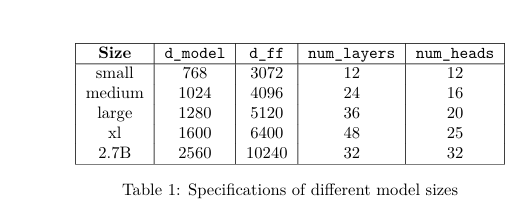
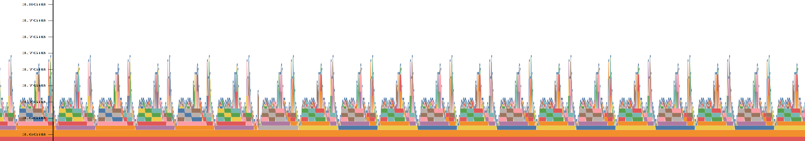
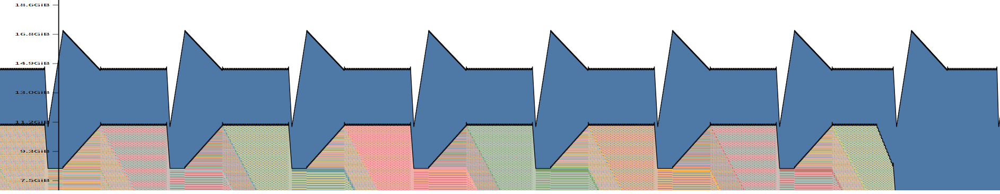
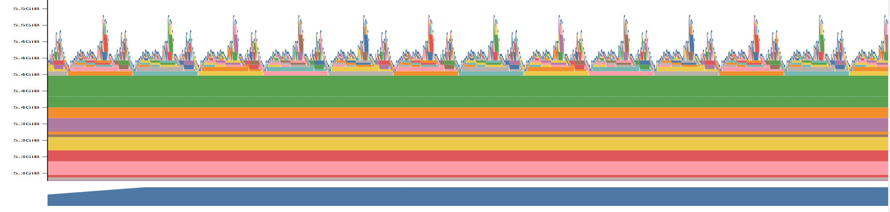
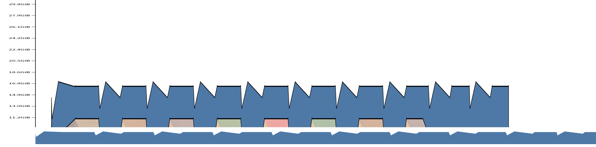
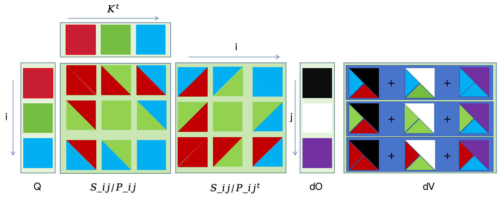
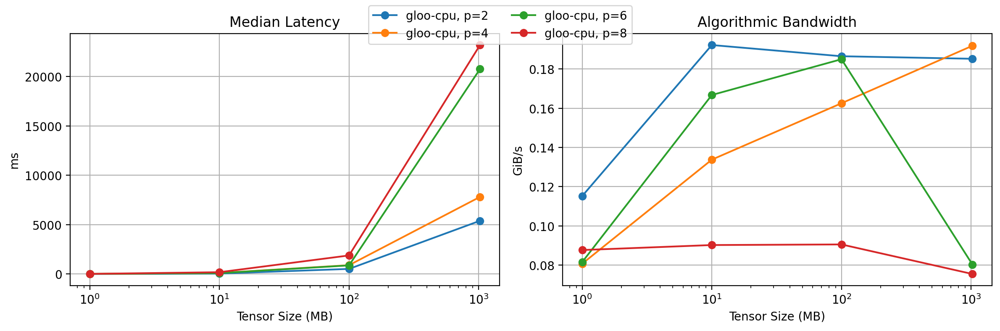
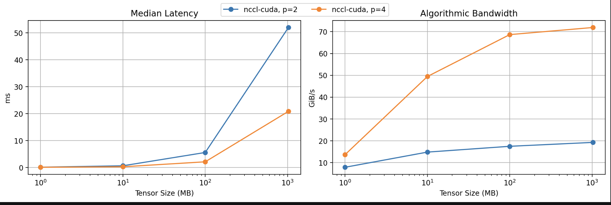

[Assignment 1]()

在上一个Assignment中，我们重头搭建了一个简单的大语言模型以及其训练到推理的全过程，在本节中，我们将进一步从计算机系统的角度，对其核心部件进行系统优化。

## 环境搭建

我们首先将仓库clone下来:

```bash
git clone https://github.com/stanford-cs336/assignment2-systems.git
```

然后其中有两个选择，一个是使用自己在Assignment1中实现的LM框架，另一个是使用课程提供的LM框架。这里建议使用自己的，更加熟悉一点。

若选用自己的LM框架，则需要在 `pyproject.toml` 中做一个简单的更改:

```toml
cs336-basics = { path = "./cs336-basics", editable = true }  # Change this path to your assignment1-basics repo you want to use your own implementation!
```

将这一行中的地址定位到你实现的LM框架即可。

搭建完毕后，可以通过下面的指令进行测试:

```text
uv run python
>>> import cs336_basics
```

若不报错，说明没有问题

## Benchmarking

在这一小节中，我们将进行模型的性能分析与基准测试。

具体而言，是如下三种性能评估路径：

- 简单的End to End基准测试，即使用Python标准库对前向和反向传播进行计时
- 计算性能分析，我们将使用NVIDIA Nsight Systems工具分析计算过程，了解时间是如何分布在CPU和GPU的各个操作上的。
- 内存使用分析：对内存使用情况进行性能分析

此外，我们使用的模型规模如下：

词表大小为：10,000

batch_size:4



### 简单的端到端基准测试

现在我们实现一个简单的性能评估脚本。由于我们会测试模型的多种变体(例如替换精度，替换层结构等)，因此我们考虑使用命令行参数的方式来支持这些变体，以便后续运行更加方便。

该测试只对模型进行性能分析：即对前向/反向传播进行计时

由于我们只测试速度和内存，因此可以使用随机权重和随机数据。这里在测试时需要特别注意：

对于GPU代码的基准测试，一个重要的注意点是:CUDA调用是异步的

也就是说，当我们调用一个CUDA Kernel时，函数会立即返回控制权，而不会等待Kernel真正执行完成。这样CPU可以继续执行其他的代码，而GPU在后台执行Kernel。

这意味着，如果我们直接测量这个Kernel调用返回所花费的时间，我们就不能得到GPU实际执行该操作的时间。

在Pytorch中，我们可以通过

```python
torch.cuda.synchronize()
```

该函数会等待所有 GPU kernel 执行完成，从而得到更准确的 CUDA kernel 运行时间。

具体的测试代码见代码仓库\~

下面展示本人测试的结果。(机器为RTX3090，显存大小为24G)

warmup_steps = 10

| Size | d_model | d_ff | num_layers | num_heads | Parameters | Forward (s) | Forward+Backward (s) | Peak Forward Mem (MiB) | Peak Train Mem (MiB) |
|-|-|-|-|-|-|-|-|-|-|
| small | 768 | 3072 | 12 | 12 | 128.625M | 0.023376 | 0.096487 | 1634.44 | 3170.83 |
| medium | 1024 | 4096 | 24 | 16 | 423.183M | 0.070973 | 0.284677 | 4934.53 | 8745.55 |
| large | 1280 | 5120 | 36 | 20 | 969.412M | 0.144661 | 0.603096 | 11503.8 | 18567.7 |
| xl | 1600 | 6400 | 48 | 25 | 1.998B | 0.2913 |  |  |  |
| 7B | 2560 | 10240 | 32 | 32 | 3.407B | 0.450041 |  |  |  |

### Nsight Systems Profile

上面的Benchmark测试不能反映在前向传播和反向传播过程中，模型的时间和显存究竟用在了哪些地方，因此我们也难以找到性能瓶颈从而找到具体的优化方法。

要了解程序在每个组件上花了多少时间，我们可以用Profiler。Profiler会在函数开始和结束时插入检测点，因此能够提供函数级别的详细执行统计信息，例如调用次数，平均耗时，在该函数上累计花费的时间等。

NVIDIA 提供了一个 profiler，我们可以通过命令行工具 `nsys` 来使用它。我们在本节将使用`nsys` 来分析 Transformer 模型的运行时间。

nsys的使用方法很直接：只要在上一小节的Python 脚本前加上nsys profile 即可。

例如，你可以对脚本 `benchmark.py` 进行分析，并将输出写入文件 `result.nsys.rep`：

```bash
~$ uv run nsys profile -o result python benchmark.py
```

随后，你可以在本地机器上使用 **NVIDIA Nsight Systems** 桌面应用查看这个 profile。

> 如果使用的是服务器环境，可以使用如下指令查看结果:
>
> `nsys stats --report nvtx_sum fwd_step_profile.nsys-rep`

在 profile 的 **CUDA API** 行中选择某个特定的 CUDA API 调用（CPU 侧），会高亮显示 **CUDA HW** 行中所有对应的 kernel 执行（GPU 侧）。

此外，我们可以用nvtx range对代码进行标注，这些标注会以块的形式显示在 profile 的 **NVTX** 行中，并涵盖其中所有的 CUDA API 调用及其对应的 kernel 执行。

具体而言，假设我们想针对 forward阶段进行profiling，那么我们可以:

```python
from contextlib import contextmanager
import torch.cuda.nvtx as nvtx

@contextmanager
def nvtx_range(name):
    nvtx.range_push(name)
    try:
        yield
    finally:
        nvtx.range_pop()
def benchmark_forward(model, x, warmup_steps, steps):
    model.eval()
    for _ in range(warmup_steps):
        with torch.no_grad():
            _ = model(x)
        torch.cuda.synchronize()

    start_time = timeit.default_timer()
    for _ in range(steps):
        with torch.no_grad():
            with nvtx_range("FWD_STEP"):
                _ = model(x)
        torch.cuda.synchronize()
    return (timeit.default_timer() - start_time) / steps
```

然后使用指令

```bash
nsys profile -t cuda,nvtx,cublas,cudnn,osrt \
  -o fwd_step_profile --force-overwrite=true \
  uv run python Train/end2end_bench.py --config Train/config.yaml
nsys stats --report nvtx_sum fwd_step_profile.nsys-rep
```

然后我们可以得到如下结果（SMALL模型）：

| Time (%) | Total Time (s) | Instances | Avg (s) | Med (s) | Min (s) | Max (s) | StdDev (s) | Style | Range |
|-|-|-|-|-|-|-|-|-|-|
| 46.4 | 6.0856754600 | 100 | 0.0608567546 | 0.0549357350 | 0.0489394220 | 0.0925647510 | 0.0101878140 | PushPop | `:BWD_STEP` |
| 22.8 | 2.9956320640 | 100 | 0.0299563206 | 0.0314317430 | 0.0211455360 | 0.0349865510 | 0.0035540577 | PushPop | `:FWD_STEP` |
| 21.8 | 2.8684238990 | 100 | 0.0286842390 | 0.0270241125 | 0.0252365100 | 0.0404667660 | 0.0039458590 | PushPop | `:OPTIM_STEP` |
| 6.7 | 0.8811120340 | 48396 | 0.0000182063 | 0.0000168720 | 0.0000067570 | 0.0023475050 | 0.0000141058 | PushPop | `cuBLAS:cublasLtSSSMatmul` |
| 2.1 | 0.2773034430 | 48396 | 0.0000057299 | 0.0000042410 | 0.0000020940 | 0.0593009870 | 0.0002695509 | PushPop | `cuBLAS:cublasLtSSSMatmulAlgoGetHeuristic` |
| 0.2 | 0.0197736070 | 2 | 0.0098868035 | 0.0098868035 | 0.0003988660 | 0.0193747410 | 0.0134179699 | PushPop | `cuBLAS:cublasCreate_v2` |

通过这个指令我们就可以知道FWD，BWD，OPT各个阶段花费的时间，可以看到与用Python Cli测试出来的时间存在一些微小的差异。

如果我们要看各个阶段占用GPU时间最长的CUDA Kernel的信息，如调用次数，我们可以采用这个指令:

```bash
nsys stats --report nvtx_kern_sum fwd_step_profile.nsys-rep | grep ':FWD_STEP'
```

在我们的实验中，ampere_sgemm_128x64_tn这个Kernel占用时间最长Total Time = 1,282,045,469 ns（约 1.282 s），调用次数为8500，这是一个矩阵乘法Kernel(GEMM)

假设我们想知道scaled_dot_product_attention中内部Softmax操作和矩阵乘法操作的运行时间，它们之间的运行时间差异，与Flops的差异，我们同样可以使用nvtx，具体而言，我们可以实现一个注释版的scale_dot_product_attention，然后做一个替换就行:

```python
def annotated_scaled_dot_product_attention(Q, K, V, mask=None):
    d_k = Q.shape[-1]
    with nvtx_range("ATTN_QK_MATMUL"):
        scores = torch.matmul(Q, K.transpose(-2, -1)) / math.sqrt(d_k)
    if mask is not None:
        scores = scores.masked_fill(~mask, float("-inf"))
    with nvtx_range("ATTN_SOFTMAX"):
        attn_weights = torch.softmax(scores, dim=-1)
    with nvtx_range("ATTN_AV_MATMUL"):
        return torch.matmul(attn_weights, V)

def install_annotated_attention():
    attention_module.run_scaled_dot_product_attention = annotated_scaled_dot_product_attention
```

然后像之前一样进行profiling就行，最后的结果为:

| Range | Total Time (s) | Instances | Avg (s) | Med (s) | Min (s) | Max (s) | StdDev (s) | Time (%) |
|-|-|-|-|-|-|-|-|-|
| `ATTN_QK_MATMUL` | 0.380551201 | 2664 | 0.0001428495 | 0.0001381315 | 0.000108449 | 0.000943515 | 0.0000377748 | 3.0 |
| `ATTN_AV_MATMUL` | 0.202245954 | 2664 | 0.0000759182 | 0.0000759685 | 0.000057080 | 0.000795635 | 0.0000197206 | 1.6 |
| `ATTN_SOFTMAX` | 0.083674056 | 2664 | 0.0000314092 | 0.0000260260 | 0.000019989 | 0.012475856 | 0.0002412466 | 0.7 |

### 混合精度

目前为止，我们一直都在使用FP32精度。然而现代的NVIDIA GPU 包含专门的 GPU 核心（**Tensor Cores**），用于在更低精度下加速矩阵乘法。例如，NVIDIA A100 的规格说明显示，它在 **FP32** 下的最大吞吐量是 **19.5 TFLOP/s**，而在 **FP16（半精度浮点）** 或 **BF16（brain floating point）** 下的最大吞吐量则高得多，可达 **312 TFLOP/s**。因此，使用更低精度的数据类型应当有助于加速训练和推理。

不过，如果只是简单地把模型直接转换成更低精度格式，可能会带来模型精度下降的问题。

例如，实际中的许多梯度值往往太小，无法用 FP16 表示，因此在直接用 FP16 训练时会变成 0。

为了解决这个问题，在使用 FP16 训练时，通常会采用 **loss scaling（损失缩放）**：即把 loss 乘上一个缩放因子，从而增大梯度幅值，避免它们下溢为 0。

此外，FP16 的动态范围比 FP32 更小，也可能导致数值溢出，表现为 loss 变成 `NaN`。

完整使用 **BF16** 训练通常会更稳定，因为 **BF16 与 FP32 具有相同的动态范围**；不过，与 FP32 相比，它仍然可能影响模型的最终性能。

为了同时利用低精度数据类型带来的速度提升，又尽量避免数值问题，通常会采用 **混合精度训练（mixed-precision training）**。在 PyTorch 中，这通过 `torch.autocast` 上下文管理器实现。

在这种模式下，某些操作（例如矩阵乘法）会使用较低精度执行，而另一些需要 FP32 完整动态范围的操作（例如累加和归约）则保持原样。

例如，下面的代码会在前向传播过程中自动识别哪些操作适合使用低精度，并将这些操作转换到指定的数据类型：

```python
model: torch.nn.Module = ...   # 例如你的 Transformer 模型
dtype: torch.dtype = ...       # 例如 torch.float16
x: torch.Tensor = ...          # 输入数据

with torch.autocast(device="cuda", dtype=dtype):
    y = model(x)
```

根据实验指导书，我们对一个ToyModel使用autocast来看看各个输出的类型，具体代码如下:

```python
class ToyModel(nn.Module):
    def __init__(self,in_features,out_features):
        super().__init__()
        self.fc1 = nn.Linear(in_features, 10, bias=False)
        self.ln = nn.LayerNorm(10)
        self.fc2 = nn.Linear(10, out_features, bias=False)
        self.relu = nn.ReLU()
    def forward(self,x):
        x = self.relu(self.fc1(x))
        print(f"fc1 output dtype: {x.dtype}")
        x = self.ln(x)
        print(f"LayerNorm output dtype: {x.dtype}")
        x = self.fc2(x)
        return x
def example2():
    model = ToyModel(20, 5).cuda()
    x = torch.randn(4, 20).cuda()
    y = torch.randint(0, 5, (4,)).cuda()
    with torch.autocast(device_type='cuda', dtype=torch.float16):
        logits = model(x)
        print(f"Final output dtype: {logits.dtype}")
        loss = nn.CrossEntropyLoss()(logits, y)
        print(f"Loss dtype: {loss.dtype}")
        loss.backward()
        print(f"Gradients dtype: {model.fc1.weight.grad.dtype}")
```

最后的输出为:

```text
fc1 output dtype: torch.float16
LayerNorm output dtype: torch.float32
Final output dtype: torch.float16
Loss dtype: torch.float32
Gradients dtype: torch.float32
```

### Memory Profiling

我们现在来看看内存，pytorch自带了一个功能强大的内存分析器，它可以持续追踪一段时间内的内存分配情况。

使用方法也很简单：

```python
# ... 你的 benchmarking script 中的 warm-up 阶段

# 开始记录内存历史
torch.cuda.memory._record_memory_history(max_entries=1000000)

# ... 你的 benchmarking script 中想要分析的部分

# 保存一个 pickle 文件，以便加载到 PyTorch 的在线工具中
torch.cuda.memory._dump_snapshot("memory_snapshot.pickle")

# 停止记录历史
torch.cuda.memory._record_memory_history(enabled=None)
```

这会输出一个名为 `memory_snapshot.pickle` 的文件，你可以把它加载到下面这个在线工具中：
`https://pytorch.org/memory_viz`

这个工具可以让你查看**整体内存使用时间线**，以及**每一次单独的内存分配**，包括它的大小和一条栈追踪（stack trace），从而定位这块内存分配源自哪段代码。要使用这个工具，你需要在浏览器中打开上面的链接，然后把你的 Pickle 文件拖放到页面中。

我们接下来看看在large模型中，在上下文为256时，forward pass，backward pass和optimizer step的内存使用情况。





从图中我们可以明显看到显存峰值，在FWD阶段大约是3.8GiB，而在TRAIN的话则会来到16GB

接下来我们看看在MIX_precision(BF16)的情况下的显存变化





可以发现一个奇怪的点在于开启了混合精度后，显存峰值不但没减小，反而更大了，这令人有点匪夷所思。

但是这其实是因为AMP 只会减少部分激活显存；参数和 AdamW 状态仍主要是 FP32，所以如果 batch 不大，节省不明显甚至被额外开销盖过。（在1.3中我们有输出过数据的type）

而autocast缓存会带来额外的开销，从而导致节省的内存不如额外的开销，从而带来混合精度占用更多内存的感觉。

## Attention的优化-- FlashAttention2

### Attention Benchmark

在进入具体的优化之前我们做了一个基本的测试，对单头的 causal self-attention 做端到端基准测试，固定 batch size 为 8，然后遍历 d_model 和 seq_len 的所有组合。对每个配置，它会先做 warmup，再执行 100 次 forward 并统计平均耗时，然后执行 100 次 backward 并统计平均耗时，同时在 backward 开始前采样显存，并分别记录 forward 和 backward 阶段的峰值显存。如果某个配置触发 out-of-memory，会把该配置标记为 OOM 后继续跑后续配置，最后把所有配置的时间和显存结果统一汇总成一个 Markdown 表格输出。

| d_model | seq_len | fwd_ms | bwd_ms | fwd_peak_mem_mib | bwd_mem_before_backward_mib | bwd_peak_mem_mib | status |
|-|-|-|-|-|-|-|-|
| 16 | 256 | 0.98 | 6.71 | 15.17 | 21.28 | 29.23 | ok |
| 16 | 1024 | 1.52 | 9.04 | 117.92 | 85.42 | 212.92 | ok |
| 16 | 4096 | 12.55 | 37.81 | 1598.91 | 1072.91 | 3118.91 | ok |
| 16 | 8192 | 46.48 | 143.74 | 6317.57 | 4209.57 | 12397.6 | ok |
| 16 | 16384 |  |  |  |  |  | oom |
| 32 | 256 | 1.25 | 7.3 | 24.2 | 22.39 | 30.14 | ok |
| 32 | 1024 | 1.63 | 9.51 | 121.49 | 89.49 | 216.5 | ok |
| 32 | 4096 | 12.58 | 38.35 | 1613.17 | 1089.17 | 3133.18 | ok |
| 32 | 8192 | 47.4 | 146.02 | 6346.08 | 4242.08 | 12426.1 | ok |
| 32 | 16384 |  |  |  |  |  | oom |
| 64 | 256 | 1.01 | 5.89 | 26.03 | 24.46 | 31.98 | ok |
| 64 | 1024 | 1.62 | 9.51 | 128.66 | 97.66 | 223.68 | ok |
| 64 | 4096 | 12.98 | 39.55 | 1641.72 | 1121.72 | 3161.74 | ok |
| 64 | 8192 | 48.63 | 149.26 | 6403.12 | 4307.13 | 12483.1 | ok |
| 64 | 16384 |  |  |  |  |  | oom |
| 128 | 256 | 0.98 | 9.25 | 29.78 | 28.71 | 35.78 | ok |
| 128 | 1024 | 1.55 | 9.29 | 143.1 | 114.1 | 238.17 | ok |
| 128 | 4096 | 14.15 | 42.6 | 1698.91 | 1186.91 | 3218.97 | ok |
| 128 | 8192 | 53 | 159.16 | 6517.31 | 4437.31 | 12597.4 | ok |
| 128 | 16384 |  |  |  |  |  | oom |

除此以外，自 **PyTorch 2.0** 起，PyTorch 还内置了一个强大的 **即时编译器（just-in-time compiler）**，它会自动尝试对 PyTorch 函数应用多种优化。

特别地，它会通过动态分析你的计算图，自动尝试生成**融合后的 Triton kernel**。
 使用 PyTorch 编译器的接口非常简单。例如，如果我们想把它应用到模型中的某一层，可以这样写：

```python
layer = SomePyTorchModule(...)
compiled_layer = torch.compile(layer)
```

现在，`compiled_layer` 在功能上与 `layer` 完全一致（例如，它的 forward 和 backward 行为相同）。

我们也可以用 `torch.compile(model)` 来编译整个 PyTorch 模型，甚至也可以编译一个调用了 PyTorch 操作的 Python 函数。

我们用上面介绍的即时编译器对我们的attention重新做了一次Benchmark，实验配置与之前一致，唯一不同在于使用的Attention是compile过后的。结果如下：

| d_model | seq_len | fwd_ms | bwd_ms | fwd_peak_mem_mib | bwd_mem_before_backward_mib | bwd_peak_mem_mib | status |
|-|-|-|-|-|-|-|-|
| 16 | 256 | 1.28 | 7.34 | 15.17 | 21.28 | 29.23 | ok |
| 16 | 1024 | 1.64 | 9.23 | 117.92 | 85.42 | 212.92 | ok |
| 16 | 4096 | 12.54 | 37.93 | 1598.91 | 1072.91 | 3118.91 | ok |
| 16 | 8192 | 46.49 | 143.7 | 6317.57 | 4209.57 | 12397.6 | ok |
| 16 | 16384 |  |  |  |  |  | oom |
| 32 | 256 | 1.26 | 8.7 | 24.2 | 22.39 | 30.14 | ok |
| 32 | 1024 | 1.62 | 8.86 | 121.49 | 89.49 | 216.5 | ok |
| 32 | 4096 | 12.7 | 38.46 | 1613.17 | 1089.17 | 3133.18 | ok |
| 32 | 8192 | 47.29 | 146.08 | 6346.08 | 4242.08 | 12426.1 | ok |
| 32 | 16384 |  |  |  |  |  | oom |
| 64 | 256 | 1.05 | 6.77 | 26.03 | 24.46 | 31.98 | ok |
| 64 | 1024 | 1.65 | 8.73 | 128.66 | 97.66 | 223.68 | ok |
| 64 | 4096 | 12.93 | 39.44 | 1641.72 | 1121.72 | 3161.74 | ok |
| 64 | 8192 | 48.62 | 149.38 | 6403.12 | 4307.13 | 12483.1 | ok |
| 64 | 16384 |  |  |  |  |  | oom |
| 128 | 256 | 1.01 | 8.77 | 29.78 | 28.71 | 35.78 | ok |
| 128 | 1024 | 1.54 | 8.77 | 143.1 | 114.1 | 238.17 | ok |
| 128 | 4096 | 14.09 | 42.53 | 1698.91 | 1186.91 | 3218.97 | ok |
| 128 | 8192 | 52.98 | 159.19 | 6517.31 | 4437.31 | 12597.4 | ok |
| 128 | 16384 |  |  |  |  |  | oom |

可以看到，虽然在较小的模型上，性能有所衰减，但是随着模型增大，带来的性能提升便逐渐开始显现。

我们在我们的End2End的Benchmark上进行一下测试，我们直接将整个Transformer模型进行编译，得到下表:

| Forward (s) | Forward+Backward (s) |
|-|-|
| 0.140853 | 0.578436 |

| Forward (s) | Forward+Backward (s) |
|-|-|
| 0.12706 | 0.578973 |

可以看到优势在Forward上还是很显著的。

### Triton编程

这一小节实际上是Assignment 2的核心，也是是否能够理解FlashAttention的关键。因此我将这一小节的内容用markdown的形式进行了留档，更新至博客，见下面这篇：

[Triton]()

### FlashAttention V2

#### High level

在学习完Triton编程的基础，并解决了Triton Puzzles中的所有问题后，我们已经对Triton编程，特别是Block Pointer的用法有了一个清晰的认知，并对Online Softmax有了一个初步的了解，在此基础上，我们接下来将实现一个完整的FlashAttention的Forward和Backward流程，并将我们在Assignment1中的Attention用这个Triton算子进行替换。

我们先简单回顾一下Attention操作，并理解其低效之处。

Attention的前向传播过程可以写作:

$$
S = \frac{QK^\top}{\sqrt{d}}\\P_{ij} = \text{softmax}_j(S)_{ij}\\O=PV
$$

其标准的反向传播过程可以写作:

$$
dV = P^\top dO\quad dP = dO V^\top\\dS_i = d\text{softmax}(dP_i)=(\text{diag}(P_i) - P_iP_i^\top)dP_i\\dQ = \frac{dS K}{\sqrt{d}} \quad dK = \frac{dS^\top Q}{\sqrt{d}}
$$

正如我们可以看到的，反向传播依赖于前向传播中的一些非常大的激活值矩阵。例如上式中计算dV需要用到P,而P的形状为`(batch_size,n_heads,seq_len,seq_len)`的Attention Score。这个激活值矩阵的大小随序列长度呈现二次增长，这也解释了我们之前在对长序列进行Attention Benchmark时需要的OOM问题。

在普通 attention 的前向和反向传播中，我们都要付出显著的内存 I/O 成本，用于在片上 SRAM 和 GPU HBM 之间传输 P 以及其他大型激活值。标准实现中会进行多次这类传输。

那么我们实现的FlashAttention的主要目标就是避免将Attention矩阵写入和读出HBM，从而减少I/O和显存峰值开销。

我们将通过三种技术来实现这一点:

- 分块:为了避免将attention矩阵写入和读出HBM，我们需要在无法访问完整输入的情况下完成softmax归约。具体来说，我们会重构Attention的计算方式，把输入拆分为多个tile，并对这些块进行多次访问遍历，从而以增量的形式执行Softmax的规约
- 重计算：我们避免在HBM中存储`(batch_size,n_heads,seq_len,seq_len)`的大型中间注意力矩阵。取而代之的是，我们会在HBM中保存某些“激活检查点”，然后在反向传播时重新计算前向传播的一部分过程，以恢复计算梯度所需的其他激活值。FlashAttention-2还会存储注意力分数的logsumexp记作`L`,它将用于简化反向传播计算。`L`的表达式为:$L_i = \log(\sum_j \exp(S_{ij}))$.在最终的Kernel中，我们将以Online的方式计算它，但最终的结果应当保持一致。通过结合分块和重计算，我们的内存IO和峰值内存将不再依赖于`Seq_len^2`,因此可以支持更长的序列长度。
- 算子融合：最后我们通过在单个Kernel中完成操作，避免对注意力矩阵以及其他中间激活进行重复的内存IO。我们将编写一个单独的 Triton kernel 来执行前向传播，在注意力机制涉及的所有操作中，尽量减少 HBM 与 SRAM 之间的数据传输。算子融合部分得益于重计算，因为这样我们可以避免将每个中间激活都写入 HBM 所产生的常规内存 IO 开销。

下面简单介绍一下带重计算的BackWard Pass。

借助`L`，我们可以进行适当的重计算，并高效地完成反向传播。在开始反向传播之前，我们会先在全局内存中预计算数值

$$
D=\text{rowsum}(O\odot dO)
$$

其中 $\odot$为逐元素乘法。由于: $\text{rowsum}(P\odot dP)=D$,这是因为

$$
PdP^\top = P(dOV^\top)^\top = (PV)dO^\top =OdO^\top
$$

且，对于任意矩阵有 $\text{rowsum}(A\odot B) = \text{diag}(AB^\top)$

有了向量L和D后，反向传播的过程可以在不显式执行softmax的情况下完成。此时，完整的反向传播计算过程如下。

$$
S = \frac{QK^\top}{\sqrt{d}},P_{ij}=\exp(S_{ij}-L_i)\\dV = P^\top dO,dP=dOV^\top \\dS_{ij}=P_{ij}\odot (dP_{ij}-D_i)\\dQ=dSK/\sqrt{d},dK = dS^\top Q/\sqrt{d}
$$

可以看到，这一系列操作并不要求我们在前向传播期间将注意力分数 P 存储在 HBM 中.

#### Forward Pass

现在我们已经对FlashAttention v2有了一个High Level的认知，接下来我们来实现具体的Kernel

为了避免将注意力矩阵在HBM中来回读写，我们希望采用tile，也就是让每个tile都能够独立于其他tile进行运算。这要求我们能够计算P的各个tile，并且最好能够在两个维度上都进行分块（query和key）。

然而，当我们对S应用softmax时，需要对S的整行进行规约，以计算Softmax的分母。这意味着我们不能直接按tile独立计算P。我们可以通过Online Softmax来解决这个问题。

在下面的描述中，我们用下标i来表示当前的query tile，用上标j来表示当前的key tile。沿query维度的tile大小为B_q,沿key维度的tile大小为B_k。我们不会沿隐藏维度d进行分块。

我们还会维护一些中间值: $m_i^{(j)}\in \mathbb{R}^{B_q},l_i^{(j)}\in \mathbb{R}^{B_q}$

其中前者表示运行中的最大值，我们跟踪它是为了能够以数值稳定的方式计算 softmax ；每当我们处理一个新的S的按行tile（即j增加时），我们都会更新它。

借助这个最大值，我们可以计算未归一化的softmax值（即分子）： $P_i^{(j)} = \exp(S_{ij}-m_i^{(j)})\cdot l_i^{(j)}$

而后者则是softmax分母的一个运行代理值，它会利用这些未归一化的softmax值进行更新。最终当我们写出输出结果时，还需要用它来进行归一化。

我们首先实现一版用torch来模拟的FlashAttention v2

代码如下：

```python
def forward(ctx,Q,K,V,is_causal=False):
        batch_size,seq_len,d_model = Q.shape
        device = Q.device
        dtype = Q.dtype
        # S = torch.zeros(batch_size,TILE_SIZE,TILE_SIZE)
        sqrt_d = math.sqrt(d_model)
        O = torch.zeros(batch_size,seq_len,d_model,dtype=dtype,device=device)
        L = torch.zeros(batch_size,seq_len,dtype=dtype,device=device)
        for i in range(0,seq_len // TILE_SIZE):
            m = torch.full((batch_size,TILE_SIZE),float("-inf"),device=device)
            l = torch.zeros(batch_size,TILE_SIZE,dtype=dtype,device=device)
            B_q = Q[:,i*TILE_SIZE:(i + 1) * TILE_SIZE,:]
            for j in range(0,seq_len // TILE_SIZE):
                B_k = K[:,j * TILE_SIZE:(j + 1) * TILE_SIZE,:]
                S = einsum(B_q,B_k,"... B_q d,... B_k d -> ... B_q B_k") / sqrt_d
                last_m,last_l = m.clone(),l.clone()
                m = torch.maximum(m,torch.amax(S,dim=2))
                l = last_l * torch.exp(last_m - m) + torch.sum(torch.exp(S - m[:,:,None]),dim=2) 
                S = torch.exp(S - m[:,:,None])
                O[:,i*TILE_SIZE:(i+1)*TILE_SIZE,:] = O[:,i*TILE_SIZE:(i+1)*TILE_SIZE,:] * torch.exp(last_m - m).unsqueeze(-1) + einsum(S,V[:,j*TILE_SIZE:(j+1)*TILE_SIZE,:],"... B_q B_k,... B_k d_model->... B_q d_model")
            O[:,i*TILE_SIZE:(i+1)*TILE_SIZE,:] = O[:,i*TILE_SIZE:(i+1)*TILE_SIZE,:] / l.unsqueeze(-1)
            L[:,i*TILE_SIZE:(i+1)*TILE_SIZE] = torch.log(l) + m
        ctx.save_for_backward(L,Q,K,V,O)
        return O
```

在实现的时候，可能会因为i和j晕头转向，因此推荐用纸和笔画一下Q，K，V，S，O之间的对应关系。

实现了Torch版本的forward pass之后实现Triton版本的就不是很困难了，我们只需要将在torch中对i维度想象成并行的就行。然后框架上，我们参考一下Weighted Sum的实现即可。

完整的Triton代码等到最后FWD+BWD一起实现了再进行展示。

#### Backward Pass

我们接下来实现一下Backward Pass。我们回顾一下之前在High Level中介绍的Backward的计算流程（带重计算）

$$
S = \frac{QK^\top}{\sqrt{d}},P_{ij}=\exp(S_{ij}-L_i)\\dV = P^\top dO,dP=dOV^\top \\dS_{ij}=P_{ij}\odot (dP_{ij}-D_i)\\dQ=dSK/\sqrt{d},dK = dS^\top Q/\sqrt{d}
$$

这部分我们同样通过分块进行，从而避免直接计算出大小为`Batch_size x N_q x Nk`的注意力分数。

分块的大小和Forward Pass统一。为了方便理解，我画了一些图。（这也是我写Triton算子时的一个小习惯，可以让思路更加清晰）



相信你从上面这个图能对这个分块运算有了更加直观的认识，对于dP，dS，dQ，dK的计算和dV的分块逻辑类似，不再过多赘述，还是一样，建议在写代码之前在纸上画一下上面这样的块图。

代码如下：

```python
def backward(ctx,grad_output):
        L,Q,K,V,O = ctx.saved_tensors
        batch_size,N_QUERIES,d_model = Q.shape
        _,N_KEYS,_ = K.shape
        scale = 1.0 / (d_model ** 0.5)
        dQ = torch.zeros_like(Q)
        dK = torch.zeros_like(K)
        dV = torch.zeros_like(V)
        D = torch.sum(grad_output * O,dim=2)
        for i in range(0,N_QUERIES // TILE_SIZE):
            Q_b = Q[:,i*TILE_SIZE:(i+1)*TILE_SIZE,:]
            L_b  =L[:,i*TILE_SIZE:(i+1)*TILE_SIZE]
            dO_b = grad_output[:,i*TILE_SIZE:(i+1)*TILE_SIZE,:]
            D_b = D[:,i*TILE_SIZE:(i+1)*TILE_SIZE]
            for j in range(0,N_KEYS // TILE_SIZE):
                K_b = K[:,j * TILE_SIZE:(j + 1) * TILE_SIZE,:]
                V_b = V[:,j*TILE_SIZE:(j+1)*TILE_SIZE,:]
                P_ij = torch.exp(torch.matmul(Q_b,K_b.transpose(-1,-2)) * scale - L_b[:,:,None])
                dV[:,j*TILE_SIZE:(j+1)*TILE_SIZE,:] += torch.matmul(P_ij.transpose(-1,-2),dO_b)
                dP_ij = torch.matmul(dO_b,V_b.transpose(-1,-2))
                dS_ij = P_ij * (dP_ij - D_b[:,:,None])
                dQ[:,i*TILE_SIZE:(i+1)*TILE_SIZE,:] += torch.matmul(dS_ij,K_b) * scale
                dK[:,j*TILE_SIZE:(j+1)*TILE_SIZE,:] += torch.matmul(dS_ij.transpose(-1,-2),Q_b) * scale
        return dQ,dK,dV,None
```

我们在用Triton实现的时候我们需要注意一个事情，就是dQ和dK，dV的计算要分为两个Phase，这是因为累计的方向不一致。

在计算dQ时，我们需要固定Q_block,遍历所有的K/V block，然后累计dQ

在计算dK，dV时，我们则需要固定K_Block,V_block,遍历所有的Q_Block,然后累计dK和dV

意思是我们需要重计算两遍P，从而提高并行度并减少不必要的通信和同步开销。

接下来给出完整的Triton实现的FlashAttention-2

```python
import triton
import triton.language as tl
import math

import torch
Q_TILE_SIZE = 16
K_TILE_SIZE = 16
@triton.jit
def flash_fwd_kernel(
    Q_ptr,K_ptr,V_ptr,
    O_ptr,L_ptr,
    stride_qb, stride_qq, stride_qd,
    stride_kb, stride_kk, stride_kd,
    stride_vb, stride_vk, stride_vd,
    stride_ob, stride_oq, stride_od,
    stride_lb, stride_lq,
    N_QUERIES, N_KEYS,
    scale,
    D: tl.constexpr,
    Q_TILE_SIZE: tl.constexpr,
    K_TILE_SIZE: tl.constexpr,
    is_causal: tl.constexpr,
):
    query_tile_index = tl.program_id(0)
    batch_index = tl.program_id(1)
    Q_block_ptr = tl.make_block_ptr(
        base = Q_ptr + batch_index * stride_qb,
        shape = (N_QUERIES,D),
        strides = (stride_qq,stride_qd),
        offsets = (query_tile_index * Q_TILE_SIZE,0),
        block_shape = (Q_TILE_SIZE,D),
        order = (1,0),
    )
    K_block_ptr = tl.make_block_ptr(
        base = K_ptr + batch_index * stride_kb,
        shape = (N_KEYS,D),
        strides = (stride_kk,stride_kd),
        offsets = (0,0),
        block_shape = (K_TILE_SIZE,D),
        order = (1,0),
    )
    V_block_ptr = tl.make_block_ptr(
        base = V_ptr + batch_index * stride_vb,
        shape = (N_KEYS,D),
        strides = (stride_vk,stride_vd),
        offsets = (0,0),
        block_shape = (K_TILE_SIZE,D),
        order =(1,0),
    )
    L_block_ptr = tl.make_block_ptr(
        base = L_ptr + batch_index * stride_lb,
        shape = (N_QUERIES,),
        strides = (stride_lq,),
        offsets = (query_tile_index * Q_TILE_SIZE,),
        block_shape = (Q_TILE_SIZE,),
        order = (0,),
    )
    O_block_ptr = tl.make_block_ptr(
        base = O_ptr + batch_index * stride_ob,
        shape = (N_QUERIES,D),
        strides = (stride_oq,stride_od),
        offsets = (query_tile_index * Q_TILE_SIZE,0),
        block_shape = (Q_TILE_SIZE,D),
        order = (1,0),
    )
    
    m = tl.full((Q_TILE_SIZE,),float("-inf"),dtype=tl.float32)
    l = tl.zeros((Q_TILE_SIZE,),dtype = tl.float32)
    O = tl.zeros((Q_TILE_SIZE,D),dtype=tl.float32)
    B_q = tl.load(Q_block_ptr,boundary_check=(0,1),padding_option="zero")
    for j in range(tl.cdiv(N_KEYS,K_TILE_SIZE)):
        B_k = tl.load(K_block_ptr,boundary_check=(0,1),padding_option="zero")
        B_v = tl.load(V_block_ptr,boundary_check=(0,1),padding_option="zero")
        S = tl.dot(B_q,tl.trans(B_k)) * scale
        if is_causal:
            q_idx = query_tile_index * Q_TILE_SIZE + tl.arange(0,Q_TILE_SIZE)
            k_idx = j * K_TILE_SIZE + tl.arange(0,K_TILE_SIZE)
            causal_mask = q_idx[:,None] < k_idx[None,:]
            S = tl.where(causal_mask,float("-inf"),S)
        last_m,last_l = m,l
        m = tl.maximum(last_m,tl.max(S,axis=1))
        S_ = tl.exp(S - m[:,None])
        l = last_l * tl.exp(last_m - m) + tl.sum(S_,axis=1)
        O = tl.dot(S_.to(B_v.dtype),B_v,acc=O * tl.exp(last_m - m)[:,None])
        K_block_ptr = tl.advance(K_block_ptr,(K_TILE_SIZE,0))
        V_block_ptr = tl.advance(V_block_ptr,(K_TILE_SIZE,0))
    O = O / l[:,None]
    L = tl.log(l) + m
    tl.store(O_block_ptr, O.to(O_block_ptr.type.element_ty), boundary_check=(0, 1))
    tl.store(L_block_ptr,L,boundary_check=(0,))

@triton.jit
def flash_bwd_kernel_phase1(
    Q_ptr,K_ptr,V_ptr,L_ptr,O_ptr,
    dO_ptr,dQ_ptr,
    stride_qb,stride_qq,stride_qd,
    stride_kb,stride_kk,stride_kd,
    stride_vb,stride_vk,stride_vd,
    stride_lb,stride_lq,
    stride_ob,stride_oq,stride_od,
    stride_dOb,stride_dOq,stride_dOd,
    N_QUERIES,N_KEYS,
    scale,
    D:tl.constexpr,
    Q_TILE_SIZE: tl.constexpr,
    K_TILE_SIZE: tl.constexpr,
    is_causal: tl.constexpr,
):
    query_tile_index = tl.program_id(0)
    batch_index = tl.program_id(1)
    Q_block_ptr = tl.make_block_ptr(
        base = Q_ptr + batch_index * stride_qb,
        shape = (N_QUERIES,D),
        strides = (stride_qq,stride_qd),
        offsets = (query_tile_index * Q_TILE_SIZE,0),
        block_shape = (Q_TILE_SIZE,D),
        order = (1,0),
    )
    K_block_ptr = tl.make_block_ptr(
        base = K_ptr + batch_index * stride_kb,
        shape = (N_KEYS,D),
        strides = (stride_kk,stride_kd),
        offsets = (0,0),
        block_shape = (K_TILE_SIZE,D),
        order = (1,0),
    )
    V_block_ptr = tl.make_block_ptr(
        base = V_ptr + batch_index * stride_vb,
        shape = (N_KEYS,D),
        strides = (stride_vk,stride_vd),
        offsets = (0,0),
        block_shape = (K_TILE_SIZE,D),
        order =(1,0),
    )
    L_block_ptr = tl.make_block_ptr(
        base = L_ptr + batch_index * stride_lb,
        shape = (N_QUERIES,),
        strides = (stride_lq,),
        offsets = (query_tile_index * Q_TILE_SIZE,),
        block_shape = (Q_TILE_SIZE,),
        order = (0,),
    )
    O_block_ptr = tl.make_block_ptr(
        base = O_ptr + batch_index * stride_ob,
        shape = (N_QUERIES,D),
        strides = (stride_oq,stride_od),
        offsets = (query_tile_index * Q_TILE_SIZE,0),
        block_shape = (Q_TILE_SIZE,D),
        order = (1,0),
    )
    dO_block_ptr = tl.make_block_ptr(
        base = dO_ptr + batch_index * stride_dOb,
        shape = (N_QUERIES,D),
        strides = (stride_dOq,stride_dOd),
        offsets = (query_tile_index * Q_TILE_SIZE,0),
        block_shape = (Q_TILE_SIZE,D),
        order = (1,0),
    )
    dQ_block_ptr = tl.make_block_ptr(
        base = dQ_ptr + batch_index * stride_qb,
        shape = (N_QUERIES,D),
        strides = (stride_qq,stride_qd),
        offsets = (query_tile_index * Q_TILE_SIZE,0),
        block_shape = (Q_TILE_SIZE,D),
        order = (1,0)
    )
    B_dO = tl.load(dO_block_ptr,boundary_check=(0,1),padding_option="zero")
    O = tl.load(O_block_ptr,boundary_check=(0,1),padding_option="zero")
    D0 = tl.sum(B_dO * O,axis=1)
    B_q = tl.load(Q_block_ptr,boundary_check=(0,1),padding_option="zero")
    B_l = tl.load(L_block_ptr,boundary_check=(0,),padding_option="zero")
    dQ = tl.zeros((Q_TILE_SIZE,D),dtype=tl.float32)
    for j in range(tl.cdiv(N_KEYS,K_TILE_SIZE)):
        B_k = tl.load(K_block_ptr,boundary_check=(0,1),padding_option="zero")
        B_v = tl.load(V_block_ptr,boundary_check=(0,1),padding_option="zero")
        S_ij = tl.dot(B_q,B_k.T) * scale
        if is_causal:
            q_idx = query_tile_index * Q_TILE_SIZE + tl.arange(0,Q_TILE_SIZE)
            k_idx = j * K_TILE_SIZE + tl.arange(0,K_TILE_SIZE)
            causal_mask = q_idx[:,None] < k_idx[None,:]
            S_ij = tl.where(causal_mask,float("-inf"),S_ij)
        P_ij = tl.exp(S_ij - B_l[:,None])
        dP_ij = tl.dot(B_dO,B_v.T)
        dS_ij = P_ij * (dP_ij - D0[:,None])
        dQ += tl.dot(dS_ij,B_k) * scale
        K_block_ptr = tl.advance(K_block_ptr,(K_TILE_SIZE,0))
        V_block_ptr = tl.advance(V_block_ptr,(K_TILE_SIZE,0))
    tl.store(dQ_block_ptr,dQ.to(dQ_block_ptr.type.element_ty),boundary_check=(0,1))

@triton.jit
def flash_bwd_kernel_phase2(
    Q_ptr,K_ptr,V_ptr,L_ptr,O_ptr,
    dO_ptr,dK_ptr,dV_ptr,
    stride_qb,stride_qq,stride_qd,
    stride_kb,stride_kk,stride_kd,
    stride_vb,stride_vk,stride_vd,
    stride_lb,stride_lq,
    stride_ob,stride_oq,stride_od,
    stride_dOb,stride_dOq,stride_dOd,
    N_QUERIES,N_KEYS,
    scale,
    D:tl.constexpr,
    Q_TILE_SIZE:tl.constexpr,
    K_TILE_SIZE:tl.constexpr,
    is_causal:tl.constexpr,
):
    key_tile_index = tl.program_id(0)
    batch_index = tl.program_id(1)
    Q_block_ptr = tl.make_block_ptr(
        base = Q_ptr + batch_index * stride_qb,
        shape = (N_QUERIES,D),
        strides = (stride_qq,stride_qd),
        offsets = (0,0),
        block_shape = (Q_TILE_SIZE,D),
        order = (1,0),
    )
    K_block_ptr = tl.make_block_ptr(
        base = K_ptr + batch_index * stride_kb,
        shape = (N_KEYS,D),
        strides = (stride_kk,stride_kd),
        offsets = (key_tile_index * K_TILE_SIZE,0),
        block_shape = (K_TILE_SIZE,D),
        order = (1,0),
    )
    V_block_ptr = tl.make_block_ptr(
        base = V_ptr + batch_index * stride_vb,
        shape = (N_KEYS,D),
        strides = (stride_vk,stride_vd),
        offsets = (key_tile_index * K_TILE_SIZE,0),
        block_shape = (K_TILE_SIZE,D),
        order =(1,0),
    )
    L_block_ptr = tl.make_block_ptr(
        base = L_ptr + batch_index * stride_lb,
        shape = (N_QUERIES,),
        strides = (stride_lq,),
        offsets = (0,),
        block_shape = (Q_TILE_SIZE,),
        order = (0,),
    )
    O_block_ptr = tl.make_block_ptr(
        base = O_ptr + batch_index * stride_ob,
        shape = (N_QUERIES,D),
        strides = (stride_oq,stride_od),
        offsets = (0,0),
        block_shape = (Q_TILE_SIZE,D),
        order = (1,0),
    )
    dO_block_ptr = tl.make_block_ptr(
        base = dO_ptr + batch_index * stride_dOb,
        shape = (N_QUERIES,D),
        strides = (stride_dOq,stride_dOd),
        offsets = (0,0),
        block_shape = (Q_TILE_SIZE,D),
        order = (1,0),
    )
    dK_block_ptr = tl.make_block_ptr(
        base = dK_ptr + batch_index * stride_kb,
        shape = (N_KEYS,D),
        strides = (stride_kk,stride_kd),
        offsets = (key_tile_index * K_TILE_SIZE,0),
        block_shape = (K_TILE_SIZE,D),
        order = (1,0)
    )
    dV_block_ptr = tl.make_block_ptr(
        base = dV_ptr + batch_index * stride_vb,
        shape = (N_KEYS,D),
        strides = (stride_vk,stride_vd),
        offsets = (key_tile_index * K_TILE_SIZE,0),
        block_shape = (K_TILE_SIZE,D),
        order = (1,0)
    )
    B_k = tl.load(K_block_ptr,boundary_check=(0,1),padding_option="zero")
    B_v = tl.load(V_block_ptr,boundary_check=(0,1),padding_option="zero")
    dK = tl.zeros((K_TILE_SIZE,D),dtype=tl.float32)
    dV = tl.zeros((K_TILE_SIZE,D),dtype=tl.float32)
    for i in range(tl.cdiv(N_QUERIES,Q_TILE_SIZE)):
        B_dO = tl.load(dO_block_ptr,boundary_check=(0,1),padding_option="zero")
        B_O = tl.load(O_block_ptr,boundary_check=(0,1),padding_option="zero")
        B_q = tl.load(Q_block_ptr,boundary_check=(0,1),padding_option="zero")
        B_l = tl.load(L_block_ptr,boundary_check=(0,),padding_option="zero")
        D0 = tl.sum(B_dO * B_O,axis=1)
        S_ij = tl.dot(B_q,B_k.T) * scale
        if is_causal:
            q_idx = i * Q_TILE_SIZE + tl.arange(0,Q_TILE_SIZE)
            k_idx = key_tile_index * K_TILE_SIZE + tl.arange(0,K_TILE_SIZE)
            causal_mask = q_idx[:,None] < k_idx[None,:]
            S_ij = tl.where(causal_mask,float("-inf"),S_ij)
        P_ij = tl.exp(S_ij - B_l[:,None])
        dV += tl.dot(P_ij.T,B_dO)
        dP_ij = tl.dot(B_dO,B_v.T)
        dS_ij = P_ij * (dP_ij - D0[:,None])
        dK += tl.dot(dS_ij.T,B_q) * scale
        dO_block_ptr = tl.advance(dO_block_ptr,(Q_TILE_SIZE,0))
        O_block_ptr = tl.advance(O_block_ptr,(Q_TILE_SIZE,0))
        Q_block_ptr = tl.advance(Q_block_ptr,(Q_TILE_SIZE,0))
        L_block_ptr = tl.advance(L_block_ptr,(Q_TILE_SIZE,))
    tl.store(dK_block_ptr,dK.to(dK_block_ptr.type.element_ty),boundary_check = (0,1))
    tl.store(dV_block_ptr,dV.to(dV_block_ptr.type.element_ty),boundary_check = (0,1))

class FlashAttention(torch.autograd.Function):
    @staticmethod
    def forward(ctx,Q,K,V,is_causal=False):
        batch_size,N_QUERIES,D = Q.shape
        N_KEYS = K.shape[1]
        ctx.is_causal = is_causal
        ctx.Q_TILE_SIZE = Q_TILE_SIZE
        ctx.K_TILE_SIZE = K_TILE_SIZE
        ctx.D = D

        O = torch.zeros((batch_size,N_QUERIES,D),device=Q.device,dtype=Q.dtype)
        L = torch.zeros((batch_size,N_QUERIES),device=Q.device,dtype=Q.dtype)

        grid = ((N_QUERIES + Q_TILE_SIZE - 1) // Q_TILE_SIZE,batch_size)
        scale = 1.0 / math.sqrt(D)
        flash_fwd_kernel[grid](
            Q,K,V,
            O,L,
            Q.stride(0),Q.stride(1),Q.stride(2),
            K.stride(0),K.stride(1),K.stride(2),
            V.stride(0),V.stride(1),V.stride(2),
            O.stride(0),O.stride(1),O.stride(2),
            L.stride(0),L.stride(1),
            N_QUERIES,N_KEYS,
            scale,
            D,
            Q_TILE_SIZE,K_TILE_SIZE,
            is_causal,
        )
        ctx.save_for_backward(L,K,Q,V,O)
        return O
    def backward(ctx,grad_output):
        L,K,Q,V,O = ctx.saved_tensors
        is_causal = ctx.is_causal
        Q_TILE_SIZE = ctx.Q_TILE_SIZE
        K_TILE_SIZE = ctx.K_TILE_SIZE
        D = ctx.D
        batch_size,N_QUERIES,_ = Q.shape
        _,N_KEYS,_ = K.shape
        dQ = torch.zeros((batch_size,N_QUERIES,D),device=Q.device,dtype=Q.dtype)
        dK = torch.zeros((batch_size,N_KEYS,D),device=K.device,dtype=Q.dtype)
        dV = torch.zeros((batch_size,N_KEYS,D),device=V.device,dtype=V.dtype)
        grid = ((N_QUERIES + Q_TILE_SIZE - 1) // Q_TILE_SIZE,batch_size)
        scale = 1.0 / (D ** 0.5)
        flash_bwd_kernel_phase1[grid](
            Q,K,V,L,O,
            grad_output,dQ,
            Q.stride(0),Q.stride(1),Q.stride(2),
            K.stride(0),K.stride(1),K.stride(2),
            V.stride(0),V.stride(1),V.stride(2),
            L.stride(0),L.stride(1),
            O.stride(0),O.stride(1),O.stride(2),
            grad_output.stride(0),grad_output.stride(1),grad_output.stride(2),
            N_QUERIES,N_KEYS,
            scale,
            D,
            Q_TILE_SIZE,K_TILE_SIZE,
            is_causal
        )    
        grid = ((N_KEYS + K_TILE_SIZE - 1) // K_TILE_SIZE,batch_size)
        flash_bwd_kernel_phase2[grid](
            Q,K,V,L,O,
            grad_output,dK,dV,
            Q.stride(0),Q.stride(1),Q.stride(2),
            K.stride(0),K.stride(1),K.stride(2),
            V.stride(0),V.stride(1),V.stride(2),
            L.stride(0),L.stride(1),
            O.stride(0),O.stride(1),O.stride(2),
            grad_output.stride(0),grad_output.stride(1),grad_output.stride(2),
            N_QUERIES,N_KEYS,
            scale,
            D,
            Q_TILE_SIZE,K_TILE_SIZE,
            is_causal
        )    
        return dQ,dK,dV,None
```

#### 对比测试&部分优化

这部分先暂时跳过了qwq

## 分布式数据并行训练

我们接下来探索的内容是如何在多个GPU上训练一个大语言模型。

### Single-Node Distributed Communication in PyTorch

我们先看看一个简单的Pytorch分布式应用示例，其目标是生成四个随机整数张量，并计算他们的和。

在下面这个场景中，我们会启动四个工作进程，每个进程都会生成一个随机张量。为了在这些工作进程之间对这些张量进行求和，我们会调用`all-reduce`集体通信操作。这个操作会将每个进程上的原始数据张量替换为all-reduce后的结果，下面是示例代码:

```python
import os
import torch
import torch.distrubuted as dist
import torch.multiprocessing as mp

def setup(rank, world_size):
    os.environ["MASTER_ADDR"] = "localhost"
    os.environ["MASTER_PORT"] = "29500"
    dist.init_process_group("gloo", rank=rank, world_size=world_size)

def distributed_demo(rank, world_size):
    setup(rank, world_size)
    data = torch.randint(0, 10, (3,))
    print(f"rank {rank} data (before all-reduce): {data}")
    dist.all_reduce(data, async_op=False)
    print(f"rank {rank} data (after all-reduce): {data}")

if __name__ == "__main__":
    world_size = 4
    mp.spawn(fn=distributed_demo, args=(world_size,), nprocs=world_size, join=True)
```

运行该脚本后我们得到如下输出：

```text
(base) root@DESKTOP-6N21GHG:~/project/CS336# uv run python assignment2-systems/distribute_example.py
[Gloo] Rank 1 is connected to 3 peer ranks. Expected number of connected peer ranks is : 3
[Gloo] Rank 3 is connected to 3 peer ranks. Expected number of connected peer ranks is : 3
[Gloo] Rank 0 is connected to 3 peer ranks. Expected number of connected peer ranks is : 3
[Gloo] Rank 2 is connected to 3 peer ranks. Expected number of connected peer ranks is : 3
rank 0 data (before all-reduce): tensor([4, 4, 2])
rank 1 data (before all-reduce): tensor([5, 3, 5])
rank 2 data (before all-reduce): tensor([2, 5, 3])
rank 3 data (before all-reduce): tensor([4, 9, 1])
rank 0 data (after all-reduce): tensor([15, 21, 11])
rank 1 data (after all-reduce): tensor([15, 21, 11])
rank 2 data (after all-reduce): tensor([15, 21, 11])
rank 3 data (after all-reduce): tensor([15, 21, 11])
```

正如我们所预期的一样，每个工作进程一开始都持有不同的数据张量。在执行完`all-reduce`后，这些张量会在所有工作进程之间进行求和，并且每个工作进程中的`data`都会被原地修改为all-reduce的结果。

我们现在可以再看看上面的脚本。命令`mp.spawn`会启动`nprocs`个进程,这些进程会使用提供的`args`参数去运行函数`fn`。此外函数`fn`会以`fn(rank,*args)`的形式被调用，其中rank为工作进程的索引。因此，我们的工作函数接受的第一个参数必须是这个rank。

这些工作进程都属于一个进程组(process group)，这个进程组可以通过`dist.init_process_group`进行初始化。进程组表示多个工作进程，它们会通过一个共享的 master 来进行协调和通信。master 由它的 IP 地址和端口定义，而 rank 为 0 的进程就是 master 所在的进程。

像 `all-reduce` 这样的集体通信操作，会作用于进程组中的每一个进程。

在上面的例子中我们使用的后端是gloo，实际上还有多种选择，特别是nccl，它会使用NVIDIA 的 NCCL 集体通信库，对于 CUDA 张量来说，通常会有更高的性能。不过，NCCL 只能在带有 GPU 的机器上使用，而 Gloo 可以运行在仅有 CPU 的机器上。一个很实用的经验法则是：**分布式 GPU 训练使用 NCCL，分布式 CPU 训练和/或本地开发使用 Gloo**。在这个示例中我们选择 Gloo，是因为它支持在仅有 CPU 的机器上进行本地运行和开发。

在运行多 GPU 任务时，要确保不同的 rank 使用不同的 GPU。一种实现方式是在 `setup` 函数中调用 `torch.cuda.set_device(rank)`，这样 `tensor.to("cuda")` 就会自动把张量移动到指定的设备上。另一种方式是显式地为每个 rank 创建一个设备字符串（例如 `device = f"cuda:{rank}"`），然后在进行任何数据移动时，把这个设备字符串作为目标设备来使用（例如 `tensor.to(f"cuda:{rank}")`）

在原有代码的基础上做了一定改进，作为一个benchmark代码在CPU+Gloo环境下进行测试，测试结果如下：

| target | world_size | tensor_size | median_ms | mean_ms | algo_GiBps |
|-|-|-|-|-|-|
| gloo-cpu | 2 | 1MB | 8.476 | 8.517 | 0.115 |
| gloo-cpu | 2 | 10MB | 50.797 | 51.094 | 0.192 |
| gloo-cpu | 2 | 100MB | 523.528 | 526.105 | 0.187 |
| gloo-cpu | 2 | 1GB | 5398.399 | 5398.969 | 0.185 |
| gloo-cpu | 4 | 1MB | 18.153 | 18.488 | 0.081 |
| gloo-cpu | 4 | 10MB | 109.498 | 110.754 | 0.134 |
| gloo-cpu | 4 | 100MB | 901.176 | 911.375 | 0.163 |
| gloo-cpu | 4 | 1GB | 7817.207 | 7812.762 | 0.192 |
| gloo-cpu | 6 | 1MB | 19.964 | 20.654 | 0.082 |
| gloo-cpu | 6 | 10MB | 97.604 | 97.988 | 0.167 |
| gloo-cpu | 6 | 100MB | 879.720 | 877.797 | 0.185 |
| gloo-cpu | 6 | 1GB | 20764.952 | 20206.942 | 0.080 |
| gloo-cpu | 8 | 1MB | 19.493 | 23.385 | 0.088 |
| gloo-cpu | 8 | 10MB | 189.436 | 190.334 | 0.090 |
| gloo-cpu | 8 | 100MB | 1887.865 | 1912.338 | 0.091 |
| gloo-cpu | 8 | 1GB | 23195.781 | 22370.482 | 0.075 |



由图可以看到

整体趋势是：tensor size 变大后，latency 基本随之上升；world size 从 2 增加到 8 后，整体延迟变大、扩展性变差。小消息（1MB）时固定开销和同步开销占主导，所以带宽利用率低；中等消息（10MB 到 100MB）时效率最好；超大消息（1GB）时，多进程配置尤其是 p=6/8 明显退化。

几个具体点：

- p=2 最稳定，algo_GiBps 大致维持在 0.18\~0.19 GiB/s，说明两进程下通信效率最好。
- p=4 虽然延迟比 p=2 高，但在 1GB 时带宽还能到 0.192 GiB/s，表现还可以。
- p=6 和 p=8 在 10MB/100MB 还能接受，但到 1GB 时延迟陡增到 20\~23s，带宽掉到 0.08 左右，说明大规模下通信瓶颈非常明显。
- 图里 p=6 在 10MB、100MB 甚至比 p=4 略好，这更像是测试波动、拓扑/调度差异，而不是稳定规律；但 1GB 的恶化很明显，说明趋势仍然是进程数越多越难扩展。

简单解释就是：gloo-cpu 在当前环境下更适合较小规模或中等消息量，随着参与进程增多，通信同步、链路竞争和 CPU 端开销会迅速放大，导致大张量场景下吞吐下降明显。可以概括成一句：

gloo-cpu 在 2\~4 个进程时扩展较平稳，但在 6\~8 个进程、尤其 1GB 大张量下出现明显的通信退化，说明系统已进入带宽竞争和同步开销主导的区间。

后续在学校的集群上利用多卡进行了一个小测试：

| target | world_size | tensor_size | median_ms | mean_ms | algo_GiBps |
|-|-|-|-|-|-|
| nccl-cuda | 2 | 1MB | 0.125 | 0.125 | 7.838 |
| nccl-cuda | 2 | 10MB | 0.660 | 0.687 | 14.789 |
| nccl-cuda | 2 | 100MB | 5.596 | 5.593 | 17.452 |
| nccl-cuda | 2 | 1GB | 51.969 | 52.684 | 19.242 |
| nccl-cuda | 4 | 1MB | 0.108 | 0.109 | 13.614 |
| nccl-cuda | 4 | 10MB | 0.296 | 0.302 | 49.437 |
| nccl-cuda | 4 | 100MB | 2.134 | 2.137 | 68.647 |
| nccl-cuda | 4 | 1GB | 20.860 | 20.900 | 71.908 |



### A Naïve Implementation of Distributed Data Parallel Training

我们现在已经了解了如何在Pytorch中编写分布式应用的基础，接下来我们来构建一个分布式数据并行训练（DDP）的最小实现。

数据并行会把一个Batch的数据切分到多个设备上，从而支持使用单个设备无法容纳的大batch进行训练。例如，我们现在有4个设备，每个设备最多只能处理的batch size为32，那么数据并行训练就能实现等效batch size 为32 x 4 = 128

下面是一种朴素方式实现分布式数据并行的步骤:起初，每个设备都会构建一个 模型(随机初始化的)。我们使用broadcast集体通信操作，将rank 0 上的模型参数发送给其他所有rank。训练开始时，每个设备都持有完全相同的一份模型参数和优化器状态(比如Adam中累积的梯度等)

1. 给定一个包含n个样本的batch，将该batch切分后，每个设备拟接收到n/d个互不重叠的样本（其中d是用于数据并行训练的设备数量）。n应当可以被d整除。
2. 每个设备使用自己本地的一份模型参数，对其收到的n/d个样本进行前向反向传播，以计算梯度。需要注意的是此时每个设备只持有基于自己收到的这 n/d 个样本计算得到的梯度。
3. 然后，我们使用`all-reduce`集体通信操作，对不同设备上的梯度求平均，这样每个设备都会持有基于全部n个样本平均后的梯度。
4. 接下来每个设备执行一次优化器更新步骤，更新自己那份参数副本——从优化器的角度看，它只是在优化一个本地模型。由于所有设备都从相同的初始模型和优化器状态开始，并且在每次迭代中都使用相同的平均梯度，因此各设备上的参数和优化器状态会始终保持同步。至此，我们就完成了一次训练迭代，然后可以重复这一过程。

按照上面的逻辑，我编写了如下代码，并与baseline的模型进行了对比：

```python
import torch
import torch.nn as nn
from einops import rearrange

import torch.distributed as dist
import torch.multiprocessing as mp
from torch.optim import AdamW

import os
from copy import deepcopy

class ToyMLP(nn.Module):
    def __init__(self, d_in=16, d_hidden=32, d_out=4):
        super().__init__()
        self.fc1 = nn.Linear(d_in, d_hidden)
        self.act = nn.ReLU()
        self.fc2 = nn.Linear(d_hidden, d_out)

    def forward(self, x):
        x = self.fc2(self.act(self.fc1(x)))
        return x

def setup(rank, world_size, backend):
    os.environ["MASTER_ADDR"] = "localhost"
    os.environ["MASTER_PORT"] = "29500"
    init_kwargs = {"backend": backend, "rank": rank, "world_size": world_size}
    if backend == "nccl":
        init_kwargs["device_id"] = torch.device(f"cuda:{rank}")
    dist.init_process_group(**init_kwargs)

def get_device(rank, backend):
    if backend == "nccl":
        torch.cuda.set_device(rank)
        return torch.device(f"cuda:{rank}")
    return torch.device("cpu")

def distributed_train(rank, world_size, backend, x_rand, y_rand):
    torch.manual_seed(rank)
    setup(rank, world_size, backend)
    device = get_device(rank, backend)
    model = ToyMLP().to(device)
    x_rand = x_rand.to(device)
    y_rand = y_rand.to(device)

    with torch.no_grad():
        for param in model.parameters():
            dist.broadcast(param, src=0)

    if rank == 0:
        model_baseline = deepcopy(model)
        baseline_opt = AdamW(
            model_baseline.parameters(),
            lr=1e-4,
            betas=(0.9, 0.999),
            eps=1e-8,
            weight_decay=1e-2,
        )
        loss_fn = nn.MSELoss(reduction="mean")
        baseline_opt.zero_grad()
        pred = model_baseline(x_rand)
        loss = loss_fn(pred, y_rand)
        loss.backward()
        baseline_opt.step()

    x_local = rearrange(x_rand, "(d b) f -> d b f", d=world_size)[rank]
    y_local = rearrange(y_rand, "(d b) f -> d b f", d=world_size)[rank]
    optimizer = AdamW(
        model.parameters(),
        lr=1e-4,
        betas=(0.9, 0.999),
        eps=1e-8,
        weight_decay=1e-2,
    )
    loss_fn = nn.MSELoss(reduction="mean")
    optimizer.zero_grad()
    pred = model(x_local)
    loss = loss_fn(pred, y_local)
    loss.backward()

    for param in model.parameters():
        if param.grad is None:
            continue
        dist.all_reduce(param.grad, op=dist.ReduceOp.SUM)
        param.grad /= world_size

    optimizer.step()

    dist.barrier()

    if rank == 0:
        for i, (p_base, p_ddp) in enumerate(zip(model_baseline.parameters(), model.parameters())):
            max_diff = (p_base - p_ddp).abs().max().item()
            print(f"param {i}: max_diff = {max_diff:.8e}")

    dist.destroy_process_group()

if __name__ == "__main__":
    torch.manual_seed(0)
    if torch.cuda.is_available():
        world_size = torch.cuda.device_count()
        backend = "nccl"
    else:
        world_size = 4
        backend = "gloo"
    batch_size = 128
    x_rand = torch.randn(batch_size, 16)
    y_rand = torch.randn(batch_size, 4)
    mp.spawn(fn=distributed_train, args=(world_size, backend, x_rand, y_rand), nprocs=world_size, join=True)
```

最终输出如下：

```text
param 0: max_diff = 3.72529030e-09
param 1: max_diff = 5.82076609e-11
param 2: max_diff = 0.00000000e+00
param 3: max_diff = 0.00000000e+00
```

可以看到几乎是没有差距的，说明我们的DDP Train的实现是正确的。

### Improving Upon the Minimal DDP Implementation

我们目前实现的Naive DDP的实现有几个关键的局限：

1. 它会对**每个张量**分别执行一次all-reduce操作。每次通信调用都会产生开销，因此将多个通信调用进行批处理以减少这类开销，可能会更有利。
2. 它会等到**整个反向传播完成之后**才开始通信梯度。但实际上，反向传播是**逐步**计算的。因此，当某个参数的梯度已经就绪时，就可以立刻对它进行通信，而不必等待其他参数的梯度也全部就绪。这使我们可以将**梯度通信**与**反向传播计算**重叠，从而减少分布式数据并行训练的开销。

#### Reducing the Number of Communication Calls

与其为每个参数都发起一次通信调用，不如看看能否通过批量执行all-reduce来提升性能。具体而言，我们会将需要进行all-reduce的梯度拼接成一个单独的张量，然后在所有的rank上对这个合并后的梯度张量执行一次all-reduce。此时两个比较重要的API是:`torch._utils._flatten_dense_tensors`和`torch._utils._unflatten_dense_tensors`

我们首先简单学习一下这两个API的作用：

他们的作用分别是：

`torch._utils._flatten_dense_tensors(tensor_list)`输入一个由多个dense tensor组成的list，输出一个由这个list中的dense tensor拼接成的连续大tensor，通常是一维的

`torch._utils._unflatten_dense_tensors(tensor,tensor_list)`输入就是刚才拼接成的大tensor，以及原始的tensor列表，用来提供每个张量的 shape / numel / dtype 信息。输出就是拆分后的 tensor 列表，形状和 tensor_list 一一对应

因此，我们可以在对梯度进行reduce前将他们先利用flatten拼接起来，然后在reduce后unflatten为原始的形状从而大大减少通信开销

```python
def reduce_less_distributed_train(rank, world_size, backend, x_rand, y_rand):
    torch.manual_seed(rank)
    setup(rank, world_size, backend)
    device = get_device(rank, backend)
    model = ToyMLP().to(device)
    x_rand = x_rand.to(device)
    y_rand = y_rand.to(device)

    params = [p.data for p in model.parameters()]
    flat_params = _flatten_dense_tensors(params)
    dist.broadcast(flat_params, src=0)
    params = _unflatten_dense_tensors(flat_params, params)
    with torch.no_grad():
        for p, p_new in zip(model.parameters(), params):
            p.data.copy_(p_new)
    if rank == 0:
        model_baseline = deepcopy(model)
        baseline_opt = AdamW(
            model_baseline.parameters(),
            lr=1e-4,
            betas=(0.9, 0.999),
            eps=1e-8,
            weight_decay=1e-2,
        )
        loss_fn = nn.MSELoss(reduction="mean")
        baseline_opt.zero_grad()
        pred = model_baseline(x_rand)
        loss = loss_fn(pred, y_rand)
        loss.backward()
        baseline_opt.step()
    
    x_local = rearrange(x_rand, "(d b) f -> d b f", d=world_size)[rank]
    y_local = rearrange(y_rand, "(d b) f -> d b f", d=world_size)[rank]
    optimizer = AdamW(
        model.parameters(),
        lr=1e-4,
        betas=(0.9, 0.999),
        eps=1e-8,
        weight_decay=1e-2,
    )
    loss_fn = nn.MSELoss(reduction="mean")
    optimizer.zero_grad()
    pred = model(x_local)
    loss = loss_fn(pred, y_local)
    loss.backward()
    params = [p for p in model.parameters() if p.grad is not None]
    grads = [p.grad for p in params]
    flat_grads = _flatten_dense_tensors(grads)
    dist.all_reduce(flat_grads, op=dist.ReduceOp.SUM)
    flat_grads /= world_size
    grads = _unflatten_dense_tensors(flat_grads, grads)
    with torch.no_grad():
        for p, g in zip(params, grads):
            p.grad.copy_(g)
    optimizer.step()
    dist.barrier()

    if rank == 0:
        for i, (p_base, p_ddp) in enumerate(zip(model_baseline.parameters(), model.parameters())):
            max_diff = (p_base - p_ddp).abs().max().item()
            print(f"param {i}: max_diff = {max_diff:.8e}")
```

后续我们直接在我们在assignment1中搭建的Transformer中进行了实验，实验代码见仓库Navie_DDP.py

结果如下，可以看到，每步确实更快了。

per-parameter all-reduce: 0.218 s/step

model config: d_model=1600, d_ff=6400, num_layers=48, num_heads=25

flattened all-reduce: 0.207 s/step

model config: d_model=1600, d_ff=6400, num_layers=48, num_heads=25

#### Overlapping Computation with Communication of Individual Parameter Gradients

虽然我们对通信调用进行了批处理，这或许有助于降低大量小型all-reduce操作，但**所有通信时间仍然会直接构成总开销**。

为了解决这个问题，我们可以利用这样一个事实：反向传播会逐层增量式地计算梯度（从损失开始，朝输入方向移动）——因此，我们可以在参数梯度一旦准备好之后就立刻对其执行 all-reduce，通过将反向传播计算与梯度通信重叠，来降低数据并行训练的开销。

我们将先实现并基准测试一个分布式数据并行包装器：当某个参数张量在反向传播中一旦准备好时，就**异步地**对该参数张量执行 all-reduce。下面这些提示可能会有帮助：

##### 反向传播Hook

为了在某个参数的梯度在反向传播过程中被累积完成后，自动调用一个函数，我们可以使用：

`register_post_accumulate_grad_hook`函数：

其作用是在反向传播时，等某个参数的梯度都累加完，`param.grad`已经写好后，再执行我们注册的回调。

一个简单的使用示例如下:

```python
p = torch.nn.Parameter(torch.randn(3))
def hook(param):
    param.data -= 0.01 * param.grad
h = p.register_post_accumulate_grad_hook(hook)
```

那么这段代码的语义就是，当p的梯度在反向传播中被计算出来后，`hook`就会被调用，此时我们可以直接读`param.grad`并更新`param`

##### 异步通信

Pytorch中所有集合通信操作都支持同步执行和异步执行(通过参数async_op进行区分前者为false后者为true)

- **同步调用**会阻塞，直到该集合通信操作被排入 GPU 队列中。这并不意味着 CUDA 操作本身已经完成，因为 CUDA 操作是异步的。尽管如此，后续依赖该输出的函数调用会按预期工作。
- **异步调用**则会返回一个分布式请求句柄；因此，当函数返回时，该集合通信操作并**不保证**已经被排入 GPU，更不用说已经完成。若要等待该操作被排入 GPU（从而使得输出可以被后续操作安全使用），你可以对返回的通信句柄调用 `handle.wait()`。

我们可以通过下面的例子进行学习：

```python
tensors = [torch.rand(5) for _ in range(10)]

# 同步方式：阻塞直到操作被排入 GPU。
for tensor in tensors:
    dist.all_reduce(tensor, async_op=False)

# 异步方式：每次调用后立即返回，
# 最后统一等待结果。
handles = []
for tensor in tensors:
    handle = dist.all_reduce(tensor, async_op=True)
    handles.append(handle)

# ...
# 此处可以执行其他不依赖 all_reduce 结果的操作
# ...

# 确保所有 all-reduce 调用都已经被排入队列，
# 从而后续依赖 all-reduce 输出的其他操作
# 也可以被排入队列。
for handle in handles:
    handle.wait()
handles.clear()
```

这段代码可以明显的看出同步方式和异步方式的差异，对于同步而言，只有上一个tensor的all_reduce完成了以后才会发送下一个all_reduce。

而异步的话就是先把很多个all_reduce发送出去，每次返回一个handle，我们可以在中间穿插一些不需要这个all_reduce结果的工作，等到最终需要用这些结果的时候，再统一wait。

在 DDP 中，反向传播时参数梯度是逐步变为 ready 的。某个参数（先不考虑 bucket）的梯度一旦 ready，DDP 通过预先注册的 autograd hook 发起对应的异步梯度同步；与此同时，backward 继续去计算后续尚未完成的梯度。等所有待同步的梯度都已经发起同步后，DDP 再在 backward 的同步边界上等待这些通信完成，随后各 rank 上对应参数的 `grad` 保持一致。

##### 实现

那么我们整体的实现流程就很明确了，那么我们需要实现的分布式数据并行包装器的功能就是：

1. 在训练开始前广播权重
2. 发起用于梯度平均的通信调用（且给每个参数插入一个hook）

在整体流程上，我们希望的是:

```python
ddp_model = MyDDP(model)

optimizer.zero_grad()
logits = ddp_model(tokens)
loss = ...
loss.backward()

ddp_model.finish_gradient_synchronization()
optimizer.step()
```

在`loss.backward()`中autograd会逐步计算出各个参数的梯度，一旦某个参数的`p.grad`计算完成，就会触发我们注册的register_post_accumulate_grad_hook，在hook中对发起all_reduce。

当backward全部结束之后，我们再统一finish_gradient_synchronization()

按照上述逻辑，以及指导手册中推荐的类函数，我们可以写作如下形式：

```python
class DDP(nn.Module):
    def __init__(self, module):
        super().__init__()
        self.module = module
        self.world_size = dist.get_world_size()
        self.handles = []

        with torch.no_grad():
            for param in self.module.parameters():
                dist.broadcast(param, src=0)

        for param in self.module.parameters():
            if not param.requires_grad:
                continue
            def make_hook(p):
                def hook(_):
                    if p.grad is None:
                        return
                    handle = dist.all_reduce(p.grad, op=dist.ReduceOp.SUM, async_op=True)
                    self.handles.append((handle, p))
                return hook
            param.register_post_accumulate_grad_hook(make_hook(param))
    def forward(self, *inputs, **kwargs):
        return self.module(*inputs, **kwargs)
    
    def finish_gradient_synchronization(self):
        for handle, param in self.handles:
            handle.wait()
            param.grad /= self.world_size
        self.handles = []
```

如下是对比结果:

per-parameter all-reduce: 0.504 s/step

model config: d_model=1600, d_ff=6400, num_layers=48, num_heads=25

flattened all-reduce: 0.501 s/step

model config: d_model=1600, d_ff=6400, num_layers=48, num_heads=25

async per-parameter all-reduce: 0.497 s/step

model config: d_model=1600, d_ff=6400, num_layers=48, num_heads=25

#### Overlapping Computation with Communication of Bucketed Parameter Gradients

目前为止我们成功将反向传播计算与**单个参数**梯度的通信进行了重叠。然而，我们之前已经观察到，对通信调用进行批处理通常可以提升性能，尤其是在拥有大量参数张量的时候。

我们之前的处理方式就是一次性发送所有的梯度，但这要求等到**整个反向传播结束**后才能开始。

那么我们一个自然的想法就是，能否将两种方法的优点结合起来: 把参数组织到若干个bucket中，并在每个bucket中所有张量的梯度都准备好后，立即对该bucket执行all-reduce操作。

此外，最好的实现方式是按照parameters的**逆序**入桶，因为实际反向传播的过程中梯度的准备顺序也是这样的。

```python
class Bucket_DDP(nn.Module):
    def __init__(self, module,bucket_size_mb=10):
        super().__init__()
        self.module = module
        self.world_size = dist.get_world_size()
        self.bucket_size_mb = bucket_size_mb

        with torch.no_grad():
            for param in self.module.parameters():
                dist.broadcast(param, src=0)
        params = [p for p in self.module.parameters() if p.requires_grad]
        params = list(reversed(params))
        
        self.buckets = []
        current_bucket = []
        current_size = 0

        for param in params:
            p_size = param.numel()
            if current_bucket and current_size + p_size > bucket_size_mb * 1024 * 1024 // 4:
                self.buckets.append(current_bucket)
                current_bucket = []
                current_size = 0
            current_bucket.append(param)
            current_size += p_size
        if current_bucket:
            self.buckets.append(current_bucket)
        self.param2bucket = {}
        for bucket_idx, bucket in enumerate(self.buckets):
            for p in bucket:
                self.param2bucket[p] = bucket_idx

        self.bucket_ready_count = [0 for _ in self.buckets]
        self.bucket_handles = [None for _ in self.buckets]
        self.bucket_flat_grads = [None for _ in self.buckets]

        for p in params:
            if not p.requires_grad:
                continue
            def make_hook(p):
                def hook(_):
                    if p.grad is None:
                        return
                    bucket_idx = self.param2bucket[p]
                    self.bucket_ready_count[bucket_idx] += 1
                    if self.bucket_ready_count[bucket_idx] == len(self.buckets[bucket_idx]):
                        grads = [param.grad for param in self.buckets[bucket_idx]]
                        flat_grads = _flatten_dense_tensors(grads)
                        handle = dist.all_reduce(flat_grads, op=dist.ReduceOp.SUM, async_op=True)
                        self.bucket_flat_grads[bucket_idx] = flat_grads
                        self.bucket_handles[bucket_idx] = handle
                return hook
            p.register_post_accumulate_grad_hook(make_hook(p))

    def forward(self, *inputs, **kwargs):
        return self.module(*inputs, **kwargs)
    
    def finish_gradient_synchronization(self):
        for bucket_idx, handle in enumerate(self.bucket_handles):
            handle = self.bucket_handles[bucket_idx]
            if handle is None:
                continue
            handle.wait()
            flat_grads = self.bucket_flat_grads[bucket_idx]
            flat_grads /= self.world_size
            grads = [p.grad for p in self.buckets[bucket_idx]]
            synced_grads = _unflatten_dense_tensors(flat_grads, grads)
            for param, grad in zip(self.buckets[bucket_idx], synced_grads):
                param.grad.copy_(grad)
            self.bucket_ready_count[bucket_idx] = 0
            self.bucket_handles[bucket_idx] = None
            self.bucket_flat_grads[bucket_idx] = None
```

### 4D Parallelism

事实上，在工业界，并行比我们了解的要更多。目前主流的做法是4D Parallelism:

- **数据并行（DP）**，也就是我们目前了解的，将同一批次的数据切分到多个设备上，每个设备对自己那一份batch计算梯度。随后必须以某种方式在设备之间对这些梯度求平均。
- **全分片数据并行（FSDP）**，优化器状态、梯度和权重都在设备之间切分。如果我们只使用 DP 和 FSDP，那么在执行前向传播或反向传播之前，每个设备都需要从其他所有设备收集权重分片。
- **张量并行（TP）**——激活值沿一个新的维度被分片，每个设备只计算自己那一片对应的输出结果。在张量并行中，我们既可以沿被切分操作的输入维度进行分片，也可以沿输出维度进行分片。如果权重和激活值沿相对应的维度进行切分，那么张量并行可以和 FSDP 高效结合使用。
- **流水线并行（PP）**——模型按层切分为多个阶段，每个阶段运行在不同的设备上。
- **专家并行（EP）**——将专家（在混合专家模型，即 Mixture-of-Experts，MoE 中）分布到不同设备上，每个设备只计算自己所负责专家的输出结果。

通常，我们总是将 FSDP 和 TP 结合使用，因此可以把它们看作并行的同一个轴。这样就剩下 4 个并行轴：DP、FSDP/TP、PP 和 EP。我们还将重点关注稠密模型（而不是 MoE），因此不再进一步讨论 EP。

在分析分布式训练时，我们经常把集群描述为一个**设备网格（mesh）**，其中网格的各个轴就对应我们定义并行方式的那些轴。比如说，如果我们有 16 张 GPU，而模型又远大于单个设备所能容纳的规模，那么我们可能会倾向于把设备网格组织成一个 **4 × 4** 的 GPU 网格，其中第一个维度表示 DP，第二个维度表示组合后的 FSDP 和 TP。

## 优化器状态共享

DDP在概念上十分简单，而且通常十分有效，但是我们能很明显地发现它存在的缺陷，它需要每个rank都持有一份独立的模型参数和优化器状态副本。这种冗余会带来显著的内存开销。比如，AdamW 优化器会为每个参数维护两个浮点数，这意味着它占用的内存是模型权重的两倍。

Rajbhandari 等人 提出了几种方法，通过将以下内容在各个 rank 之间进行分片来减少数据并行训练中的这种冗余：（1）优化器状态，（2）梯度，以及（3）参数；并在需要时在各个 worker 之间进行通信。

接下来，我们将实现一个简单的优化器分片器来降低每个rank的内存损耗。与其为所有参数都保存优化器状态，不如让每个 rank 上的优化器实例只处理其中一部分参数（大约是 1 / world_size）。当每个 rank 的优化器执行一次 optimizer step 时，它只会更新自己分片中的那部分模型参数。然后，每个 rank 会将自己更新后的参数广播给其他 rank，以确保每次 optimizer step 之后，所有 rank 上的模型参数仍然保持同步。

根据实验手册，我们实现的分片器的实现如下:

```python
from __future__ import annotations

from typing import Any, Type

import torch
import torch.distributed as dist
import torch.optim as optim

class OptimizerStateSharding(optim.Optimizer):
    def __init__(self, params, optimizer_cls: Type[optim.Optimizer], **kwargs: Any):
        if not dist.is_initialized():
            raise RuntimeError("OptimizerStateSharding requires torch.distributed to be initialized.")

        self.optimizer_cls = optimizer_cls
        self.optimizer_kwargs = dict(kwargs)
        self.world_size = dist.get_world_size()
        self.rank = dist.get_rank()
        self._owned_rank_by_param = {}
        self._local_param_groups = []
        self._next_param_index = 0
        self.local_optimizer = None
        self._initializing = True

        super().__init__(params, kwargs)

        self._initializing = False
        non_empty_local_groups = [group for group in self._local_param_groups if group["params"]]
        if non_empty_local_groups:
            self.local_optimizer = optimizer_cls(non_empty_local_groups, **kwargs)

    @torch.no_grad()
    def step(self, closure=None, **kwargs):
        loss = None
        if self.local_optimizer is not None:
            if closure is not None:
                with torch.enable_grad():
                    loss = self.local_optimizer.step(closure=closure, **kwargs)
            else:
                loss = self.local_optimizer.step(**kwargs)

        for group in self.param_groups:
            for param in group["params"]:
                dist.broadcast(param.data, src=self._owned_rank_by_param[param])

        return loss

    def add_param_group(self, param_group: dict[str, Any]):
        super().add_param_group(param_group)

        added_group = self.param_groups[-1]
        local_params = []
        for param in added_group["params"]:
            owner_rank = self._next_param_index % self.world_size
            self._owned_rank_by_param[param] = owner_rank
            if owner_rank == self.rank:
                local_params.append(param)
            self._next_param_index += 1

        local_group = {key: value for key, value in added_group.items() if key != "params"}
        local_group["params"] = local_params
        self._local_param_groups.append(local_group)

        if self._initializing or not local_params:
            return

        if self.local_optimizer is None:
            self.local_optimizer = self.optimizer_cls([local_group], **self.optimizer_kwargs)
        else:
            self.local_optimizer.add_param_group(local_group)
```
