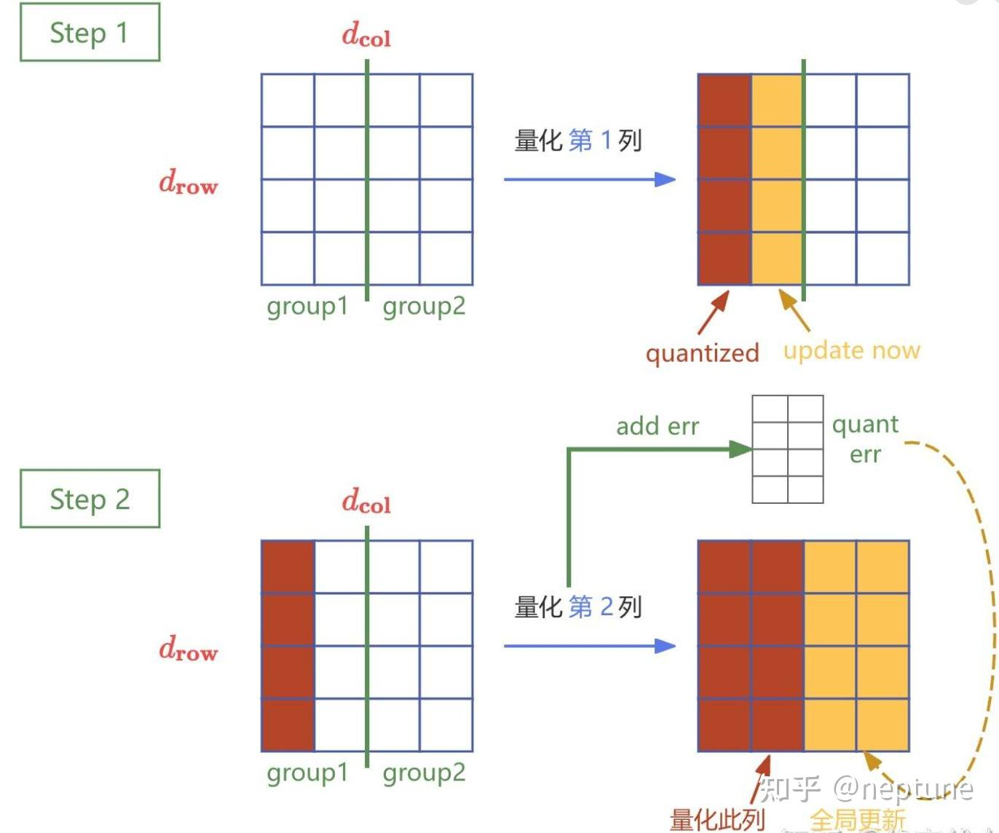

这个文章是OWQ的前身，借着对这篇文章的分析，我们梳理一下这一系列的文章的intuition。
大概的分析顺序为:
$$
\text{OBD} \to \text{OBS} \to \text{OBC} \to \text{GPTQ}
$$

首先是OBD，这是由Yann LeCun在1990年提出的神经网络剪枝算法。该算法基于二阶导数信息，旨在通过去除目标函数影响较小的参数来降低模型复杂度，提高泛化能力。

具体而言，就是希望去除目标函数对目标函数E(即Loss)影响小的参数，我们记去除了若干参数的模型的参数为$\hat W = W + \Delta w$,有:
$$
\Delta E = L(x,y,W) - L(x,y,W + \Delta w) = 
\sum_{i}g_i \Delta w_i + \frac{1}{2}\sum_{i}h_{i,i}\Delta w_{i}^2 + \frac{1}{2}\sum_{i\neq j}h_{i,j}\Delta w_i\Delta w_j + O(\Delta w^3)
$$
其中$g_i = \nabla L$,$h_{i,j}$为Hessian矩阵$H_{L}$的一个元素

其中由于剪枝发生在对于已经训练好的神经网络，因此一阶导项可以忽略不计，而高阶项由于模型会进行归一化，因此$\Delta w$较小，可以忽略不计。

此外，OBD做了一个有争议的假设，即删除任意一个参数后，其他参数对目标函数的影响不变，也就是说每个参数对目标函数的影响是独立的，因此可以忽略交叉项:

那么我们可以得到简化后的公式:
$$
\Delta E = \frac{1}{2}\sum_{i}h_{i,i}\Delta w_i^2
$$
因此，对神经网络进行剪枝，删除参数时，参数对目标函数的影响可以通过海森矩阵的对角项进行衡量。我们只需要在剪枝时求出海森矩阵，按对角项从小到大排序，即可确定参数剪枝的次序。

可以注意到，OBD的这个认为参数对目标函数的影响是独立的假设是很强的。OBS认为参数之间的独立性不成立，如果考虑交叉项，可以写作矩阵形式
$$
\Delta E = \frac{1}{2}\Delta w^\top H\Delta w
$$
OBS希望在W每次迭代找到一个位置q(即准备剪枝的位置，后续会将该位置的$w_q = 0$),以及在获得位置q的同时，计算处一个与之相关的$\Delta w$对w进行补偿，使得$L(w+\Delta w)-L(w)$尽量小。

那么这个流程可以描述为一个带约束的凸优化问题:
$$
\arg \min_q \frac{1}{2}\Delta w^\top H \Delta w\\
s.t.\ e_q^\top\Delta w + w_q = 0
$$
这里$e^\top_q$是第q个值为1的列向量。

采用Lagrange乘子法进行求解:
$$
\mathcal{L} = \frac{1}{2}\Delta w^\top H \Delta w + \lambda(e^\top_q \Delta w + w_q)
$$
对$\lambda$并置为0得到:
$$
e_q^\top \Delta w + w_q = 0\\
\Delta w^\top e_q + w_q = 0
$$
对$\Delta w$求导并置为0有:
$$
\Delta w^\top H + \lambda e^\top_q = 0\\
\Delta w^\top H H^{-1} + \lambda e_q^\top H^{-1}=0\\
\Delta w^\top + \lambda e^\top_q H^{-1} = 0
$$
有
$$
w_q = \lambda e_q^\top H^{-1} e_q\\
\lambda = \frac{w_q}{[H^{-1}]_{qq}}
$$
其中用到了等式$e_q^\top H^{-1}e_q = [H^{-1}]_{qq}$

将$\lambda = \frac{w_q}{[H^{-1}]_{qq}}$带入等式$\Delta w^\top H + \lambda e_q^\top = 0$,得到
$$
\Delta w^{\top} = -\frac{w_q}{[H^{-1}]_{qq}}e_{q}^\top H^{-1}\\
\Delta w = -\frac{w_q}{[H^{-1}]_{qq}}(H^{-1})^\top e_q \\
\Delta w = -\frac{w_q}{[H^{-1}]_{qq}}H_{:,q}^{-1}
$$
其中$H_{:,q}^{-1}$表示$H^{-1}$的第q列,且Hessian矩阵是一个对称矩阵.

将$\Delta w$带入$\Delta \mathcal{L}$我们有:
$$
\Delta\mathcal{L} = \frac{1}{2}\Delta w^\top H \Delta w = \frac{1}{2}(-\frac{w_q}{[H^{-1}]_{qq}}e_q^\top H^{-1})H(-\frac{w_q}{[H^{-1}]_{qq}}H^{-1}e_q)\\
=\frac{1}{2}(\frac{w_q}{[H^{-1}]_{qq}})^2e_q^\top H^{-1}e_q\\
=\frac{1}{2}(\frac{w_q}{[H^{-1}]_{qq}})^2[H^{-1}]_{qq}\\
=\frac{1}{2}\frac{w_q^2}{[H^{-1}]_{qq}}
$$
由此我们得到:
$$
q = \arg \min_q \frac{w_q^2}{[H^{-1}]_{qq}}
$$

我们不难发现，要进行k次剪枝，每一次剪枝都要求一次Hessian矩阵的逆(时间复杂度为$O(d^3)$),这样的时间复杂度明显是不能实际应用的，因此OBC对其进行了进一步的优化。

OBC主要做了两点优化，一个是对原始问题进行了拆分，另一个是对Hessian矩阵的计算进行了简化。

首先是对原始问题的拆分，对于Layer-wise的量化/剪枝而言，通常将对整个网络进行的量化/剪枝拆分为每一层独立的子问题。在先前对AdaQuant的分析中我们有提到，这种Layer-wise的拆分是高度可并行的。

在Layer-wise的量化/剪枝下，参数变化带来的损失可以描述为以下形式:
$$
\Delta \mathcal{L} = ||W_lX_l - \hat W_l X_l||_2^2
$$
其中$\hat W$表示经过量化/剪枝后的参数。

OBC将这个损失函数进行了按行拆分，即认为删掉某个权重$w_{ij}$只影响该行的输出，行与行之间的Hessian矩阵元素是没有耦合的。(这两个都是对按行拆分合理性的解释，前者是直观解释，后者是数学解释)

对于第一点，我们知道，改变某个权重$w_{ij}$它只会对输出的某一行的结果产生影响，即$Y_{i,:} = W_{i,:}X$,那么既然只对某一行的输出产生影响,那么对于整体误差而言,也只对这一行的误差产生影响,而误差是可以按行拆分的:
$$
\Delta \mathcal{L} = ||WX - \hat W X||_2^2 = \sum_{i=1}^{d_{row}}||W_{i,:}X-\hat W_{i,:}X||_2^2
$$
因此剪枝/量化是可以按行拆分并行处理的。

由于是Layer-wise的量化/剪枝，我们在这个尺度下的进行单行损失函数(二阶范数)的Hessian矩阵的计算从而对第二点进行证明，我们有:
$$
H_{pq} = \frac{\partial^2\Delta \mathcal{L}_l}{\partial w_{lp}\partial{w_{lq}}} = \frac{\partial}{\partial w_{lp}}\sum_{k=1}^N 2(\sum_{j=1}^{d_{col}}(w_{lj}-\hat w_{lj})x_{jk})\frac{\partial}{\partial w_{lq}} \sum_{j = 1}^{d_{col}}(w_{lj}-\hat{w_{lj}})x_{jk}\\
=\frac{\partial}{\partial w_{lp}}\sum_{k=1}^N2(\sum_{j=1}^{d_{col}}(w_{lj}-\hat w_{lj})x_{jk})x_{qk}\\
=2\sum_{k=1}^N x_{pk}x_{qk}
$$
写成矩阵的形式就是
$$
H = 2XX^\top
$$
发现每一行的损失的Hessian矩阵只跟输入数据X有关且相等，而与模型权重无关，因此我们认为行与行之间的Hessian矩阵元素是没有耦合的。

而我们知道通过泰勒展开可以得到参数变化对损失函数的影响的近似表示$\Delta w^\top H \Delta w$,那么结合上式我们可以知道行与行之间的损失是相互独立的(对于行而言$\Delta w$,行与行之间互相独立,对于Hessian矩阵而言，行与行之间相等且互不影响),由此可以从数学上说明按行拆分进行单独处理的方式是合理的。

有了这个证明，我们可以对每行进行单独处理进行量化剪枝。这种方式为我们提供了一个更加简单的Hessian矩阵形式$2X^\top X$但是每次更新参数仍然需要对其求逆，因此OBC提供了一个高效的求逆方法:

  给定一个可逆矩阵H以及其逆矩阵$H^{-1}$,我们希望高效地计算删除H第q行第q列(删除权重$w_q$)后的逆矩阵$H^{-1}_{-q}$:
$$
  H_{-q}^{-1} = (H^{-1} - \frac{1}{[H^{-1}]_{qq}}H^{-1}_{:,q}H^{-1}_{q,:})_{-q}
$$
  这个定理证明较为复杂，将在博客上更新详细证明与intuition。

  接下来我们来描述OBC剪枝的完整流程:

  给定一个神经网络层的权重行向量$w \in \mathbb{R}^d$,以及其对应的Hessian矩阵的逆$H^{-1}\in \mathbb{R}^{d\times d}$,要求切除其中k个权重，同时最小化输出误差。

   - 初始化
      $M \leftarrow \{0,1,2,\dots,d-1\}$,为尚未被剪枝的权重索引集合。
   - 重复执行k次:

    首先选择当前最优的剪枝目标q:$q \leftarrow \arg\min_{q\in M}\frac{w_q^2}{[H^{-1}]_{qq}}$,接着弥补剪掉$w_p$带来的误差$\Delta w \leftarrow \Delta w - \frac{w_q}{[H^{-1}]_{qq}}(H^{-1}_{:,q})^\top$,然后更新$H^{-1}\leftarrow H^{-1}_{-q}$,从候选集中移除该索引$M\leftarrow M - \{q\}$

  而对于量化而言(OBQ)，相对剪枝我们需要做一些调整。首先是之前的最优化问题的限制条件需要改为:
$$
  \Delta w \cdot e_q + w_q - \text{quant}(w_q) = 0
$$
  同样使用Lanrange乘子法进行求解:
$$
  \mathcal{L} = \frac{1}{2}\Delta w^\top H \Delta w + \lambda(\Delta w \cdot e_q + w_q - \text{quant}(w_q))
$$
  对$\Delta w$求导并置为0可以得到:
$$
  \Delta w^\top H + \lambda e_q = 0\\
  \Delta w^\top = -\lambda e_q H^{-1}\\
  \Delta w = -\lambda H^{-1}e_{q}^\top
$$
  对$\lambda$求导并置为0可以得到:
$$
  \Delta w\cdot e_q + w_q - \text{quant}(w_q) = 0\\
  w_q - \text{quant}(w_q) = \lambda H^{-1}e_q^\top e_q\\
  \lambda = \frac{w_q - \text{quant}(w_q)}{[H^{-1}]_{qq}}
$$
  得到:
$$
  \Delta w = -\frac{w_q - \text{quant}(w_q)}{[H^{-1}]_{qq}}(H^{-1}_{:,q})^\top\\
  q = \arg \min_{q} \frac{(w_q-\text{quant}(w_q))^2}{[H^{-1}]_{qq}}
$$
  用上式替换OBC剪枝的流程，便可以得到量化流程。

  GPTQ则是对OBQ进行了改进，GPTQ发现，在对权重的每一行量化时，按照贪心策略选择量化的q和按照任意固定顺序来量化每一行的权重最终的误差是相差不大的，那么可以直接让所有行都按照列序(0 $\rightarrow$ col),这样可以提高计算效率与存储效率。

  这样做的另一个好处在于：每行的顺序一样，那么每一行对应的Hessian矩阵都是相同的，每次Hessian矩阵的逆只需要计算一次！

  在固定量化顺序的前提下，我们不再需要求解$q = \arg\min_q$只需要关心$\Delta w$,此时$\Delta w$的更新公式为:
$$
  \Delta w = -\frac{w_q - \text{quant}(w_q)}{[H_{q:,q:}]^{-1}_{0,0}}([H_{q:,q:}]^{-1}_{:,0})^\top
$$
  这个式子我们对比在贪心策略下的式子便不难发现，这个式子就是贪心策略式子在每次删除当前候选集里的第一个q时的式子的等价形式，同样地我们也能给出Hessian矩阵的逆的更新形式:
$$
  [H_{q:,q:}]^{-1} = ([H_{q-1:,q-1:}]^{-1} - \frac{1}{[H_{q-1:,q-1:}^{-1}]_{0,0}}[H^{-1}_{q-1:,q-1:}]_{:,0}[H_{q-1:,q-1:}^{-1}]_{0,:})_{1:,1:}
$$
  从矩阵的角度来看我们在做的是这样一个变换:
$$
  (H^{-1})^{(k)} = 
  \left[
    \begin{matrix}
    I_{k-1} & 0 & 0^\top\\
    0 & a_{k,k} & b_{k}^\top\\
    0 & b_k & B'^{(k)}
    \end{matrix}
  \right]\to (H^{-1})^{(k+1)} = 
  \left[
\begin{matrix}
I_{k} & 0 & 0\\
0 & a_{k+1,k+1} & b_{k+1}^\top\\
0 & b_{k+1} & B''^{(k+1)} 
\end{matrix}
  \right]
$$

  若我们不断更新Hessian的逆总会产生非正定的Hessian逆矩阵,其原因可能是由于数值误差的累积。为了解决这个问题，作者注意到每次从$H^{(-1)}$中删除一行一列，本质上和对称正定矩阵的Cholesky分解的逐步过程类似，因此作者对初始的$H^{-1}$进行了Cholesky分解，得到了一个上三角矩阵$T$。

Cholesky分解:假设一个正定矩阵$A\in \mathbb{R}^{n\times n}$是正定对称矩阵，那么必然存在一个对角元素为正数的下三角矩阵$L\in \mathbb{R}^{n\times n}$满足$A = LL^\top$

我们尝试模拟一次这个分解过程:
$$
A = \left[
  \begin{matrix}
  a_{11} & A_{21}^\top\\
  A_{21} & A_{22}
  \end{matrix}
\right],L = \left[
\begin{matrix}
l_{11} & 0\\
L_{21} & L_{22}
\end{matrix}
\right],L^\top = \left[
  \begin{matrix}
  l_{11} & L_{21}^\top\\
  0 & L_{22}^\top
  \end{matrix}
\right]
$$
由于$A = LL^\top$,我们有:
$$
l_{11} = \sqrt{a_{11}},L_{21} = \frac{1}{l_{11}}A_{21},L_{22}L_{22}^\top = A_{22} - L_{21}L_{21}^\top
$$

于是我们可以惊奇地发现$L_{22}L_{22}^\top$就是我们想要的$H_{q:,q:}^{-1}$!因此我们可以认为删去$[H_{q:,q:}^{-1}]$的第一行和第一列的过程与对该矩阵进行一次Cholesky分解是等价的。因为我们进行Cholesky分解得到的$L_{22}$恰好是更新了之后的$H^{-1}$进行Cholesky分解得到的下三角矩阵。

进一步地，GPTQ对初始的Hessian矩阵的逆进行了Cholesky分解得到一个上三角矩阵$L^\top$,这个矩阵还有一个特点在于，它的每一行刚好就等于逆矩阵每次更新迭代后的第一行乘以一个常数:
$$
C_qL_{q,q:}^\top = [H_{q:,q:}]^{-1}_{0,:}
$$
这个我们可以通过Cholesky分解的式子知道，因为分解得到的$L$是一个下三角矩阵，那么它的第一行就只有一个常数，而这个常数乘以$L^\top$便可以得到A的第一行。

而恰好我们发现，$\Delta w$的更新公式只需要用到当前Hessian矩阵的逆的第一行，那么我们有:
$$
\Delta w = -\frac{w_{:,q}- \text{quant}(w_{:,q})}{C_q T_{qq}}C_qT_{q,q:}
$$
其中常数可以直接约掉:
$$
\Delta w = -\frac{w_{:,q} - \text{quant}(w_{:,q})}{T_{qq}}T_{q,q:}
$$
因此我们在进行量化时不用每次都更新Hessian矩阵的逆，而是直接对$H^{-1}$进行Cholesky分解，得到它的每一行便可以进行参数的量化。

此外，如果每行的量化并行计算，那么每次更新都要读写一次参数矩阵。若参数矩阵的维度为$d_{row}\times d_{col}$，那么量化这个参数矩阵就要读写$d_{col}$次参数，总共的读写量高达$d_{row}\times d_{col}^2$.(因为我们量化第i列的时候，后面的列相应地也要补偿更新)

那这样大量的IO开销将会成为瓶颈，因此GPTQ采用了Lazy Batch-Update技术。我们注意到对于列i，最终的量化决策并不会受到尚未更新的列的影响。这使得我们可以将后续列的更新推迟到后续步骤中，从而减少不必要的内存操作。

具体步骤如下:

- 每次处理B列的一个小块，限制该列更新的补偿更新只影响块内的列

- 当前块的权重会在量化过程中被更新，而其影响暂时不传播到矩阵的其他部分

- 对当前块中的每一列进行量化，同时计算误差并更新当前块剩余的列

- 这些更新仅在当前块内进行，而不会影响整个矩阵

- 当一个块内的所有列完成量化后，将该块的更新结果批量应用到矩阵的剩余部分

这部分通过语言可能难以描述清楚，可以见下图:

