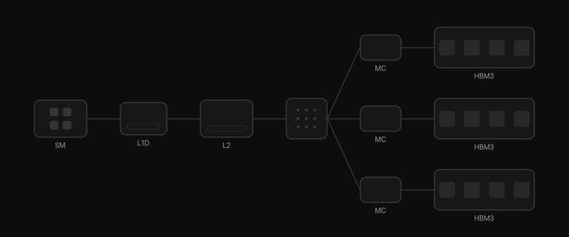
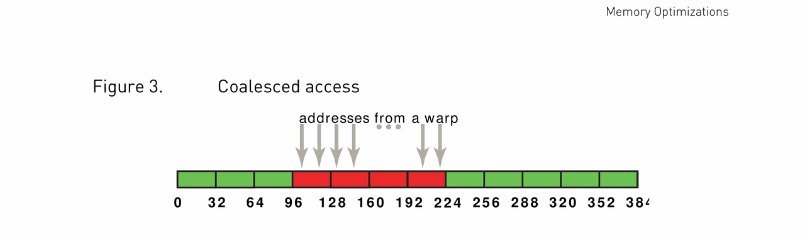
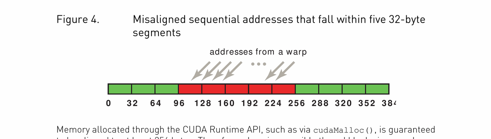
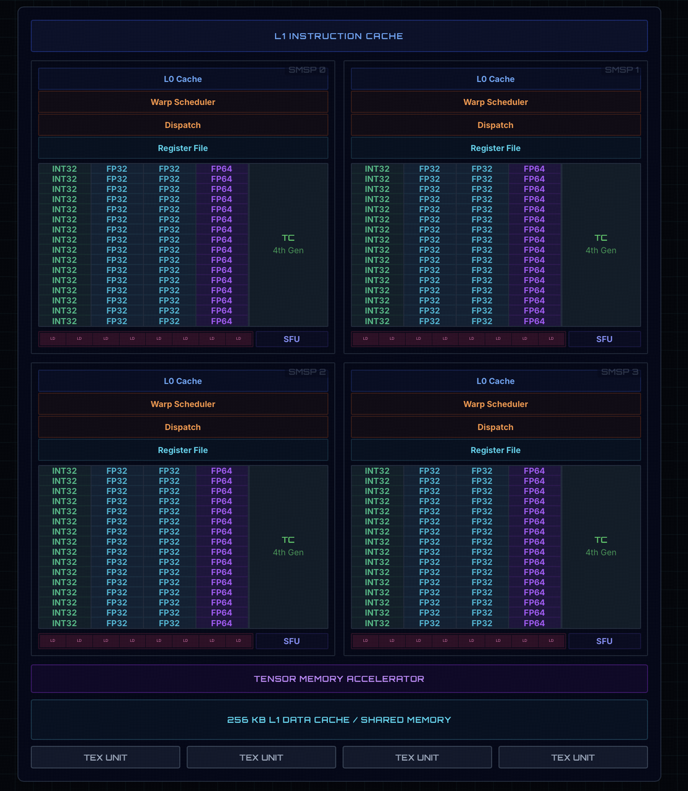
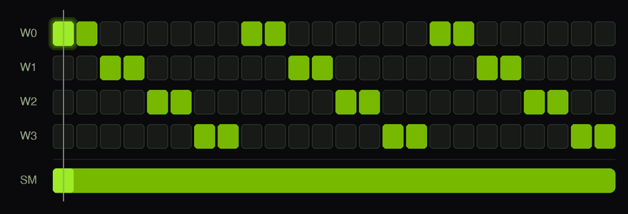

> 💡 **建议搭配阅读**：[H100 硬件架构可视化演示](https://cudacourseh100.github.io/h100visu/) —— 一个交互式网页，完整演示了 H100 的硬件架构。阅读本文前可以先花几分钟浏览，快速建立对 H100 硬件的整体认识。

## GPU 的基本组成原理

一个 GPU 芯片可以被划分为以下几个主要组成部分：

- NVIDIA GigaThread Engine（巨线程引擎）
- 8 个 GPC（Graphics Processing Cluster，图形处理集群）
- HBM3 Stacks（HBM3 显存堆栈）
- HBM3 Memory Controllers（HBM3 内存控制器）
- PCI Express 5.0 Host Interface（PCIe 5.0 主机接口）
- NVLink Switches、Ports、Hub（NVLink 交换机、端口和 Hub）
- L2 Cache Slices（L2 缓存分片）

## NVIDIA GigaThread Engine

GigaThread Engine 译作巨线程引擎，这是 GPU 上负责调度 Kernel 以及 Thread Block 的硬件。

当一个 Kernel 启动后，GigaThread Engine 会负责将 Kernel 中的 Thread Block（CTA）分配给各个 SM，并跟踪每个 CTA 当前的状态，如哪些 CTA 还没开始执行、哪些 CTA 正在执行、哪些 CTA 执行完毕。当某个 SM 有足够的资源、可以容纳另一个 CTA 时，GigaThread Engine 以及相关的前端调度逻辑就会把下一个 CTA 分给这个 SM。

同时它还会处理和强制执行一些资源约束，如 Occupancy 限制、寄存器资源控制等。

在 Hopper 架构的显卡上，GigaThread Engine 还能够理解和处理 Cluster 相关的资源调度。

## HBM3

HBM3 是一种 off-chip 的设备内存，也就是我们常说的 Global Memory 的物理介质，在 H100 上其容量为 80GB，理论带宽为 3.35TB/s。

其组织结构大致如下：

1. HBM3 Stack：在 H100 上总共有 6 个 HBM3 Stack，但是出于良率考虑，只使用了其中的 5 个。
2. 总线宽度共 5120 bit（每个 HBM3 Stack 的位宽为 1024 bit）。
3. 通过 10 个独立的 512-bit memory controller 连接 HBM（每个 HBM3 Stack 两个）。

通常来说，我们一次从 HBM 中请求数据的流程如下：

首先从 SM 进入 L1D 缓存或合并器，若没有相关数据则进入 L2 缓存，若还没有则通过 Memory Partition / Crossbar 来确定这次请求应该由哪一个 memory controller 处理，最后由 Memory Controller 在 HBM3 Stack 中取出对应的 cache line 返回数据并写入 L1D Cache。

其中需要强调的是，Memory Controller 负责把 GPU 的内存访问请求转换成符合 HBM/DRAM 协议和时序的实际读写操作，并进行调度以尽可能提高内存带宽。

## L2 Cache

在 H100 上有 50MB 的 L2 Cache，它们被划分为了两个 25MB 的分区。由于这种分区的特性，同一个 GPC 中的 SM 与其直接相连的 L2 Cache 分区之间会具有更近的访问路径。因此，当我们的内存访问命中这些相邻的 L2 Cache 分区中的 Cache Line 时，可以获得更低的有效访问延迟和更高的带宽。

L2 Cache 采用 128 字节的 Cache Line，以及 32 字节的 Sector。也就是说一次内存访问最多可以访问一个 128 字节 Cache Line 的 1-4 个 sector。如果内存访问的 Coalescing（合并）做得不好，就可能导致每个请求涉及的 sector 数量急剧增加，从而降低内存的访问效率。

## GPC

GPC 是一组 SM（18 个）。每个 GPC 与物理上邻近的 L2 Cache 分区之间访问延迟更低（即前文提到的亲和性），但任何 SM 都可以访问全部的 L2 Cache。当需要把数据取到 shared memory 时，数据路径是 HBM → L2 → L1。GPC 还能让各 SM 之间共享 DSMEM（Distributed Shared Memory，详见文末的 Thread Block Cluster）。

GPC 中有 TPC，每个 TPC 包含两个 SM。TPC 主要是硬件物理实现层面的分组概念，对 CUDA 编程模型基本不可见。

## SM

如下图所示是一个 SM，它是 GPU 的基本执行单元，负责执行 CUDA Kernel 的 thread block。其基本由 4 个相同的子部分组成，并且这四个子部分我们称作 SMSP 或者 quadrant。

整体上，每个 SM 由 4 个 SMSP 组成，每个 SM 都包含 L1 指令缓存以及大小为 256KB 的数据缓存/shared memory、TMA，与共享的 texture unit。

而每个子部分包含的内容如下：

### FP32 CUDA Core

它们是通用图形计算或 compute shading 的主力单元。H100 的每个 SM 上有 128 个 FP32 CUDA Core。因此总共有 16896 个活跃的 CUDA Core（132 个 SM）。

### SFU

SFU 通常负责复杂数学函数的计算，如正余弦、对数、指数、平方根、倒数这类。每个 SM 有 16 个 SFU，也就是每个 SMSP 有 4 个。每个 SFU 每 cycle 可以完成 1 个线程的运算，所以每个 SM 的 SFU 吞吐是 16 个线程/cycle——也就是说一条 warp 级（32 线程）的 SFU 指令需要 2 个 cycle 才能执行完。也因此，如果一个 warp 里所有 thread 都在调用这些复杂的数学函数，SFU 就会成为瓶颈。

### INT unit

这是标准的整数 ALU，用来做内存寻址、循环控制以及一般的整数运算。每个 SM 有 64 个 int unit。这些 unit 与 CUDA Core 以及其他计算 core 是可以并行执行的，也就是说 GPU 可以一边计算内存地址（INT），一边处理数据（FP），互不 stall。

### FP64 Unit

H100 有独立于 FP32 的专用 FP64 core。每个 SM 有 64 个 FP64 Core。

一般用于科学计算等场景。

### Tensor Core

Tensor Core 是专门加速矩阵乘加运算（D = A × B + C）的单元，深度学习中的绝大多数计算都发生在它上面。H100 的每个 SM 配有 4 个 Tensor Core（每个 SMSP 1 个），全卡共 528 个。

H100 搭载的是第四代 Tensor Core：新增了对 FP8 精度的支持，并引入了 WGMMA 指令——矩阵乘可以异步执行，且操作数可以直接来自 Shared Memory。TMA 把数据异步搬进 Shared Memory，WGMMA 再异步地从 Shared Memory 取数计算，两者配合就构成了 Hopper 异步流水线的核心。（Tensor Core 的详细机制会在后续章节单独介绍。）

### Load/Store Unit（LSU）

它负责执行每个线程的内存指令如 store、load、atomic 等。

每个 SMSP 有 8 个专用的 LSU，每个 SM 一共 32 个，都是直连 L1、L2 缓存的。

当 warp 执行 ld/st/atom 时，LSU 会把 32 个 thread 的地址做 coalescing，拼成 cache-line / sector 请求，再去查 L1 data cache。命中就很快回到 register；miss 则继续往 L2 / DRAM 走，回来时也可能填回 L1。

访问能 coalesced 时，LSU 会把这个 warp 的 32 个地址合并成尽量少的 cache-line，发给 L1/L2 的请求就更少，replay / stall 减少，有效带宽也更高。

这里需要注意的是 TMA 会直接绕过整个 L1 Cache，进入 L2 Cache 或 DRAM 读取数据并将其放入 Smem 中。

### Unified Shared Memory + L1 Cache

每个 SM 共 256 KB，全卡合计带宽约 33 TB/s，分成 32 个 bank，每个 bank 宽 32 bit（4 byte）。其中 shared memory 大小是 228 KB。

无冲突时，load / store 各 128 B/cycle。TMA 异步拷贝能打到接近峰值带宽，并和计算重叠。Bank 按连续的 4-byte word 交错分布在相邻 bank 上。（对于 bank 的理解，可以想象成体育场的门）

L1 cache 相当于 coalescing buffer：把 warp 要的数据收齐，再高效送出去。

Cache line = 128 byte，Sector = 32 byte，cache 可以按 sector 逐块填充。

每个 SM 可配置的 shared memory 上限是 228 KB。

每个 thread block 上限是 227 KB，因为 CUDA 预留了 1 KB。

### Registers

每个 thread 都有一套私有的片上 register。带宽最高、延迟最低，每个 SM 256 KB。每个 SM 每 cycle 最多 128 次读/写。

Register 经常是瓶颈。如果 kernel 每个 thread 用 R 个 register，那最多常驻 thread 数大约是 floor(65536 / R)（再按 block 粒度和其它限制取整/封顶）。到 128 register/thread 时，每个 block 最多 512 个 thread。

Register 的基本单位是 32-bit。硬件 register file 本质上就是 32-bit 槽位。用 FP16 或 FP8 时，必须用 packed datatype，才能把 2/4 个元素塞进同一个 register。

访问 register file 比访问 shared memory 还快 30–50 倍，比访问 HBM3 快 1000 倍以上。

Register 用量在编译期就定了，不是运行时决定的。

编译器 register 不够用时，会把数据 spill 到 local memory，比 register 慢很多。CUDA 13.0 加了优先 spill 到 shared memory 的支持，只有 shared memory 也不够时才退回 local memory。

哪怕只多几个（比如 63 → 65 register/thread），常驻 warp 数也可能掉下去，因为分配会按内部粒度取整。活跃 warp 变少，性能就下来。

## Warp

我们通常称 32 个线程组成的一组是一个 warp，它们从同一个 thread block 里被创建，每个 cycle 共享同一个 warp scheduler 调度，各自私有 register，但执行相同的指令流。

而 Warp scheduler 通常是负责指令发射的单元，每个 cycle 选出就绪的 warp 来发射指令，并处理 warp 级别的分支和 divergence。维护一个 scoreboard，记录哪些 warp 真正就绪。发射前确保源 register 已经从 register file 读出，或已从 pipeline 转发过来。

所谓 divergence（分支发散），是指同一个 warp 内的 32 个线程走进了不同的分支（例如 if/else 的两侧）。由于整个 warp 共享同一条指令流，硬件无法让两部分线程同时走两条路径，只能把各分支**串行**执行：先执行 if 分支，同时用 active mask 屏蔽走 else 的线程，然后再反过来。原本一条指令的工作变成了多条，warp 内的分支越碎，性能损失就越大——因此写 kernel 时应尽量避免 warp 内的分支发散。

**为什么 GPU 要让尽可能多的 warp 常驻在 SM 上？** 答案是为了隐藏内存访问的延迟（Latency Hiding）。一次 HBM 访问需要数百个 cycle，如果 SM 上只有少量 warp，一旦它们全部陷入内存等待，计算单元就只能空转。而常驻 warp 足够多时，Warp Scheduler 每个 cycle 都能挑出一个已就绪的 warp 发射指令——某个 warp 发起内存请求后转入等待，它空出的执行槽立刻被其他就绪的 warp 顶上，内存延迟就这样被"藏"在了别人的计算之下。这也是前文反复强调的 Occupancy（由 register、shared memory 用量共同决定）对性能如此关键的根本原因。

## 动手实验

本章的四个硬件概念（Coalescing、Occupancy 与 Latency Hiding、Bank Conflict、SFU 吞吐）各配了一个可编译运行的小实验，放在 **[Assignment 01](https://github.com/July-h5kf3/HopperLearing/tree/main/assignment/assignment01)**。读完本章建议亲手跑一遍——纸上的硬件数字变成实测数据，理解会深很多。

## H100 的重大变革

H100 拥有 80GB 的 HBM3 内存，内存带宽达到 3.35 TB/s。

拥有 132 个 SM，每个 SM 拥有 4 个 Tensor Core，总共有 528 个 Tensor Core。

Hopper 架构最大的特性在于引入了异步特性：

- **TMA**：每个 SM 有一个 TMA 单元，这是一个用于将 Tensor 数据拷贝操作从 SM 中卸载出去的硬件单元。在先前的架构中，我们通常需要让每个线程执行相应的计算、遍历数据区域、并发射多条指令，才能完成 Global Memory 到 Shared Memory 的数据传输。而有了 TMA 之后，我们可以通过 TMA Descriptor 来异步地执行这些操作。只需要一个线程发起整个数据搬运操作，剩下的数据移动工作由硬件在后台完成。
  - **同步拷贝**：如果一个拷贝是同步的，那么发起这个拷贝操作的线程在拷贝完成前就无法继续执行接下来的指令了，也就是说当控制流重新回到这个线程时，这个数据拷贝操作已经完成了。
  - **异步拷贝**：如果一个拷贝是异步的，那么发起拷贝操作仅仅意味着启动了数据传输，发起者（这个线程）可以在数据传输进行时继续执行其他工作，之后在真正需要使用这些数据之前，再去等待或检查拷贝是否完成。这种方式比同步拷贝更加高效，能够让我们有效地掩盖内存访问带来的延迟。（例如在处理第 i 块数据时，预取第 i+1 块数据）
- **第四代 Tensor Core**：FP8 的支持（1979 TFLOPs），WGMMA
- **Thread Block Cluster**：Hopper 在 Thread Block 和 Grid 之间引入的新层级。同一个 Cluster 内的多个 Thread Block 会被硬件保证共同调度到同一个 GPC 内的不同 SM 上执行，这些 Block 之间可以通过 Distributed Shared Memory（DSMEM）直接读写彼此的 Shared Memory，并在 Cluster 范围内做同步。这让跨 SM 的线程协作第一次有了硬件级的支持，而不必再绕道 Global Memory。（更详细的内容会在后续章节介绍。）
