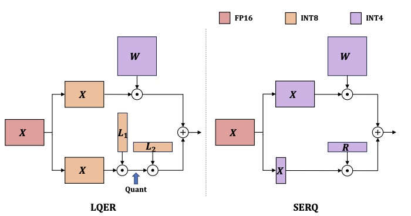

这是一篇**受保护的示例文章**。只有拿到邀请码的人，才能在页面里输入口令后阅读正文。没有口令时，站点上任何位置都只会露出这篇文章的标题，正文、摘要、目录、封面、RSS、搜索索引里都不含正文明文。

## 为什么正文是安全的

站点是纯静态托管，本身无法做服务器鉴权。这里的做法是：**构建时用 AES-256-GCM 把正文加密**，公开出去的只有密文；读者输入正确口令后，浏览器用 WebCrypto 在本地解密。口令错误时，AES-GCM 的完整性校验会失败，什么也拿不到。

下面这段用来验证解密后 **数学公式** 依然能正确渲染：

$$
\text{Softmax}(x_i) = \frac{e^{x_i}}{\sum_{j=1}^{n} e^{x_j}}, \qquad \abs{a} \ge 0
$$

行内公式也应正常：当 $\alpha \to 0$ 时，$\lim_{\alpha \to 0} f(\alpha) = f(0)$。

## 图片也应正常显示

解密后，页面包（page bundle）里的图片同样会被正确渲染：



## 一个代码块

```python
def derive_key(password: str, salt: bytes) -> bytes:
    # PBKDF2-SHA256, 310k 迭代，派生 256-bit AES 密钥
    return hashlib.pbkdf2_hmac("sha256", password.encode(), salt, 310_000, 32)
```

如果你能看到上面的公式、图片和代码，说明解密后的正文渲染链路完全正常。
