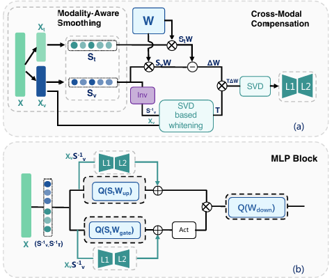

    <b>个人评价</b>:很有价值的工作，从High-Level的角度来看，不同模态激活值的分布不同带来的量化挑战可以看作LLM Quant中激活值Outlier带来的挑战，因此从这个角度出发可以很好的理解文章的出发点。

总结：本文旨在解决基于通道级平滑的PTQ方法应用于多模态大模型时面临的一个核心挑战：Smoothing Misalignment。论文通过MAS为每个模态确定一个平滑因子来解决这个问题，并通过CMC方法来解决与之伴随而来的Cross-Modal Computation Invariance问题。

当将基于通道级（Per-channel）平滑的PTQ应用于多模态大模型（MLLMs）时会面临两个核心挑战：

1. Smoothing Misalignment（平滑错位）：不同模态的激活值幅度存在数量级的差异，例如视觉Token的激活范围通常比文本和音频大10-100倍。传统的Per-channel量化为每个通道计算单一的缩放因子，导致主导模态的较大激活决定平滑因子，而使非主导模态的激活被过度平滑，信号被严重压制，最终导致量化后的模型性能不佳。
2. Cross-Modal Computational Invariance（跨模态计算不变性）：直接为不同模态计算独立的平滑因子会破坏计算不变性（坐标系不同）。若严格保持模态特定的平滑，推理时需要为不同模态存储不同的量化权重矩阵，这违背了量化技术通过单一低精度权重表示来减少内存占用的根本目标。

论文提出了MASQuant框架来解决上述两个问题，该框架包含两个核心组件：MAS（Modality-Aware Smoothing）以及CMC（Cross-Modal Compensation ）

对于Smoothing Misalignment的问题，其核心还是在于不同模态的激活值幅度存在数量级的差异，因此MASQuant通过为每种模态维护模态特定的平滑因子来解决这个问题，从而从根本上解决了某一模态的主导效应。

(n这里有一点与SmoothQuant不同，MAS的平滑因子是通过学习得到的：

首先获得模态感知的平滑因子初始值如下
$$
S_m= \text{diag}(s_m),\quad s_{m,i} = \frac{\max_t |x_{t,i}^m|}{\max_j |w_{j,i}|},\quad m\in M
$$
随后，我们在模态特定的数据上最小化MAE损失来优化$S_m$。我们记$\{S_m\}_{m\in M}$为$\{S_m\}$,我们有:
$$
\{S_m^*\} = \arg \min_{\{S_m\}_{m\in M}}(\lambda_m \cdot \mathcal{L}_{\text{MAE}}(S_m,X_m,W))
$$
其中$\lambda_m$表示模态m的损失权重，对于模态m，量化重建的MAE损失为:
$$
\mathcal{L}_{\text{MAE}}=||Q(X_m S_m^{-1})Q(S_mW)-X_mW||
$$
这保证了$S_m^*$能捕获模态特定的统计特性，同时避免跨模态干扰。

此外，论文中还给出了通过信噪比量化的收益，可以证明相较于之前的统一平滑(Unified Smoothing)，MAS使用的最优平滑(Optimal Smoothing)二者差值：
$$
\Delta =10\log_{10}(\frac{\sum_{i=1}^d \frac{1}{\alpha_i^2}}{d\cdot (\max_i \frac{1}{\alpha})^2})\leq 0
$$
这说明，在任何情况下MAS的Optimal Smoothing都不会比Unified Smoothing更差（虽然这是显而易见的）

在MAS中，我们为每个模态都存储了一个$S_m$，那么这意味着我们模型中每一层的权重W，对于每一个模态都要维护一个量化矩阵$S_mW$，这显然是我们无法接受的。MAS为了保证在PTQ过程中所有的模态之间共享一个量化权重，采用了如下方法（CMC）：

首先，我们仅存储一个量化权重$Q(S_tW)$,以文本模态为参考，并通过lora矫正来补偿其他模块。以视觉输入为例：理想情况下，我们计算：
$$
X_vS_v^{-1}\cdot(S_vW)
$$
但使用共享权重则会产生残差：
$$
\Delta Y = X_vS_v^{-1}\cdot(\underbrace{S_vW-Q(S_tW)}_{\Delta W})
$$

那么我们可以对于每个非文本模态，我们都去存储这个残差，然后为了避免大矩阵的存储开销，我们可以使用低秩近似。

然而，我们不能直接对$\Delta W$使用SVD进行近似，因为事实上，我们需要近似的是残差$\Delta Y$,而非$\Delta W$（可以理解为$\Delta Y$是带权重的$\Delta W$）,且$\Delta W$不一定具有低秩结构（即前若干个大的奇异值不能解释大部分的能量）

我们现在来看我们的优化目标：
$$
\arg \min_{L} ||X_vS_v^{-1}(L-\Delta W)||^2_F
$$
为了符号简便起见，我们令$A = X_vS_v^{-1}$,那么我们可以把最小化目标拆开写作:
$$
\arg \min_L \text{tr}((\Delta W - L)^\top A^\top A (\Delta W - L))
$$
那么一个自然的想法就是考虑能否通过某种线性变换消去这个权重的影响。在线性代数中我们知道，可以通过对一个矩阵进行白化（可将数据的协方差变为单位矩阵I）来达成我们的目的。

我们通过如下方式计算白化变换：
$$
\text{SVD}(A^\top A) = P\Lambda P^\top,T = (P\Lambda^{\frac{1}{2}})^\top
$$
那么此时$AT^{-1}$是正交的。我们近似的目标可以描述为:
$$
\arg \min_L ||AT^{-1}T(\Delta W -L)||_F^2 = \arg \min_L ||T(\Delta W-L)||_F^2
$$
所以我们现在相当于在用一个rank为r的矩阵$TL$对矩阵$T\Delta W$进行逼近（经过实验验证，它具有低秩结构），因此我们可以对$T\Delta W$进行SVD截断:
$$
SVD(T(\Delta W)) = U\Sigma V^\top \approx U_r \Sigma_r V^\top_r
$$

那么我们对白化进行逆变换后就可以得到低秩修正项：
$$
\Delta W = L_1L_2 \quad L_1 = T^{-1}U_r \quad L_2 = \Sigma_r V_r^\top
$$
可以证明上述近似在秩r补偿近似下最优：

假设秩为r的矩阵$L = L_1L_2$,其中$L_1,L_2$由上式中定义的秩 r 截断 SVD 给出，它能够最小化重构损失。用形式化语言描述：
$$
\mathcal{L}=\sum_v ||X_vS_v^{-1}(\Delta W-L)||_F^2 \quad L^* = \arg \min_{\text{rank}(L)\leq r}\sum_v ||X_vS_v^{-1}(\Delta W-L)||_F^2
$$
证明如下：

只考虑两个模态，并且仅对权重进行量化，那么根据定义我们有：
$$
L^*=T^{-1}(\text{Trunc}_r(T\Delta W))
$$
由
$$
(X_vS^{-1}_v)^\top (X_vS_v^{-1}) = P\Lambda P^{\top}
$$
可以推出：
$$
X_vS_v^{-1}=U\Lambda^{\frac{1}{2}}P^{\top}=UT
$$
那么有
$$
\begin{align}
\mathcal{L}(L^*)
&= \left\| X_v S_v^{-1}(\Delta W - L^*) \right\|_F^2 \\
&= \left\| U T (\Delta W - L^*) \right\|_F^2 \\
&= \left\| U T \left(\Delta W - T^{-1}\operatorname{Trunc}_r(T\Delta W)\right) \right\|_F^2 \\
&= \left\| T\Delta W - \operatorname{Trunc}_r(T\Delta W) \right\|_F^2 \\
&= \sum_{i>r} \sigma_i(T\Delta W)^2 \\
&= \sum_{i>r} \sigma_i\!\left(U^{-1}X_vS_v^{-1}\Delta W\right)^2 \\
&= \sum_{i>r} \sigma_i\!\left(X_vS_v^{-1}\Delta W\right)^2 \\
&= L_{\min}^2.
\end{align}
$$

那么至此我们可以写出最终推理阶段将基础量化输出与模态特定修正结合起来：
$$
Y =\left
\{
\begin{aligned}
Q(X_mS_m^{-1})Q(S_tW), \quad m=\text{text}\\
Q(x_mS_m^{-1})Q(S_tW) + X_mS_m^{-1}\cdot L_1^mL_2^m,\quad m\neq \text{text}
\end{aligned}
\right.
$$
MAS完整的流程如下图

