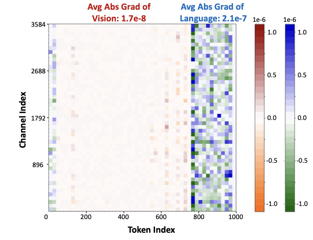

    <b>个人评价</b>:文章的Insight很不错，不同模态Token的影响差异确实很显著，Method is Simple but benefit a lot

当我们直接使用大语言模型的量化的方法对多模态大模型进行量化时(如AWQ，GPTQ等)，往往会忽略不同模态激活值带来的差异，在论文中这种差异被描述为模态之间敏感度的差异。MBQ的思路是在量化过程中平衡这些差异，从而提高VLMs的准确性。

MBQ首先通过实验发现将\，作者认为这源于对不同模态一视同仁的处理方式。原因主要有两点:

1. 从数据角度来看，视觉数据具有较高的冗余性，因此对小扰动具有强抗干扰性。
2. 从模型角度来看，目前VLM生成的内容主要受预训练LLM的影响，而非输入的图像本身。

作者做了一个小实验来验证上述猜想，他们将图像-文本对作为VLM的输入，并计算并计算监督微调损失函数相对于语言token和视觉token的梯度。这些梯度反映了当对语言（文本）或视觉（图像）token特征施加微小扰动时，对输出语言token（caption）的影响。

如下图所示，可以发现,语言Token的平均绝对值比视觉的大了一个数量级。这也就意味着，在相同的扰动下，视觉token对SFT损失的影响仅为语言token的0.1倍，因此我们不能发把语言Token和视觉Token同等对待

为了展示在校准过程考虑模态差异的重要性，作者进行了一个简单的小实验:在CWE校准中，对视觉Token的重建损失施加一个0.1的模态平衡因子。此时优化目标可以写作:
$$
E^* = \arg \min_{E}[||Q(W\cdot E)(E^{-1}X_l)-W\cdot X_l||^2 + 0.1 *||Q(W\cdot E)Q(E^{-1}X_v)-W\cdot x_v||^2]
$$
实验结果表明:	即使仅使用一个启发式选择的模态平衡因子，balanced CWE 也能够显著超过原始 CWE 的性能。

为了进一步探索这个最优的平滑因子，论文提出了MBQ方法。

具体而言，该方法通过最小化SFT损失函数的变化，为每一层分配最优的模态平衡因子。具体而言，我们用下式描述每个线性层的输出激活Y收到一个小扰动$\Delta $时，SFT损失L的变化:
$$
\mathcal{L}(Y+\Delta W) \simeq \mathcal{L} + g^\top \cdot \Delta
$$
其中$g^\top$表示输出激活Y的梯度。那么由量化引起的SFT损失可以表示为：
$$
\begin{align}
||\mathcal{L}(\hat Y)-\mathcal{L}(Y)||\simeq ||g^\top \cdot \Delta||\\
=||g_v^\top \cdot \Delta_v + g_l^\top \cdot \Delta_l||\\
\leq ||g_v^\top \cdot \Delta_v|| + ||g_l^\top \cdot \Delta_l||\\
\leq |g_v^\top|\cdot |\Delta_v| + |g_l^\top|\cdot |\Delta_l|\\
=\overline{|g_v|}\cdot ||\hat Y_v - Y_v|| + \overline{|g_l|} \cdot ||\hat Y_l - Y_l||
\end{align}
$$
在一般的大语言模型的量化中，通常会分为两个阶段采用不同粒度的量化:

- Prefill阶段：这个阶段主要是将整个Prompt并行地计算每一层的hidden state（即计算KV，并得到KV-Cache），这个阶段整个Prompt一次性并行计算，矩阵乘法很大，算力利用率很高。这时候如果把 权重和激活都量化，就能直接减少 GEMM 的计算/带宽开销，所以 W8A8 / FP8 W8A8 往往比较合适。
- Decode阶段：decode阶段是逐token生成，其瓶颈不在于计算，而是权重的访存，因此通常只会对权重进行量化

在MBQ中遵循了同样的方式，在Prefill阶段进行权重-激活值的量化，在Decode阶段进行权重的量化。二者的优化目标均为:
$$
\min_E{\mathbb{E}}[\overline{|g_v|}\cdot ||WX_v-Q(W\cdot E)Q(E^{-1}\cdot X_v)|| + \overline{|g_l|}\cdot ||WX_l-Q(W\cdot E)Q(E^{-1}X_l)||]
$$
需要注意的是，这里的重建损失函数是基于MAE而非MSE的。
