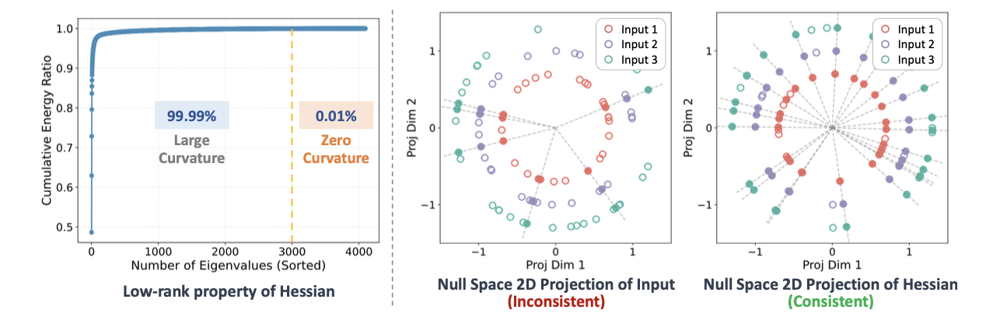

目前针对大语言模型中存在的系统性异常值问题，现有方法主要依赖层内乘法变换来抑制异常值，包括:

1. 缩放:如AWQ，SmoothQuant等方法通过激活分布特征对权重进行缩放
2. 旋转:如QuIP等方法通过正交矩阵旋转权重矩阵

然而这些方法在极低比特量化时，性能仍远未达到理想水平，表明单一乘法策略在根本上不足以充分处理异常值问题。

本方法基于如下发现:

即任务损失关于权重的Hessian矩阵具有低秩一致性，即

- 特征值沿特定方向趋于0零
- 对应的特征向量构成稳定的零空间
- 该零空间在不同输入样本间保持高度一致

而我们知道，通过泰勒展开，我们可以知道权重收到扰动时，任务损失L关于权重的二阶泰勒展开可以写作:
$$
\mathbb{E}[L(w+\Delta w)-L(w)]\approx\frac{1}{2}\Delta w^\top H_w \Delta w
$$
而我们又发现$H_w$具有低秩一致性，因此根据零空间的定义，用$H_w$乘以零空间中的任意向量都会得到零。因此，通过对这些零空间向量进行加权组合，我们可以构造出$\Delta w$。这使得一种加性变换成为可能，并且保证损失保持不变:
$$
W' = W +\Delta W\quad s.t. \quad \Delta w^\top H_w \Delta w = 0
$$
基于这个发现，我们旨在构建一个由低秩结构引导的$\Delta w$，对权重执行加性变换，从而实现异常值的子吸收，同时保持模型的性能。

给定一个权重矩阵$W\in \mathbb{R}^{M\times N}$,其中M表示输出通道维度，N表示输入通道维度，$\Delta W$的构造过程如下所述:

1. 零空间提取: 首先我们对Hessian矩阵$H_w$进行特征分解，并按照特征值幅度的非递减顺序进行排序，如下所示:

$$
H_w = V \text{diag}(\lambda_1,\dots,\lambda_N)V^\top,\quad 0\leq \abs{\lambda_1}\leq \abs{\lambda_2}\leq \dots \leq \abs{\lambda_N}
$$

其中$V\in \mathbb{R}^{N\times N}$是特征矩阵,$\lambda_1 ,\dots,\lambda_N$是矩阵的特征值。我们采取尾部能量累积的策略，从最小的特征值开始累加，得到前缀能量，并将零空间维度确定为满足累积尾部能量达到预设阈值时的最小K:
$$
\mathcal{N}=V^\top_{[:,0:K-1]},\text{where}\quad K=\min_k \{\sum_{i=1}^k \abs{\lambda_i} \geq \gamma \sum_{i=1}^N\}
$$
其中$\gamma \in (0,1)$是尾部能量阈值，$\mathcal{N}\in \mathbb{R}^{N\times K}$表示矩阵$H_w$的零空间，其中每一行对应一个特征方向，在该方向上$H_w$表现出近似消失的曲率。

2. $\text{softmax}-\infty$目标近似：在获取了Hessian矩阵的零空间后，我们引入了一个权重系数矩阵$\beta \in \mathbb{R}^{N\times K}$,用于为每个零空间中的每个向量分配权重，从而构造$\Delta w$：

$$
\Delta W = \beta \mathcal{N}
$$

​	我们希望构造出来的$\Delta W$能够最小化施加加性扰动后权重的数值范围，我们可以通过最小化下式达到目标:
$$
\min_{\beta}||W+\Delta W||_{\infty} = \min_{\beta}||W+\beta \mathcal{N}||_{\infty}
$$
其中$x=[x_1,\dots,x_n]^\top,\quad ||x||_{\infty} = \max_{1\leq i \leq n}\abs{x_i}$.显然无穷范数不可微，为了解决这个问题，我们采用$\text{softmax}-\infty$近似:

我们沿着输出通道维度应用softmax操作:
$$
s_{ij} = \frac{\exp{(\abs{W_{ij}}/\tau)}}{\sum_{t=1}^N \exp(\abs{W_{it}}/\tau)}
$$
其中,$i=1,\dots,M,\quad \tau > 0$是温度系数。当它较大时，它能够捕捉所有分量的平均行为；而当$\tau \to 0^+$时，它会越来越强调极端峰值。

在这种情况下，对这些被“峰值强调”的参数施加$\mathcal{l}_2$范数，便可以作为$l_{\infty}$的一种近似，从而有效地识别并抑制异常值。

3. $\beta$的显式解: 接下来我们来显式解决上述优化问题。经过$\text{softmax}-\infty$近似后我们可以把优化目标写作如下形式，特别地，由于量化的scale和zero-point都是沿着输出通道维度计算的，因此我们给出每个输出通道对应的$\mathcal{l}_2$范数优化目标:

$$
\min_{b_i}\frac{1}{2}\sum_{j=1}^{N}s_{ij}(W_{ij}+b_i^\top \mathcal{n}_j)^2 + \frac{\mu_1}{2}||b_i||_2 + \frac{\mu_2}{2}(b_i^\top v)^2
$$

​	其中:
$$
b_i = \beta[i,:] \in \mathbb{R}^{K},\\
n_j = \mathcal{N}[:,j] \in \mathbb{R}^{K},\\
v = \mathcal{N}1_{N} \in \mathbb{R}^{K}
$$
上式中第一项是主要的优化目标，作用是最小化施加加性扰动后权重的数值范围；第二项是关于$b_i$的正则化项，防止过大的修正；第三项施加了一个反平移约束，用于惩罚整个通道沿同一方向发生一致平移。

**Remark**：这个第三项约束是为了避免第 i 个输出通道的整行权重整体发生同方向平移。它希望$\sum_{j=1}^N \Delta w_{ij} \approx 0$

求解上述最优化方程（对$b_i$求导，并令一阶最优性条件为零），可以得到:
$$
A_ib_i = -\rho_i
$$
其中
$$
A_i^* = \sum_{j=1}^N s_{ij}n_j n_j^\top + \mu_1 I_K +\mu_2 v v^\top,\quad \rho_i = \sum_{j=1}^N s_{ij}W_{ij}n_j
$$
因此，我们可以得到最优的系数矩阵$\beta$：
$$
\beta^* = [b_1^*,\dots,b_M^*]^\top,\quad b_i = -A_i^{-1}\rho_i,i = 1,\dots,M
$$
