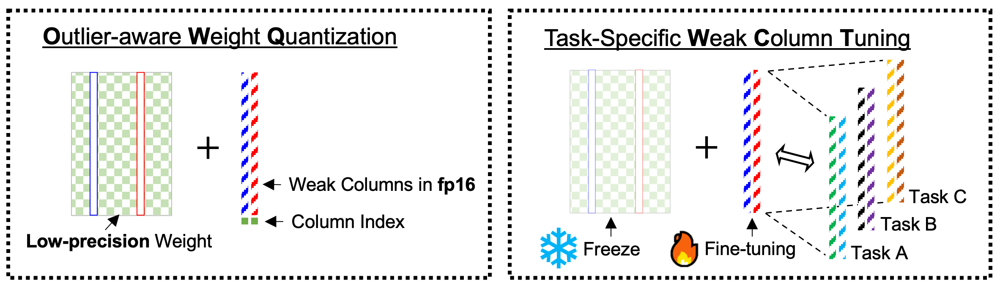

**总结**：本文提出了一个异常感知的权重量化方法OWQ，利用LLMs中的异常激活值挑选出Weak Column，对其采用全精度的方式在牺牲很小的性能的情况下提升了巨大的精度。此外为进一步提升其性能做了一定的硬件适配并提出了一个基于OWQ的WTC方案，简单来说就是在OWQ量化模型上微调只更新Weak Column的参数。

<b>评价:</b> 这篇文章思路很新颖，从大模型中间激活值的异常出发，结合Hessian矩阵分析，提出了一个简单但高校的方法，似乎可以进一步提升？

本文基于这样一个发现，LLMs在中间激活中表现出一些异常值，其值显著大于其他值，并且这些异常值集中在特定的特征维度上。保留这些异常值的值已知对于在激活量化之后保持准确性至关重要。此外，作者团队还发现激活异常值仍然会影响权重量化的敏感性。基于此，作者提出了一种称为异常值感知权重量化的概念(OWQ).

我们知道逐层权重量化的过程，实际上进行如下优化过程:

给定输入特征$X\in R^{C_{i,n} \times N}$,其中$C_{i,n}$表示输入的通道数，N是输入的序列长度，用于$C_{out}$输出特征的完整精度权重矩阵$W \in R^{c_{out}\times C_{i,n}}$被映射到低精度。
$$
\arg \min_{W} E= \arg \min_{\hat W}||WX - \hat W\hat x||^2_2 
$$
在量化时我们从输入到输出逐层量化。此外大模型的量化中，Embedding层以及LM Head的权重通常不被量化，因为前者的权重量化误差会随着网络的传播不断放大，且Token向量较为稀疏而LM Head层直接决定logits，而Top-k词之间的分数差往往较小，低比特改写会对排序以及argmax产生显著影响。

接下来阐释权重敏感性和激活异常值之间的关系。

（这里与原论文中的证明方式不一致，原论文只考虑了对量化误差$$||WX - \hat W\hat X||$$的论证，这是单层量化误差，但是忽略了误差随着网络的放大的影响）

在AdaRound文章中有提到，对于权重的量化产生的误差我们有如下基于泰勒展开的近似:
$$
\mathbb{E}[L(x,y,w+\Delta w) - L(x,y,w)] =\Delta L \approx \nabla L^{\top}\Delta w + \frac{1}{2}\Delta w^\top H\Delta w \approx \Delta W^\top H\Delta W
$$
由此我们知道，输出误差可以直接与海森矩阵和权重扰动的幅度相关。

将Hessian矩阵写作Kronecker积的矩阵形式，我们得到
$$
H(w^{(l)}) = \mathbb{E}[x^{(l-1)} x^{(l-1)\top}⊗ \nabla^2_{z^{(l)}}L]
$$
由此我们可以从全局的视角看到，异常激活值(激活值的激增)使Hessian矩阵H的某些元素具有异常大的值。Hessian矩阵的这种异常激增增加了相应权重通道对量化的敏感性。具体来说，即使在相同的权重扰动下，由于一些H的一些大元素，输出的变化也会相当大。我们可以将这些易受量化影响的权重称为Weak Column，特别是那些与特定输入通道中的激活值异常值相关联的权重。

OWQ为了解决这个问题，实现了如下技术：首先，识别Weak Column并将他们从量化中排除。随后使用精心调整的量化参数将剩余的权重量化为极低的bit。

对于Weak Column的检索，OWQ遵循如下方法:

我们定义j-th权重列的敏感性为:
$$
sensitivity_j = \lambda_j||\Delta W_{:,j}||_2^2
$$
其中$\lambda_j$是Hessian矩阵的第j个对角元素。

(若考虑的Hessian矩阵是层内重构误差的，那么这里$\lambda_j = (X^\top X)_{j,j} = 2\sum_{n}x_{j,n}^2$)

可以注意到在我们写的Hessian矩阵是针对全局损失而言的，那么这个场景下的$\lambda_j$就有所改变。虽然在这个场景下我们无法像论文里一样因为layer-wise量化误差输出通道之间没有Hessian交互，从而Hessian是对角矩阵。

但是将其作对角近似是合理的。因为在这样一个大的模型下，进行Hessian矩阵的精确计算是不可行的。

在此场景下我们有:

对于神经网络中的第j个神经元的输入$a_j$对应权重为$w_{ji}$:
$$
\frac{\partial^2 E_n}{\partial w_{ji}^2} = \frac{\partial^2 E_n}{\partial a_j^2}z_i^2
$$
其中$z_i$是上一层神经元的输出。

而$\frac{\partial^2 E_n}{\partial a_j^2}$可以通过链式法则递归计算(类似于反向传播):
$$
\frac{\partial^2 E_n}{\partial a_j^2} = \underbrace{\frac{\partial}{\partial a_j}[h'(a_j)\sum_{k}w_{kj}\frac{\partial E_n}{\partial a_k}]}_{链式法则}=h'(a_j)^2 \sum_{k,k'}w_{kj}w_{k'j}\frac{\partial^2 E_n}{\partial w_k\partial w_{k'}} + h''(a_j)\sum_k w_{kj}\frac{\partial E_n}{\partial a_n}
$$

忽略二阶导中的非对角线项$k\neq k'$:
$$
\frac{\partial^2 E_n}{\partial a_j^2}\approx \underbrace{h'(a_j)^2\sum_k w_{kj}^2 \frac{\partial^2 E_n}{\partial a_k^2}}_{链式法则} + \underbrace{h''(a_j)\sum_{k}w_{kj}\frac{\partial E_n}{\partial a_k}}_{链式法则}
$$
从而一次反向传播便可以计算出来，时间复杂度为$O(W)$

由此我们可以计算出在全局损失下的$\lambda_j$

在实际的计算中，同样也是只需要一个小批量的校验集，但是坏处是要多进行一次反向传播得到曲率。这样的Trade off得到的性能提升应该不小，因为它会真正识别出在全局下的 Real Weak Column

我们根据权重列的敏感性挑选出top-k个作为weak column。然后其余权重被量化为低精度。（这里可以采用任何的量化方法）论文中采用了OPTQ的方法。

作者团队对OPTQ进行了重要修改，使用二维网格搜索来搜索量化配置，包括步长以及零点。通过四舍五入到最接近的截断来搜索使量化前后差异最小的参数的最优值。

文章指出了一个利用Weak Column进一步减轻误差的方法:将高精度的Weak Column重新排列到权重的末尾，OPTQ过程中其他列的量化误差可以主要由Weak Column得到补偿

在此之后，我们将Weak Column存储为fp16，并为每一列使用一个额外的整数，该整数用于索引Weak Column。此外存储一个低精度矩阵，其中Weak Column的位置采用0填充。

此外，作者还对OWQ格式在真实GPU上提供了专门的加速以及WTC微调方案。

具体而言，这个微调方案会将OWQ的量化模型进行微调但只对Weak Column进行参数更新。因为weak column的数量很少，所以总体微调参数量很少，同时又因为weak column的权重使用fp16进行存储，因此微调空间较大，能够实现较好的微调效果。
