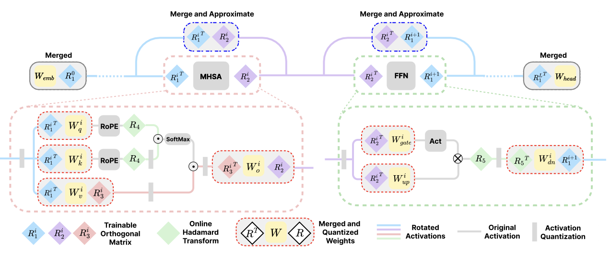

在LLM的权重-激活值量化中，目前的主流是基于旋转的方法，总体而言可以分为两类，一种是以SpinQuant，QuaRot为代表的全局旋转方法，另一种是以FlatQuant，OSTQuant为代表的layer-wise 变换方法。

二者的区别在于前者全局共享旋转矩阵，可以实现激活旋转与权重的离线融合，这种方式推理时无额外开销，效率高，但是表达能力有限；而Layer-Wise变换方法为每层分配独特的旋转矩阵，可以通过局部适应实现更优的异常值抑制，但是会产生额外的推理开销，因为这个旋转矩阵在激活侧无法融合进前一层的权重层。

ReSpinQuant克服了这一限制。实现了可融合的Layer-Wise Rotation base PTQ。

具体方法如下:

上图是respinquant应用于标准Transformer层时的完整架构。

我们设L表示总层数，对于第i层:

- $R_1^i$:用于旋转MHSA模块的激活输入，以及FFN模块的输出激活（来自于下一层）
- $R_2^i$:用于旋转FFN模块的输入，以及MHSA的输出。
- $R_3^i$:作用于注意力机制的中间旋转，如Value projection
- $R_4,R_5$:通过快速 Hadamard 变换实现的结构化旋转。与SpinQuant中保持一致。

上述旋转矩阵均可被MHSA，FFN内部的线性变换吸收，例如$W_v^i$会被融合为:$\hat W_v^i = {R_1^i}^\top W_v^i R_3^i$

上述吸收可以离线进行，因此基本上在保证计算不变性的同时，几乎没有带来额外的推理开销。

但是上述公式仅在Transfomer Block内部成立，当使用逐层旋转时，残差连接会带来挑战。

我们设$R_{in}$和$R_{out}$分别表示每个MHSA或FFN block的输入和输出所对应的最优逐层旋转矩阵。原始残差连接为:
$$
x_{out} = x_{in} + \text{Block}(x_{in})
$$
在旋转后，我们可以写作:
$$
\hat{x_{out}} = R_{out}R_{in}^{\top}\hat{x_{in}}+R_{out}\text{Block}(R_{in}^{\top}\hat{x_{in}})
$$
如果采用类似于SpinQuant的全局旋转策略，那么有$R_{out} = R_{in}$,此时:
$$
T = R_{out}R_{in}^\top  = I
$$
因此可以消除残差连接中的额外计算开销（也就是我们不需要显式计算）。然而，这会限制模型的表达能力，因为它强制所有层共享同一个旋转基。

为了解决这个问题，我们采用完整大小的逐层旋转矩阵，以最大化表达能力；同时，通过对子空间旋转近似来逼近残差旋转矩阵 T。

作者团队通过实验发现，用Hadamard矩阵初始化旋转矩阵，并通过Caley Optimizer对其进行优化，学习到的旋转矩阵$(R_1,R_2)$在收敛后并不会显著偏离初始的Hadamard结构。因此，残差旋转矩阵T表现出很强的对角占优特性:
$$
T = R_{out}R_{in}^\top\approx HH^\top = I
$$
我们将其相对于单位矩阵I的偏差记为:
$$
\Delta T = T - I
$$
随后，对偏差矩阵进行SVD分解,以识别基空间不匹配的主要方向（按照我们对SVD的理解，经过矩阵T的线性变换后，向量所在空间以Q为基底，也就是Q所在的线性空间）:
$$
Q,S,V^\top = \text{SVD}(T-I)
$$
我们截断分解，只保留前r个奇异向量，从而构造投影矩阵（即我们认为在空间上只有少数方向上残差不匹配）:
$$
Q \in \mathbb{R}^{D\times r}
$$
推理出这个子空间基后，我们便可以在子空间内推导最优旋转矩阵:
$$
\hat{R}_{sub}\in \mathbb{R}^{r\times r}
$$
首先，将完整的变换矩阵投影到该子空间中:
$$
T_{\text{sub}} = Q^\top T Q \in \mathbb{R}^{r\times r}
$$
由于投影操作不严格保持正交性，因此我们通过极分解提取最接近的正交矩阵。具体而言，我们对投影后的分量进行 SVD：
$$
U_{sub},\Sigma_{sub},V_{sub}^\top = \text{SVD}(T_{sub})
$$
由此得到正交化后的子空间旋转矩阵:
$$
\hat{R}_{\text{sub}} = U_{\text{sub}}V_{\text{sub}}^\top
$$
我们通过仅在识别出的子空间内施加变换，同时保持其正交补空间不变，来近似完整旋转矩阵T。近似后的变换矩阵$\hat T$定义为:
$$
\hat T = \underbrace{I-QQ^\top}_{(D-r)维恒等变换}+\underbrace{Q\hat R_{\text{sub}}Q^\top}_{子空间旋转}
$$
那么残差流的整体流程如下：

1. 投影: $y = Q^\top \hat x_{in} \in \mathbb{R}^{r}$
2. 子空间变换,在r维子空间内应用可学习的稠密变换，我们定义有效子空间矩阵：

$$
M = \hat{R_{\text{sub}}} - I_r
$$

以合并加法操作，因此有：
$$
z = My \in \mathbb{R}^{r}
$$

3. 重投影与残差相加:

将原始结果投影回原始维度，并与输入相加:
$$
\hat{x_{\text{out}}} = \hat{x_{in}}+Qz
$$
