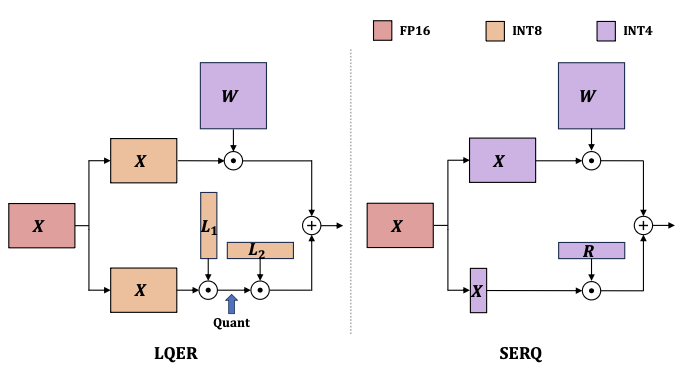
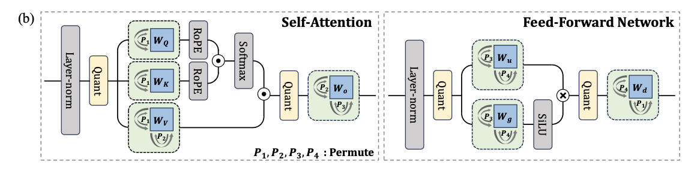

这篇文章将LLM PTQ做到了W4A4，是通过低秩误差重建的方式做到的。

传统的W4A4量化方法一般是通过Rotation-Based的方式进行的，这种方式虽然有效，但是一方面可能不存在鲁棒性，另一方面校准/训练成本高。

相较于Rotation-Base的PTQ方法， 基于低秩误差重建的方法有不用重训练太多，也不需要复杂在线层的优势，但仅在W4A8下表现优异，在W4A4下会呈现出明显的性能损失。更加关键的是，传统低秩补偿是两个矩阵$L_1,L_2$,推理时需要进行:
$$
X_qW_q + X_qL_1L_2
$$
这意味着第二项$X_qL_1L_2$我们除了要对$X_q$进行量化以外，我们还需要在线对$X_qL_1$的结果进行在线量化，这带来的额外开销对低精度的kernel而言并不友好。

可以见下图:

此外，传统的低秩误差重构方法通常对整个误差矩阵$E = W - Q(W)$做截断SVD，这带来的问题是固定 rank budget 会被分散到整个矩阵的所有行列上，而造成真正大影响的可能只是少数几个权重，这样会稀释低秩补偿能力。

基于上述问题，论文提出了SERQ方法，一种显著性感知的误差重构算法，它在单个低秩矩阵中同时考虑权重显著性和激活显著性。

具体而言该方法的步骤如下：

- 静态激活平滑

激活值量化通常因为异常值的存在而十分脆弱，通常的方法是通过旋转变换或者辅助层对异常值进行在线处理，这些方法虽然有效，但是会引入额外的推理时延，因此这里选用的是SmoothQuant的方式，即采用静态的逐通道缩放来平滑激活分布。

具体来说，激活会被一个缩放因子s缩放，同时对应的缩放因子会被折叠进权重中。因此，线性层中的操作可以表示为：
$$
Y = XW = (X\cdot \text{diag}(S^{-1}))(\text{diag}(S)\cdot W) = XW
$$
这些缩放因子在校准阶段获得，并在线下合并到相邻层中，因此不会带来运行时开销。

- 显著性感知的误差重建

逐通道静态平滑过程会把激活离群值的尺度转移到对应的权重中。假设原始权重符合正态分布，那么在折叠后的权重中，显著行可以直接通过它们的尺度来识别。

这些显著行在反复与激活矩阵相乘时，会累积较大的量化误差。为了缓解这一问题，我们引入了一个低秩补偿矩阵:
$$
R \in \mathbb{R}^{r \times d}
$$
它用于修正r个显著权重行中的量化误差，记这些显著权重行为$W_s$

考虑将权重行按照显著性降序排列，即通过置换矩阵P进行重排，则折叠后的矩阵W和显著性感知的低秩矩阵R可以定义为:
$$
W = P\cdot \text{diag}(S)\cdot W = P\cdot W = [W_s;W_r]\\
R = W_s - Q(W_s)
$$
其中$W_r$表示剩余的非显著行

随后，整体线性操作可以描述为:
$$
Y = (X\cdot \text{diag}(s^{-1})\cdot P^{-1})(P\cdot \text{diag}(s)W) = XW\\
Q(X)\cdot Q(W)=Q([X_s;X_r])\cdot Q([W_s;W_r])+Q(X_s)\cdot R \approx X_q\cdot W_q + X_{s,q}\cdot Q(R)
$$
需要注意的是我们也会对低秩矩阵R进行量化，从而保证整个推理流程都可以使用低精度算子。

通过提取出敏感行的方法，我们将原本的在线量化成本省去，并保留了低秩乘法的便捷！此时残差分支只需要执行一个计算量较低的低秩乘法:
$$
\mathbb{R}^{s\times r}\times \mathbb{R}^{r\times d}
$$

- 离线置换权重

我们为了提取敏感行将激活值和权重通过置换矩阵P变换为了:
$$
X = [X_s;X_r]\quad W = [W_s;W_r]
$$
为了不引入额外的在线计算开销，会做一个简单的融合。

一共有两部分，一个是权重上的，$P\cdot \text{diag}(s)\cdot W$,那这个很简单，我们一般的做法是会把scale离线融到W中，按照同样的思路我们也把P融合进去。另一部分则是激活值上的$X\cdot \text{diag}(s^{-1})\cdot P^{-1}$因为激活值X在推理时才有，我们无法离线融合，因此选用的方法是不在当前层进行融合，而是把这个重排继续传播到前一层中。因为我们知道当前层l的激活值X:
$$
X = X^{l-1}W^{l-1}
$$
因此我们令:
$$
W^{l-1} = W^{l-1}\cdot \text{diag}(s^{-1})\cdot P^{-1}
$$
即可，这个操作可以离线执行，因此不会带来额外的计算开销

至此，完整的流程可见下图:

