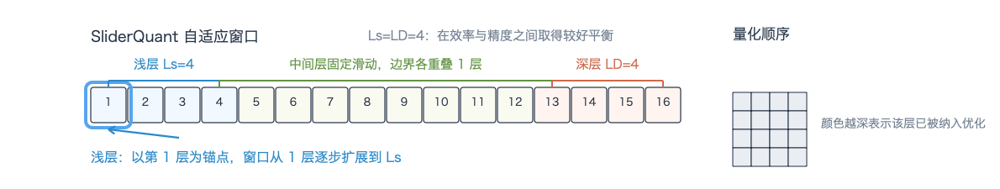
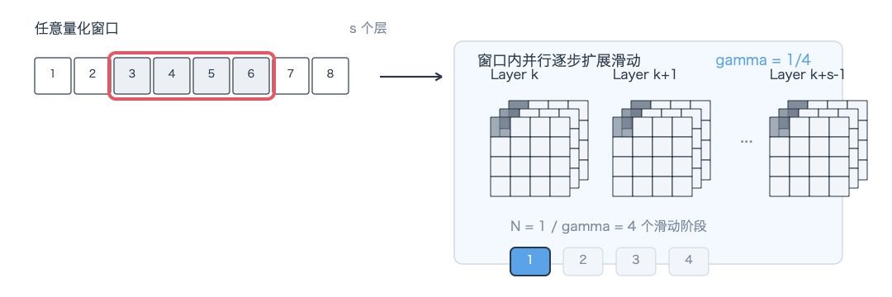
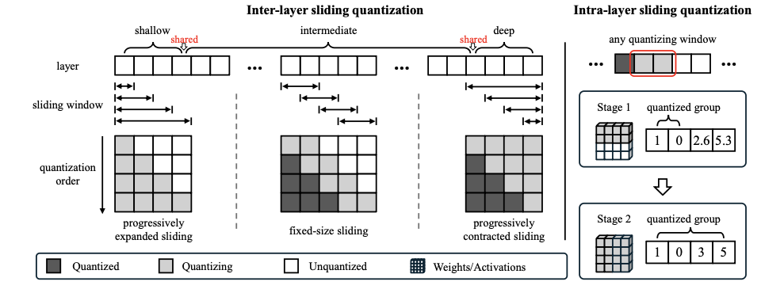

现有的PTQ通常采用顺序量化框架，将预训练模型分割为相同大小的部分并依次量化，且对所有层一视同仁。在低比特情况下，这种平等处理方式存在如下缺陷：

1. 层间敏感度差异被忽略:实证研究表明，浅层和深层通常比中间层对量化更敏感，且第一层和最后一层的量化误差显著大于其他层
2. 量化误差跨层累积:随着逐层量化进行，误差逐渐放大，而现有方法缺乏有效的跨层协同机制来抑制此问题

具体而言，作者做了两个简单的实验

将某个模型的特定层量化，来比较量化不同层带来的影响，以及量化不同数量的层数，来比较量化误差的积累效应，结果如下：

可以看到无论模型大小，对量化最敏感的永远是第一层和最后一层，且随着量化层数的增加，量化误差的积累也越来越明显。

为了解决上述问题，论文提出了SliderQuant框架，其核心包括:

1. Inter-layer sliding quantization: 针对浅层，中间层和深层分别设计自适应滑动窗口，建立跨层的智能化接力机制
2. Intra-layer sliding quantization: 在每个量化窗口内采用增量式量化策略，实现局部到全局的参数协同。

**Inter-layer sliding quantization**

一般的PTQ量化普遍选择Layer-Wise的量化，因此误差会随着层数加深而逐渐累积。作者选择使用滑动窗口的方式进行量化，每次在整个窗口中的layer会被当作一个block进行量化。为了减少跨层量化误差，总会保证两个连续的窗口之间存在重叠即$s-i\geq 1$。（size，stride）

然而使用固定大小的滑动窗口时，预训练大语言模型的所有层都会以相同的窗口大小和每一步相同的移动间隔进行量化。也就是说，浅层、中间层和深层在很大程度上仍然被同等对待，这与我们期望的量化设计之间仍存在较大差距。

因此SliderQuant选用的方式为:

对于$L_s$个浅层，采用渐进扩展滑动窗口。具体而言，从仅量化第一层开始，窗口大小被设置为1；随后以第一层作为锚定层，每一步将窗口大小增加1，直到窗口覆盖所有浅层$L_s$

对于$L_D$个深层，采用渐进收缩滑动窗口。具体而言，从量化所有深层开始，然后每一步将窗口大小减少 1，直到窗口中只包含最后一层。最后一层始终作为锚定层，并参与每一个收缩后的滑动窗口的量化过程。

对于中间$L_i$个中间层，采用固定大小的滑动窗口，其中设置$\{s=2,i=1\}$,并保证各层具有均匀的优化频率。具体而言，在浅层和中间层之间设置一个重叠层，同时在中间层和深层之间也设置一个重叠层。

根据消融实验得到$L_s = L_D =4$可以在效率和精度之间达到平衡

可以参考下面的gif

**Intra-Layer Sliding Quantization**

为了进一步利用之前发现两个性质，论文提出了一个与Inter-layer sliding 互补的组件。

具体而言，它将逐步扩展的滑动设计进一步扩展到层间滑动量化的每一个窗口内部。在窗口内，s个层会沿着权重和激活维度，以比例$\gamma$并行地执行逐步扩展滑动。因此，所有 s个层的联合量化会在$N = \frac{1}{\gamma}$个滑动阶段完成。

这里从语言上描述比较抽象，可以参考下面的GIF，简单来说就是对于权重/激活值矩阵，沿着某个维度逐渐进行量化（而非一次性量化）。

层内滑动量化在层间滑动量化当前滑动窗口内部，建立了一种从局部到全局的跨层参数协同关系，从而降低量化误差。

在层内对激活值和权重进行量化时，采用如下策略，该策略参考了目前主流的通道缩放以及低秩近似：

设$W_i \in \mathbb{R}^{n\times m}$表示滑动窗口中第i层的权重矩阵，$X_i \in \mathbb{R}^{k\times n}$表示其对应于一小组校准样本的输入特征，其中校准样本数为c，默认设置c=128,那么，量化过程定义为:
$$
\hat{X_i} = X_i \oslash \alpha_i\\
\hat{W_i} = W_i \odot \alpha_i + A_iB_i \\
\hat{X_{i+1}} = \text{quantizer}(\hat X_i)\cdot \text{quantizer}(\hat{W_i})
$$
其中$\alpha_i$表示一个可学习的通道缩放参数，$A_i,B_i$为两个低秩矩阵。
