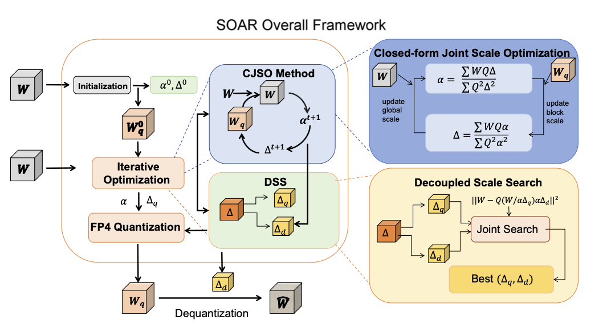

对于NVFP4量化，我们可以将其量化行为用下述公式描述:

对于高精度张量X，设$M_{\text{FP4}},M_{\text{FP8}}$分别表示FP4(E2M1)与FP8(E4M3)能够表示的最大值，分别为6和448，$Q_{\text{E4M3}}$表示FP8(E4M3)的量化函数，$\alpha,\Delta_i$分别表示全局scale以及块级scale:
$$
\alpha = \frac{\max (\abs{X})}{M_{\text{FP4}}\cdot M_{\text{FP8}}}\\
\Delta_i = Q_{\text{E4M3}}(\frac{\max (\abs{X_i})}{\alpha \cdot M_{\text{FP4}}})\\
\hat X = 
\begin{cases}
\frac{1}{2}「\frac{2X}{\alpha \Delta}」\quad \abs{\frac{X}{\alpha \Delta}} < 2\\
「\frac{X}{\alpha \Delta}」 \quad 2\leq\abs{\frac{X}{\alpha \Delta}}\leq 4\\
2「\frac{X}{2\alpha \Delta}」\quad 4\leq\abs{\frac{X}{\alpha \Delta}}\leq 6
\end{cases}
$$
这里之所以$\hat X$是分段函数，是因为在FP4量化中，在数值0-2的区间内，采样点的间隔是0.5（0，0.5，1，1.5），而在2-4内采样点间隔是1，而4-6内为2。

那么反量化函数可以写作:
$$
\hat X = \hat X \cdot(\alpha \Delta)
$$
然而目前的NVFP4量化方法普通通过简单的启发式公式来确定全局scale 和块级scale，例如基于最大值的缩放方法，或仅在有限候选集上进行离散搜索。这写方法往往会导致次优结果。尤其是对于FP32全局scale 而言，如果只将其优化限制在固定规则或粗粒度的离散空间内，就很难准确刻画大语言模型复杂的权重分布。

位了解决这个问题，作者提出了闭式联合Scale优化方法，即CJSO。简单来说就是直接通过最小化原始权重W和反量化权重$\hat W$之间的重构误差来联合优化全局scale和块级scale:
$$
\alpha,\Delta = \arg \min_{\alpha,\Delta}\sum_i ||W_i - Q_i\cdot(\alpha \Delta_i)||_2^2
$$
其中:
$$
Q_i = Q_{\text{fp4}}(\frac{W_i}{\alpha \Delta_i})
$$
由于直接最小化这个重构误差是比较困难的，因为$Q_i$是离散的，并且同时依赖于$\alpha,\Delta_i$.不过，在固定$Q_i$的分配结果时，重构目标可以看作是关于缩放因子的二次函数，因此我们可以求解得到:

全局Scale优化，在给定块级scale$\Delta_i$的情况下， 最优化张量级scale$\alpha^*$可以表示为:
$$
\alpha^* = \frac{\sum_{i=1}^N \sum_{j\in \text{block}_i}W_{ij}Q_{ij}\alpha}{\sum_{i=1}^N\sum_{j\in\text{block}_i}Q_{ij}^2 \alpha^2}
$$
块级Scale优化，反过来，在$\alpha$固定的情况下， 每个块级scale $\Delta_i^*$都可以独立优化，以拟合对应块内的局部分布:
$$
\Delta_i^* = \frac{\sum_{j\in \text{block}_i} W_{ij}Q_{ij}\alpha}{\sum_{j\in\text{block}_i}Q_{ij}^2 \alpha^2}
$$
那么基于此，可以得到CJSO的量化方案:

​	首先使用NVFP4中标准的基于最大值的规则来初始化$\alpha,\Delta_i$。随后，用上述公式迭代更新全局scale $\alpha$以及块级scale$\Delta_i$,以及量化矩阵$Q_i$:每次更新后，都会在新的scale下重新执行FP4量化从而重新计算Q

除此之外，在NVFP4中，块级缩放因子还受限于FP8精度的表示限制，因此它本身也会引入量化误差。这种量化误差会传播到量化以及反量化两个阶段，从而直接影响重构精度。

因此论文考虑将量化与反量化使用的scale 解耦，具体而言，将原本的单一尺度块级缩放因子解耦为两个独立变量:

- 量化尺度$\Delta_i^q$（高精度）:用于确定FP4权重分配，不受硬件精度限制
- 反量化尺度$\Delta_i^d$（E4M3）:实际存储的硬件兼容尺度，用于推理时重建

那么，我们将NVFP4量化重新表述为:
$$
\min_{\Delta_i^q \in \mathbb{R},\Delta_i^d \in \text{FP8}} L = \sum_i||W_i - Q_{\text{FP4}}(\frac{W_i}{\alpha \Delta_i^q})\cdot (\alpha \Delta_i^d)||_2^2
$$
基于上述解耦，我们对两个块scale进行联合优化。

1. 初始化：使用CJSO结果初始化$\Delta_i^d$,并令$\Delta_i^q = \Delta_i^d$
2. 构造候选空间:
   - 对于$\Delta_i^q$,在$[0.5,1.5]$范围内以步长0.01进行连续乘性扰动(高精度搜索)
   - 对于$\Delta_i^d$则限制为当前值附近最近两个E4M3表示值
3. 对每个候选$(\Delta_i^q,\Delta_i^d)$计算重建误差，选择最优组合

