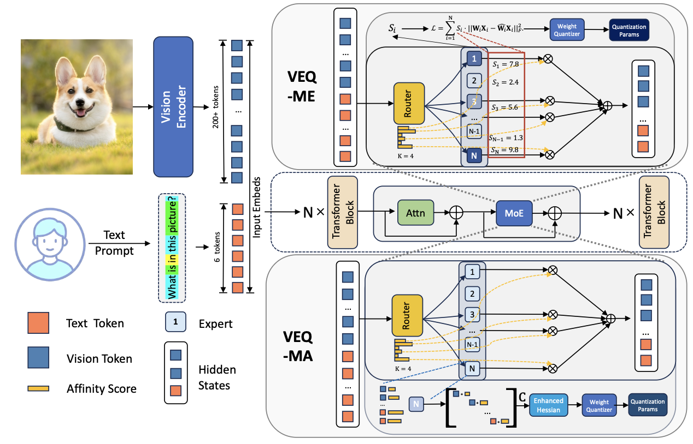

本篇文章主要针对MoE架构的VLMs的PTQ。

目前主流的MoE VLMs PTQ方法往往忽略了两种异质性：

1. 跨模态异质性:视觉token和语言token在统计分布，敏感度和对模型输出的影响上存在显著差异:

   a. 敏感度差异，文本token的梯度范数平均是视觉token的22.4倍，表明文本token包含更密集的信息，对量化误差更加敏感。

   b. 数量不平衡，视觉Token远多于文本Token，但文本token在推理中起主导作用

2. 专家间异质性:MoE架构中不同专家的重要性呈现高度不均匀分布：

   a. 激活稀疏性，少数热专家被频繁激活，而大部分专家很少被使用

   b. 功能分化，部分专家专门处理视觉特征，部分专门处理文本语义，还有部分作为跨模态通用处理器。

   c.  路由偏差，路由器对少数专家赋予极高置信度，这些专家对最终输出起决定性作用。

基于此论文提出了VEQ-ME,VEQ-MA.

首先介绍VEQ-ME，即模态-专家感知量化。其核心在于将专家重要性引入误差最小化目标中。

我们定义第i个专家的重要性分数为$S_i$,用于平衡衡量该专家在不同模态下的贡献。由于视觉token天然比文本token数量多，因此单纯用原始频次统计会使结果过度偏向视觉主导型专家，因此重要性分数采取加权求和的方式:
$$
S_i = \gamma N_i^{\text{text}} + \beta N_i^{\text{vis}}
$$
其中$N_i^{\text{text}},N_i^{\text{vis}}$表示被路由到第i个专家的某种模态token数目。令$T_{text},T_{vis}$分别表示校准集中所有文本 token 和视觉 token 的总数。系数:
$$
\beta = \frac{T_{text}}{T_{vis}}
$$
作为数量归一化因子，用于缩小高频视觉激活的影响，使其能够与文本 token 的计数处于可比较的尺度。系数
$$
\gamma = \frac{||\nabla_{text}||}{||\nabla_{vis}||}
$$
作为质量敏感性因子，用于反映文本 token 具有更高梯度影响这一事实。

得到每个专家的重要性分数后，后续在计算量化误差时，采用加权形式:
$$
\mathcal{L}_{\text{weighted}} = \sum_{i=1}^M S_i \cdot ||W_iX_i-\hat W_i X_i||_2^2
$$
接下来介绍VEQ-MA，即模态-亲和性感知量化。其核心在于构建增强的Hessian矩阵$\hat H = XCX^\top$

目前具有代表性的PTQ框架通常使用二阶信息(Hessian矩阵)来确定最优量化参数，而出于计算效率的考虑，往往采用如下近似:
$$
H = 2X^\top X
$$
这种形式隐含地假设所有输入 token 对重构误差的贡献是相同的，也就是说，它将序列维度上的优化地形视为均匀的。

然而在MoE-VLM中，存在如下问题:

1. 路由多样性，不同token与特定专家之间具有不同程度的亲和性，这由路由器输出的概率决定；
2. 模态敏感性,尽管文本 token 的数量更少，但相比空间冗余较高的视觉 token，它们通常具有更高的梯度密度和信息价值。

如果直接将统一的 Hessian 计算方式应用于 MoE 层，就无法刻画这些细粒度差异，进而可能导致关键语义信息被忽视。

因此VEQ-MA采用了增强的Hessian矩阵:

设$X \in \mathbb{R}^{d\times N}$表示被路由到当前专家的输入 token，其中 N 是这些 token 的数量。我们根据每个 token 的模态相关亲和性，对其贡献进行缩放，从而重构 Hessian 矩阵 $\hat H$：
$$
\hat H = (X\cdot \sqrt{C})(X\cdot \sqrt{C})^\top = XCX^\top
$$
其中$C\in \mathbb{R}^{N\times N}$是一个对角矩阵，表示每个 token 的重要性权重。对于第 j 个 token $x_j$，其对应的对角元素 $c_j$ 定义为：
$$
c_j = p_j \cdot \alpha_j
$$
其中:
$$
\alpha_j =
\begin{cases}
\gamma, & x_j \text{ 是文本 token}, \\
1,      & x_j \text{ 是视觉 token}.
\end{cases}
$$
$p_j$表示$x_j$与专家的亲和性。项$\gamma$表示梯度缩放因子。

整体架构图如下:

