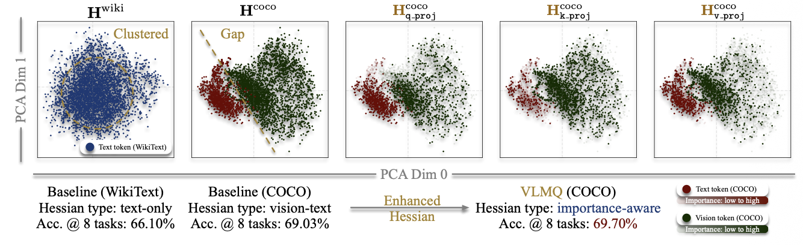

    <b>个人评价</b>:文章引出给不同token分配重要性的方式特别好，值得学习！后面的方法就和MBQ，QIG大同小异了

文章提出在VLM中，视觉被过度表征是一个被广泛接受的观点，然而目前基于Hessian的PTQ方法没有利用这种冗余性，而我们知道在GPTQ中近似Hessian是通过激活值的内积近似得到的，这就会导致GPTQ等基于Hessian的量化方法直接应用于VLM上时，构建的Hessian矩阵大部分贡献来自于视觉冗余Token，从而表现不佳。因此，给各个Token分配不同的重要性是至关重要的。

那么视觉token是如何影响Hessian的估计和模型精度的呢？ 

论文作者发现：

1. 在对VLM进行量化时，视觉Token的纳入是必要的
2. 过量的视觉Token可能会导致量化性能下降，为冗余token赋予较低的重要性，可以缓解由此带来的性能衰退

作者对这两个发现给出了一定的解释：

性能的波动实际上可以归因于Hessian的特征偏移，如下图所示

可以看到，当仅有文本输入时，Hessian矩阵的主成分空间中的分布较为紧凑，而加入了视觉Token后，校准分布变得更加多样化，这有助于缓解量化与推理之间的差距。然而，由于视觉过度表征问题，过量引入视觉 token 会带来 Hessian 向冗余视觉特征偏置的风险（即周围稀疏的点)。

为了解决这个问题，作者提出了一种面向VLM的精确PTQ方法，该方法主要由两方面组成:

1. 重要性感知的量化目标
2. 建立了分块损失扰动与逐层输出误差之间的理论联系，从而能够仅通过一次分块反向传播，高效计算由梯度驱动的重要性分数。

重要性感知的量化目标实际上就是我们先前阅读过的MBQ，QIG等方法使用的量化目标，即Token-Wise的加权。VLMQ的Token重要性通过矩阵形式给出:

令$G\in \mathbb{R}^{N\times N}$,其中G为对角矩阵，第i个对角元素表示分配给输出token$Z_{:,i}$的重要性。

将其纳入目标函数后，我们得到了如下改进形式的目标函数：
$$
\arg \min_{\hat w} ||(\Delta w X-r)\sqrt{G}||_2^2 \quad s.t. \Delta w e_q^\top +w_q - \hat w_q = 0
$$
利用拉格朗日算子法，我们有：
$$
L = ||(\Delta w X -r)\sqrt{G}||_2^2 +\lambda(\Delta w e_q^\top + w_q - \hat w_q)
$$
解得:
$$
\Delta w = \frac{\hat w_q - w_q}{\hat H_{qq}^{-1}}\cdot \hat H_{q,:}^{-1} + \hat r \hat X^\top \hat H_{-q,:}^{-1}
$$
其中$\hat H = XGX^\top ,\quad \hat r = r\sqrt{G} ,\quad \hat X = X\sqrt{G}$

该形式与原始的GPTAQ方式对齐，因此可以复用其中的效率技巧如Cholesky等。

那么重要性是如何得到的呢？

参见MBQ中的推导，可以得知，最终使用的是:
$$
G = \text{diag}([\overline{|P|}_0,\overline{|P|}_1,\dots,\overline{|P|}_{N-1}])
$$
其中第 n个 token 的重要性定义为梯度中第 n 列的 ℓ1 范数
$$
|P|_n = \sum_{i=0}^{C_0 - 1}|P|_{i,n}
$$
