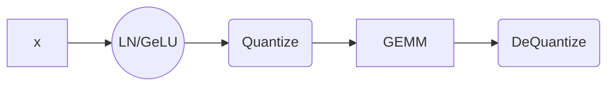
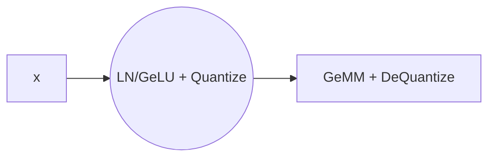

<b>评价:</b> 这篇文章比较Solid，考虑了硬件适配的问题，这是模型量化中一个老大难的问题尤其是混合精度。但是实验的模型都是参数规模较小的模型，在大模型上的效果有待考究。

**总结**：这篇文章指出，低比特量化在大型 Transformer 架构模型中精度受限的主要原因是激活值和权重矩阵的值分布方差较大。针对这一问题，提出了 ZeroQuant 方案。该方案主要包括：对权重采用 Group-wise 量化、对激活值采用 Token-wise 量化，这种方法既能适配硬件架构，又能保持较高的精度；同时，通过 Layer-wise 知识蒸馏方法来减少量化带来的精度损失。

文章指出，在大模型的量化中，采用PTQ会面临以下挑战。

- 激活分布动态性强

  论文通过展示每一层的激活值在不同Token语义下的分布，发现了其范围随输入token的语义上下文变化极大的特点。这一特点使得难以对所有的token使用固定的量化范围。

- 权重矩阵范围差异大

​	通过同样的方式，展示了不同层行权重的范围。同样可以看到权重矩阵的神经元范围差异较大。

这两个挑战使得Per-Tensor粒度的量化很难在大模型的量化中使用，而采用Per-channel粒度的量化会面临大的计算存储开销，且会导致在硬件级别的矩阵乘法优化难以执行。基于此作者提出采用Group-wise量化旨在对精度和实用性做出权衡。

对于权重矩阵而言，Group-wise量化就是将$W\in R^{n\times m}$划分为g个组，每个组单独量化。但是在最先提出这个量化方法的Q-BERT中仅将其用于QAT且没有考虑硬件效率约束，以及系统后端支持。基于此作者团队考虑了GPU的架构（Ampere架构）的硬件约束，特别是将Group-size与Tensor Core中的计算单元对齐。

具体而言，Tensor Core允许16\*16大小的矩阵块在一个warp中并行处理，从而加速矩阵乘法和其他张量操作。如果我们让Group-size为16或32这样与Tensor core中矩阵乘法相适配的大小，这样就能在降低延迟的同时保持模型精度。

**注**：这部分文章在附录D中有详细介绍，简单来说Group-wise的group size是通过CUTLASS库和Profiler工具，根据输入尺寸和硬件特性动态确定的，以优化Tensor Core的计算效率。

对于激活值而言，在挑战中我们已经阐明了在不同的Token上下文语义下，激活值的范围存在巨大方差，因此解决这个问题的一个自然而然的想法是采用Token-wise的量化策略。但是直接采用DL框架中的Token级量化会导致显著的量化和反量化成本，因为引入了额外的操作。基于此作者采用了算子融合的方法等一系列优化。

知识蒸馏是缓解模型压缩后精度下降的最强大的办法之一。因此，论文提出了一种逐层的知识蒸馏技术来避免低比特量化带来的精度损失。

具体而言，在传统的知识蒸馏中，教师模型和学生模型的输出通常是整个模型的输出，但在逐层知识蒸馏(LKD)中，蒸馏的学习目标是逐层的，即学生模型要学习教师模型每一层的中间激活值。

假设我们要量化的是$L_k$层，其量化版本为$\hat L_k$,然后我们使用$L_{k-1}$层的输出作为$L_k,\hat L_k$的输入，测量差异，并更新模型
$$
L_{LKD,k} = MSE(L_kL_{k-1}\dots L_1(X)-\hat L_k L_{k-1}\dots L_1(X))
$$
因为使用相同的前k-1层，所以无需单独保留一个单独的教师模型，因此额外的模型成本仅仅是$L_k$。而每次只对一层进行蒸馏，所以内存和计算开销非常小，并且无需原始训练数据。

在前面Token-wise的量化处我们提到，作者对Kernel做了对应的优化，下面我们详细展开。

首先是针对Token-wise 的激活值量化做了一系列的kernel融合。作者将激活值量化与其相关的逐元素和或基于reduction的操作（如bias，GELU,LayerNorm等）的kernel进行了融合。这样减少了数据转移的开销。而将反量化与矩阵乘法做了相应的融合。具体而言见下面的流程图

经优化后

